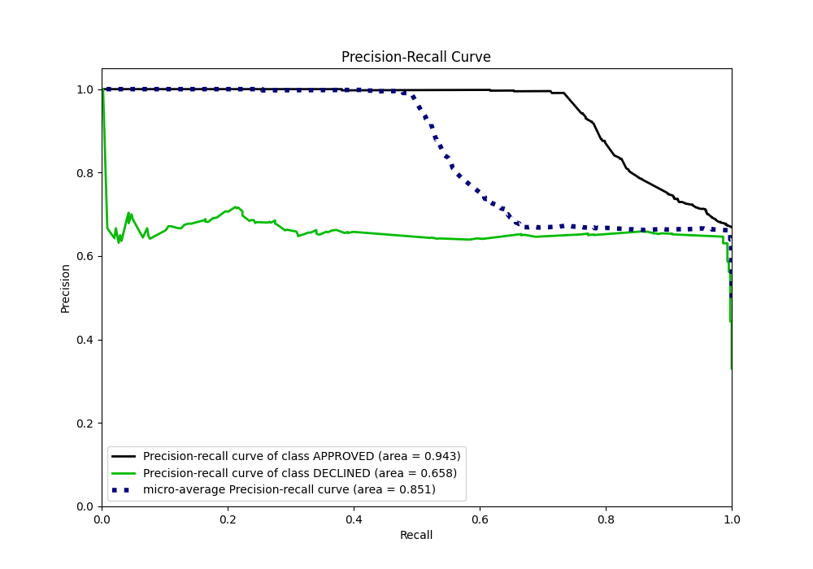

# Summary of 47_ExtraTrees

[<< Go back](../README.md)

## Extra Trees Classifier (Extra Trees)
- **n_jobs**: -1
- **criterion**: gini
- **max_features**: 0.7
- **min_samples_split**: 50
- **max_depth**: 3
- **eval_metric_name**: auc
- **explain_level**: 0

## Validation
 - **validation_type**: split
 - **train_ratio**: 0.8
 - **shuffle**: True
 - **stratify**: True

## Optimized metric
auc

## Training time

2.3 seconds

## Metric details
|           |    score |    threshold |
|:----------|---------:|-------------:|
| logloss   | 0.480204 | nan          |
| auc       | 0.867324 | nan          |
| f1        | 0.781055 |   0.44802    |
| accuracy  | 0.817164 |   0.44802    |
| precision | 0.708661 |   0.470369   |
| recall    | 1        |   0.00199792 |
| mcc       | 0.677455 |   0.44802    |

## Metric details with threshold from accuracy metric
|           |    score |   threshold |
|:----------|---------:|------------:|
| logloss   | 0.480204 |   nan       |
| auc       | 0.867324 |   nan       |
| f1        | 0.781055 |     0.44802 |
| accuracy  | 0.817164 |     0.44802 |
| precision | 0.64645  |     0.44802 |
| recall    | 0.986456 |     0.44802 |
| mcc       | 0.677455 |     0.44802 |

## Confusion matrix (at threshold=0.44802)
|                     |   Predicted as APPROVED |   Predicted as DECLINED |
|:--------------------|------------------------:|------------------------:|
| Labeled as APPROVED |                     658 |                     239 |
| Labeled as DECLINED |                       6 |                     437 |

## Learning curves

## Confusion Matrix

## Normalized Confusion Matrix

## ROC Curve

## Kolmogorov-Smirnov Statistic

## Precision-Recall Curve

## Calibration Curve

## Cumulative Gains Curve

## Lift Curve

[<< Go back](../README.md)
