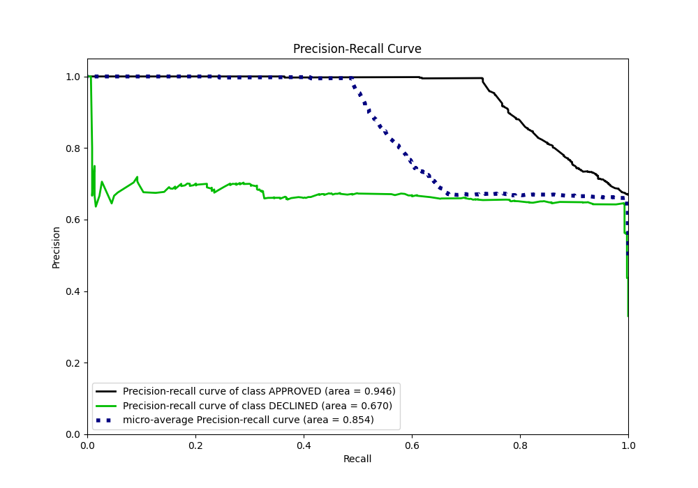

# Summary of 50_ExtraTrees

[<< Go back](../README.md)

## Extra Trees Classifier (Extra Trees)
- **n_jobs**: -1
- **criterion**: entropy
- **max_features**: 0.7
- **min_samples_split**: 40
- **max_depth**: 3
- **eval_metric_name**: auc
- **explain_level**: 0

## Validation
 - **validation_type**: split
 - **train_ratio**: 0.8
 - **shuffle**: True
 - **stratify**: True

## Optimized metric
auc

## Training time

3.0 seconds

## Metric details
|           |    score |    threshold |
|:----------|---------:|-------------:|
| logloss   | 0.481328 | nan          |
| auc       | 0.871357 | nan          |
| f1        | 0.777385 |   0.430811   |
| accuracy  | 0.812687 |   0.448023   |
| precision | 0.703297 |   0.461663   |
| recall    | 1        |   0.00233237 |
| mcc       | 0.673582 |   0.430811   |

## Metric details with threshold from accuracy metric
|           |    score |   threshold |
|:----------|---------:|------------:|
| logloss   | 0.481328 |  nan        |
| auc       | 0.871357 |  nan        |
| f1        | 0.775291 |    0.448023 |
| accuracy  | 0.812687 |    0.448023 |
| precision | 0.642433 |    0.448023 |
| recall    | 0.977427 |    0.448023 |
| mcc       | 0.666847 |    0.448023 |

## Confusion matrix (at threshold=0.448023)
|                     |   Predicted as APPROVED |   Predicted as DECLINED |
|:--------------------|------------------------:|------------------------:|
| Labeled as APPROVED |                     656 |                     241 |
| Labeled as DECLINED |                      10 |                     433 |

## Learning curves

## Confusion Matrix

## Normalized Confusion Matrix

## ROC Curve

## Kolmogorov-Smirnov Statistic

## Precision-Recall Curve

## Calibration Curve

## Cumulative Gains Curve

## Lift Curve

[<< Go back](../README.md)
