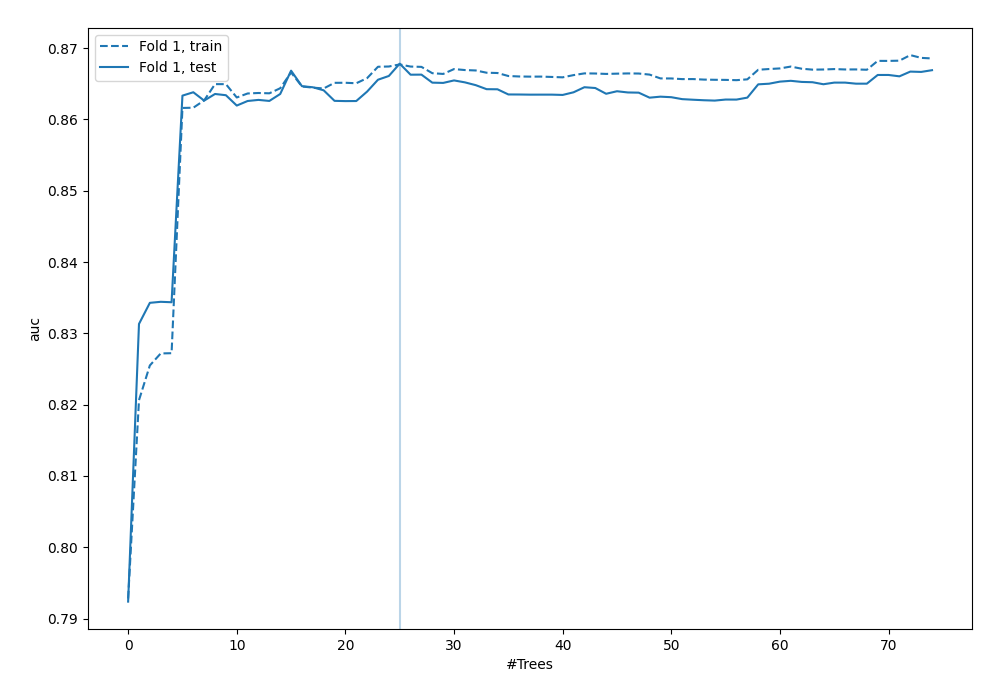
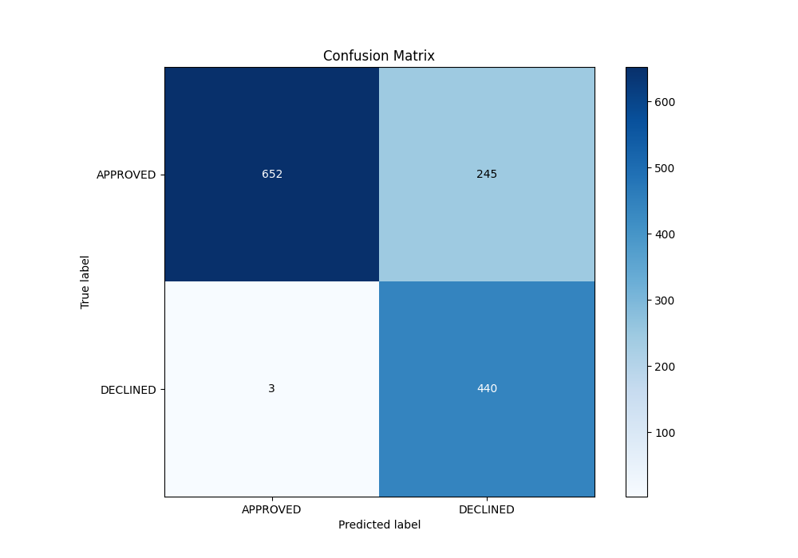
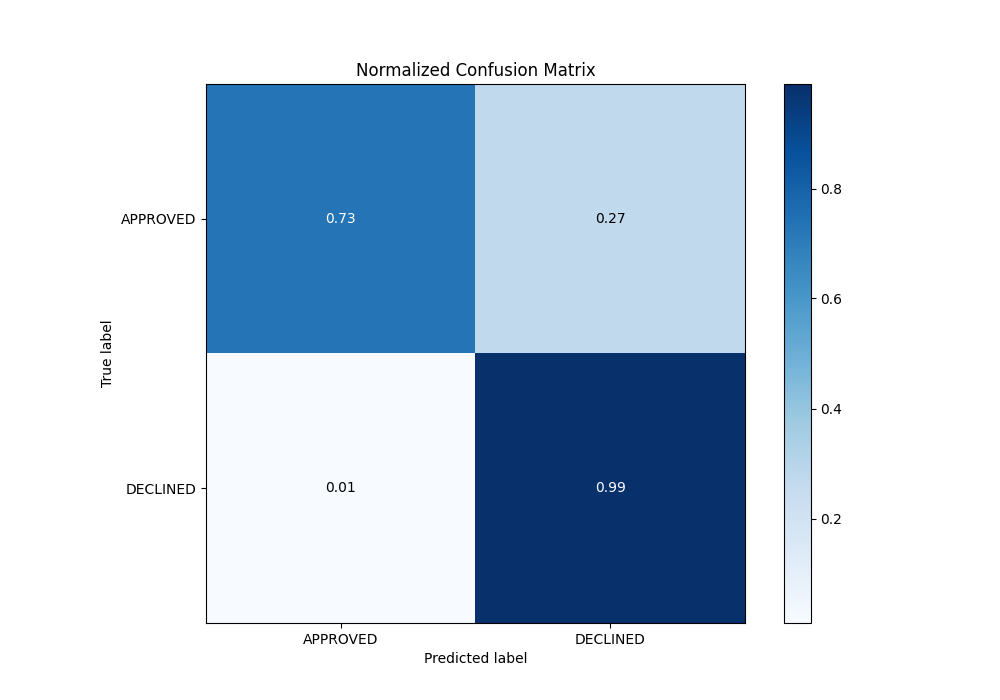
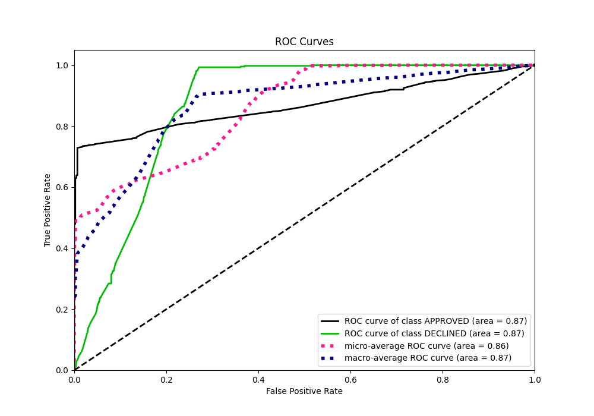
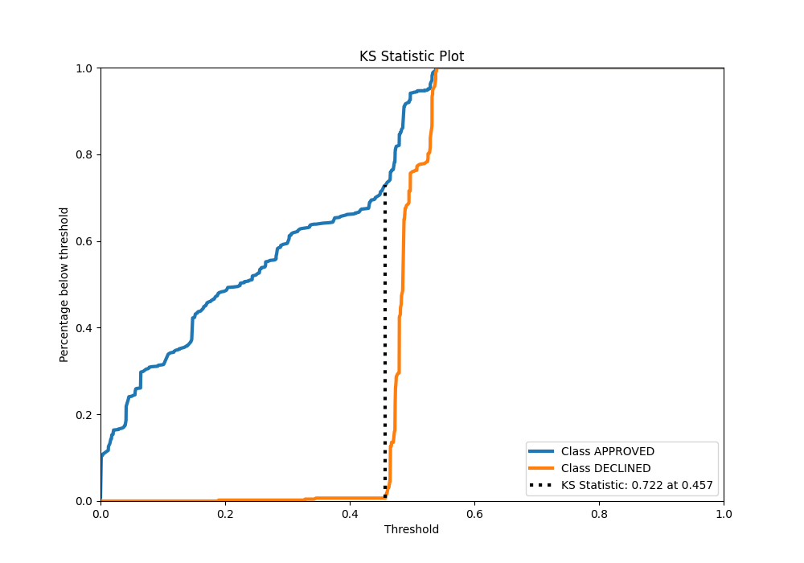
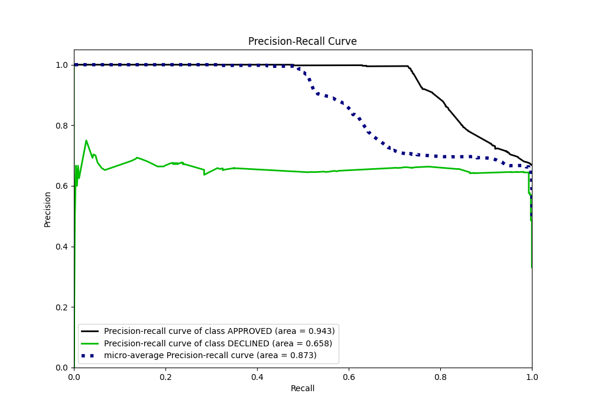
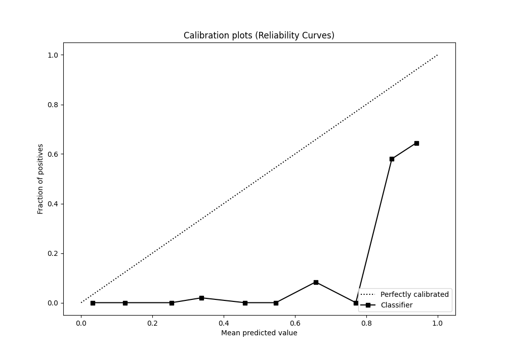
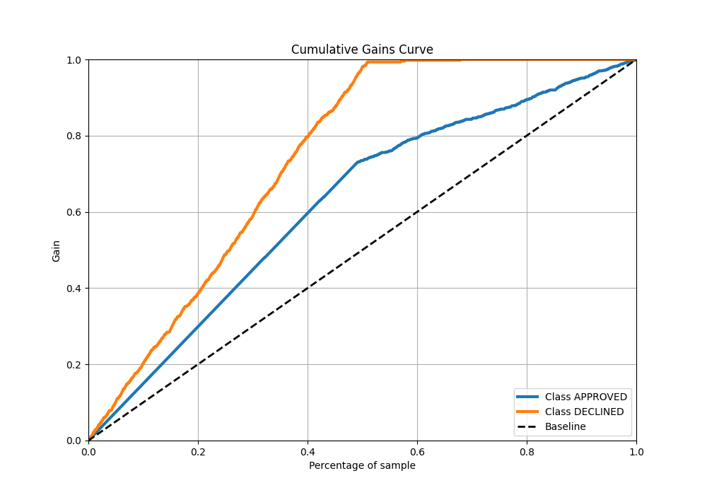
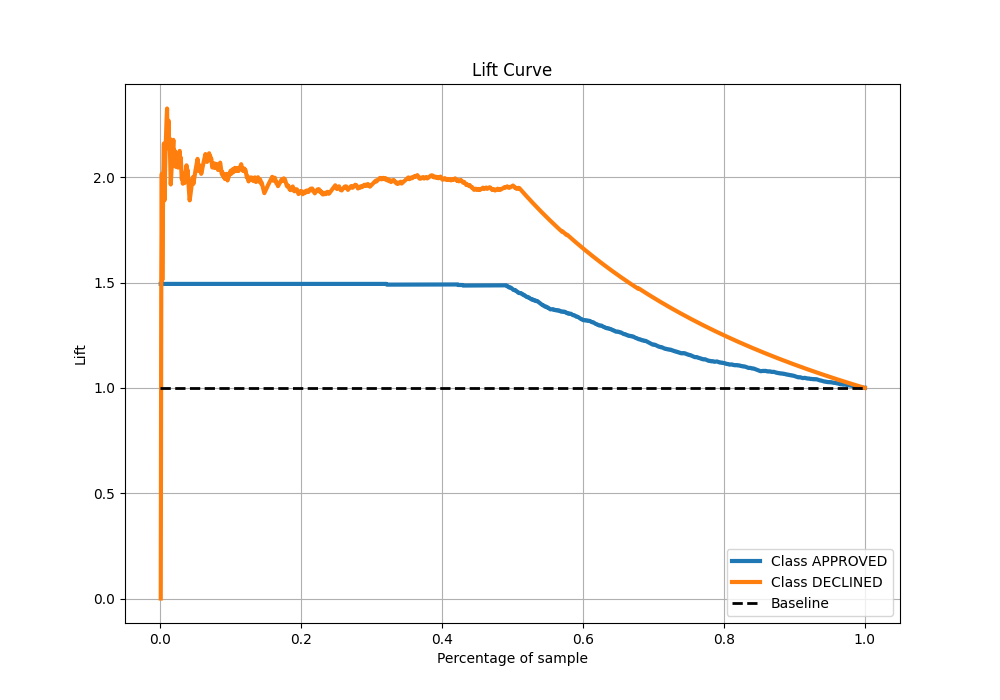

# Summary of 51_ExtraTrees

[<< Go back](../README.md)

## Extra Trees Classifier (Extra Trees)
- **n_jobs**: -1
- **criterion**: entropy
- **max_features**: 0.7
- **min_samples_split**: 30
- **max_depth**: 4
- **eval_metric_name**: auc
- **explain_level**: 0

## Validation
 - **validation_type**: split
 - **train_ratio**: 0.8
 - **shuffle**: True
 - **stratify**: True

## Optimized metric
auc

## Training time

2.3 seconds

## Metric details
|           |    score |   threshold |
|:----------|---------:|------------:|
| logloss   | 0.449654 |  nan        |
| auc       | 0.867825 |  nan        |
| f1        | 0.780142 |    0.455233 |
| accuracy  | 0.814925 |    0.455233 |
| precision | 0.693182 |    0.531761 |
| recall    | 1        |    0        |
| mcc       | 0.677676 |    0.455233 |

## Metric details with threshold from accuracy metric
|           |    score |   threshold |
|:----------|---------:|------------:|
| logloss   | 0.449654 |  nan        |
| auc       | 0.867825 |  nan        |
| f1        | 0.780142 |    0.455233 |
| accuracy  | 0.814925 |    0.455233 |
| precision | 0.642336 |    0.455233 |
| recall    | 0.993228 |    0.455233 |
| mcc       | 0.677676 |    0.455233 |

## Confusion matrix (at threshold=0.455233)
|                     |   Predicted as APPROVED |   Predicted as DECLINED |
|:--------------------|------------------------:|------------------------:|
| Labeled as APPROVED |                     652 |                     245 |
| Labeled as DECLINED |                       3 |                     440 |

## Learning curves

## Confusion Matrix

## Normalized Confusion Matrix

## ROC Curve

## Kolmogorov-Smirnov Statistic

## Precision-Recall Curve

## Calibration Curve

## Cumulative Gains Curve

## Lift Curve

[<< Go back](../README.md)
