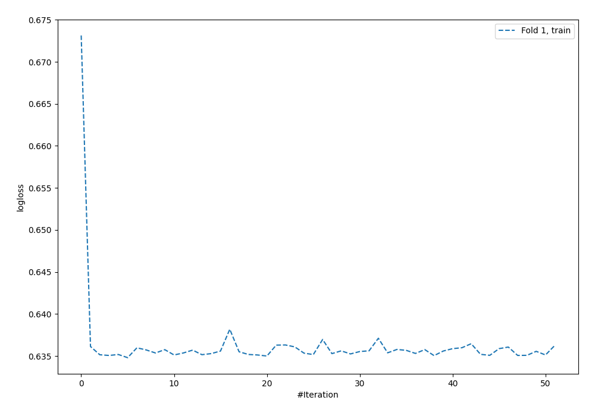
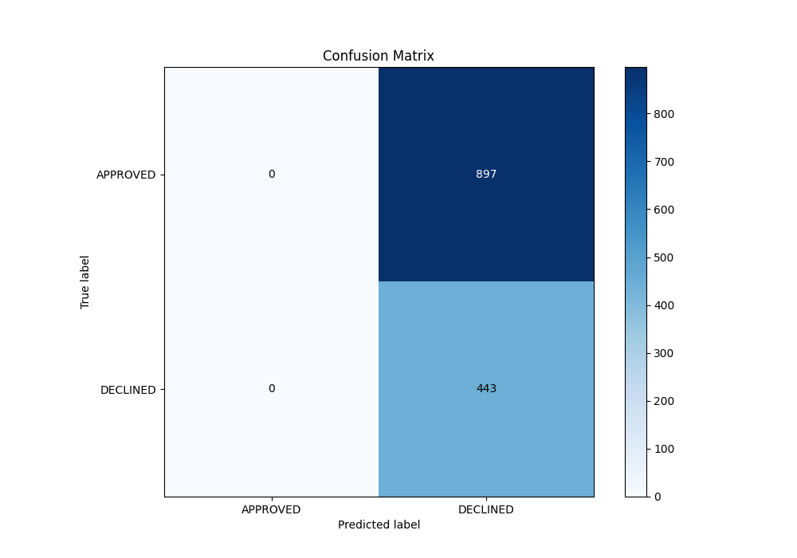
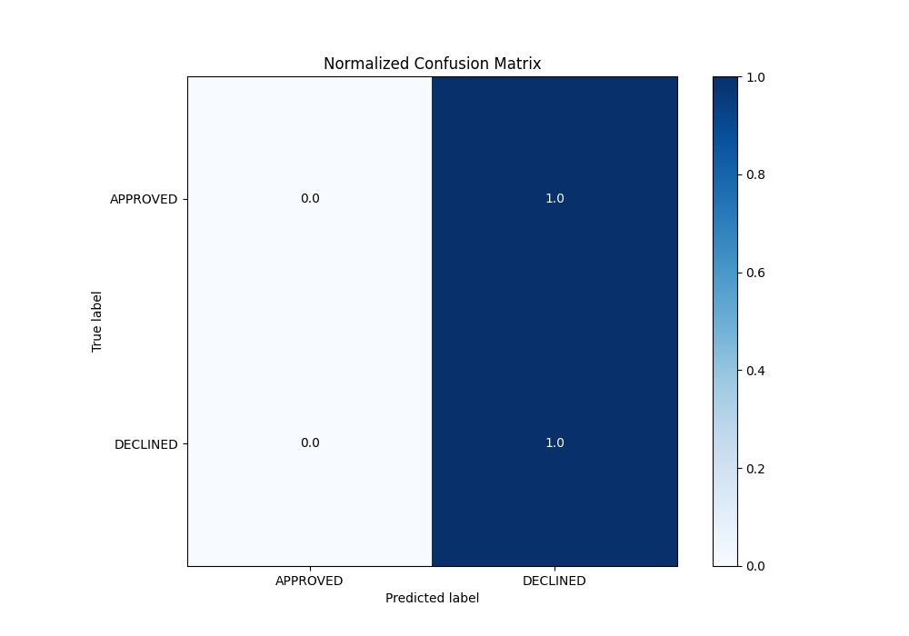
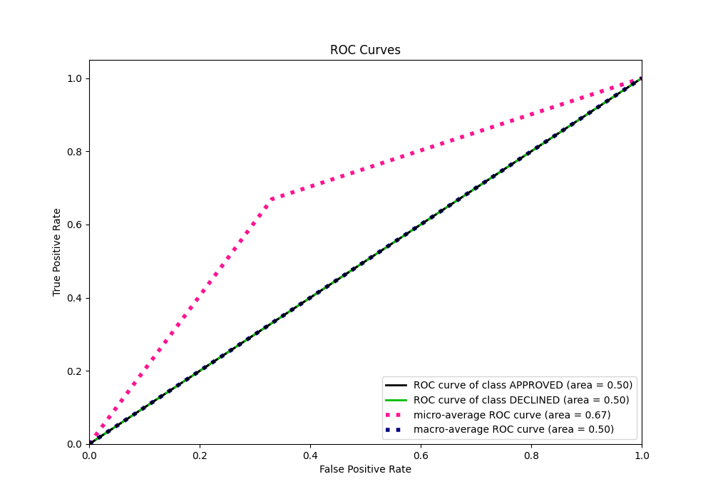
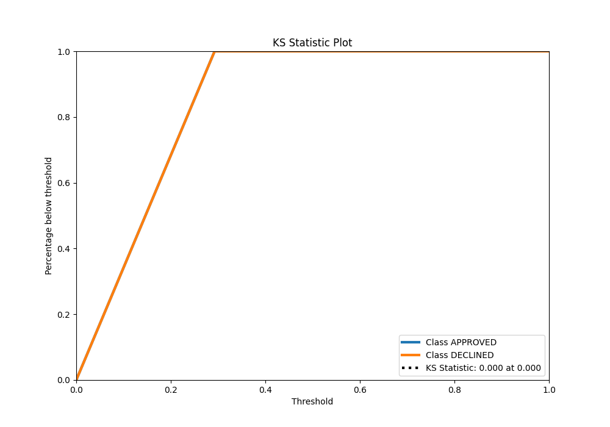
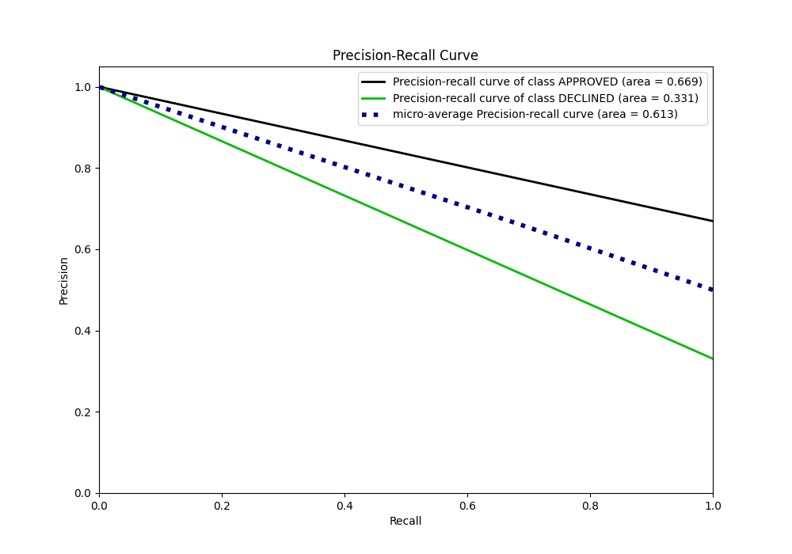
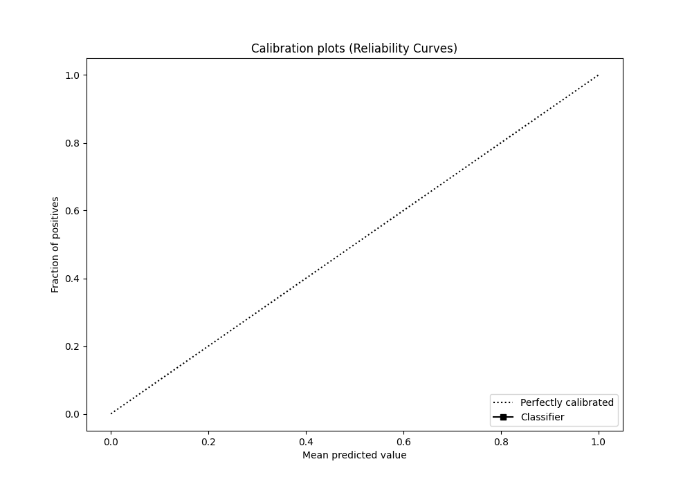
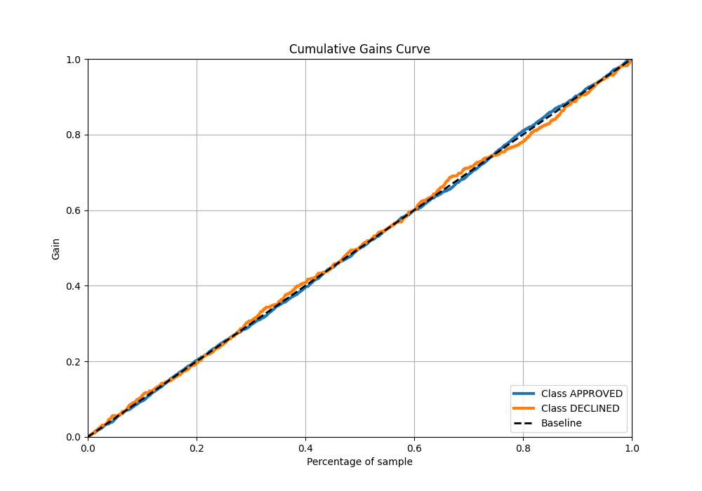
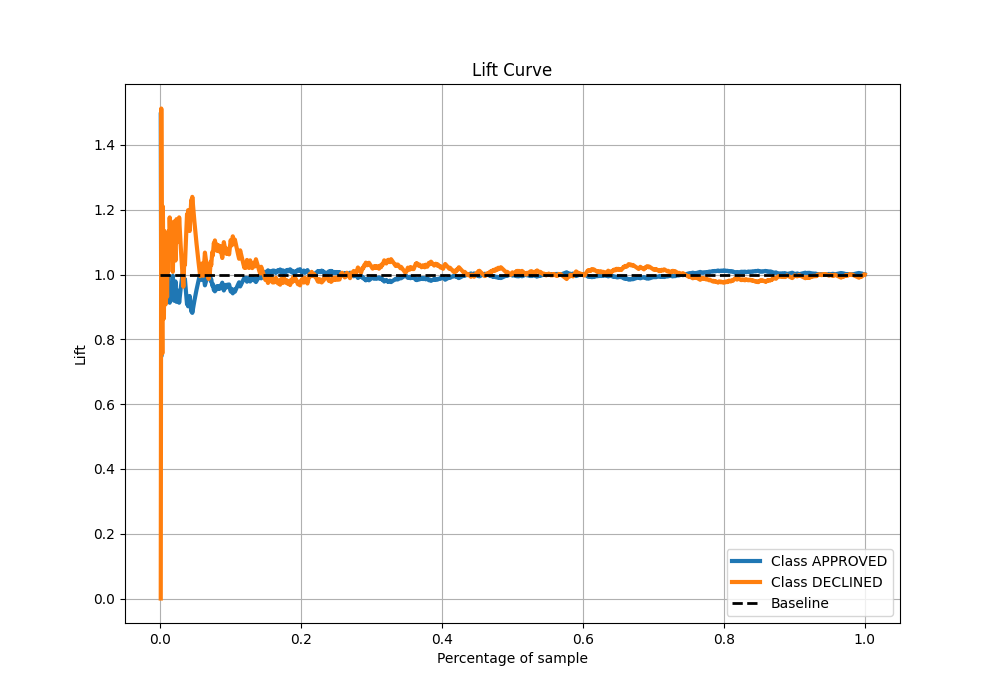

# Summary of 52_NeuralNetwork

[<< Go back](../README.md)

## Neural Network
- **n_jobs**: -1
- **dense_1_size**: 32
- **dense_2_size**: 4
- **learning_rate**: 0.1
- **explain_level**: 0

## Validation
 - **validation_type**: split
 - **train_ratio**: 0.8
 - **shuffle**: True
 - **stratify**: True

## Optimized metric
auc

## Training time

1.1 seconds

## Metric details
|           |    score |   threshold |
|:----------|---------:|------------:|
| logloss   | 0.637993 |  nan        |
| auc       | 0.5      |  nan        |
| f1        | 0.496915 |    0.263409 |
| accuracy  | 0.330597 |    0.263409 |
| precision | 0.330597 |    0.263409 |
| recall    | 1        |    0.263409 |
| mcc       | 0        |    0.263409 |

## Metric details with threshold from accuracy metric
|           |    score |   threshold |
|:----------|---------:|------------:|
| logloss   | 0.637993 |  nan        |
| auc       | 0.5      |  nan        |
| f1        | 0.496915 |    0.263409 |
| accuracy  | 0.330597 |    0.263409 |
| precision | 0.330597 |    0.263409 |
| recall    | 1        |    0.263409 |
| mcc       | 0        |    0.263409 |

## Confusion matrix (at threshold=0.263409)
|                     |   Predicted as APPROVED |   Predicted as DECLINED |
|:--------------------|------------------------:|------------------------:|
| Labeled as APPROVED |                       0 |                     897 |
| Labeled as DECLINED |                       0 |                     443 |

## Learning curves

## Confusion Matrix

## Normalized Confusion Matrix

## ROC Curve

## Kolmogorov-Smirnov Statistic

## Precision-Recall Curve

## Calibration Curve

## Cumulative Gains Curve

## Lift Curve

[<< Go back](../README.md)
