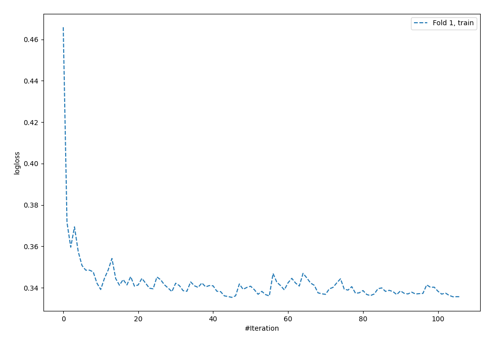
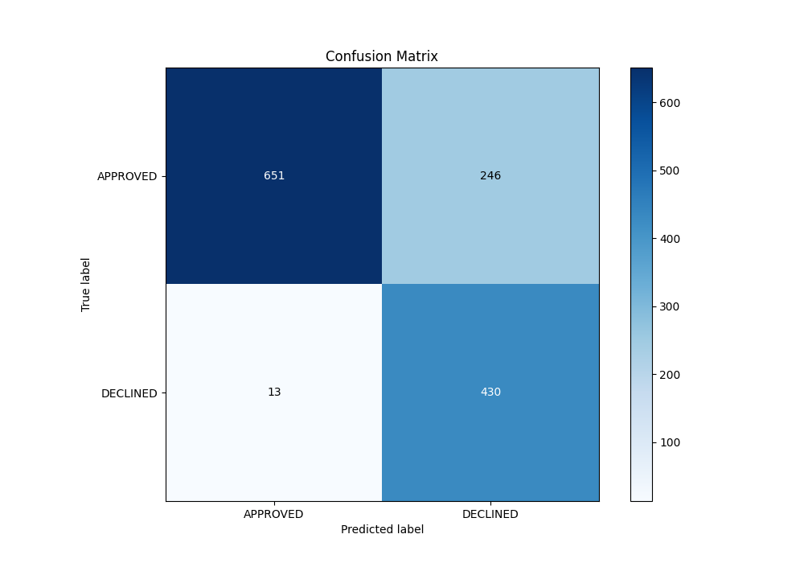
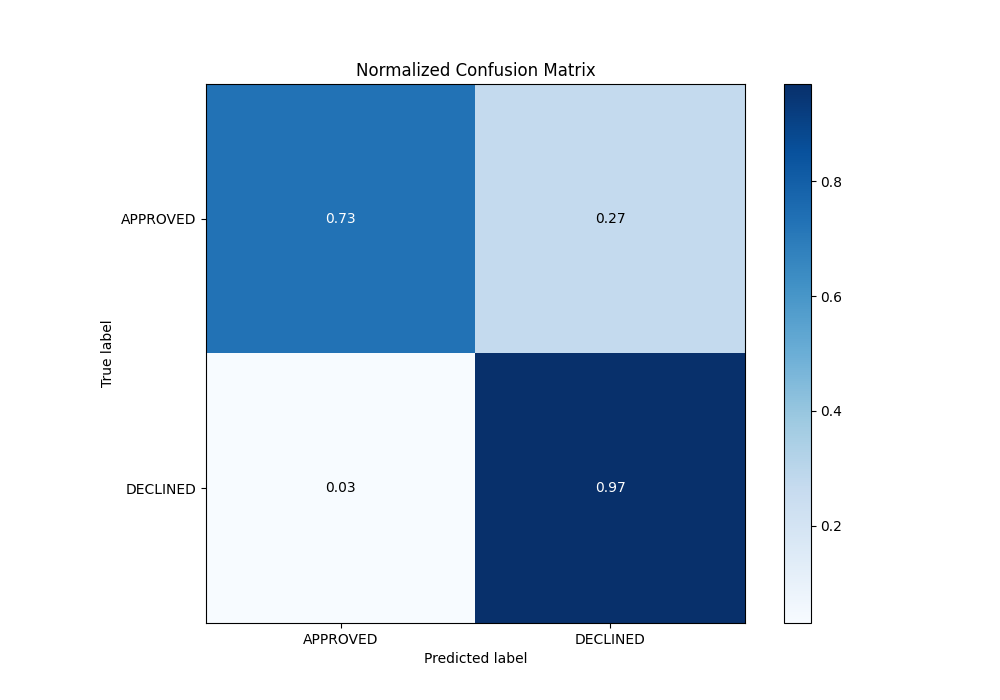
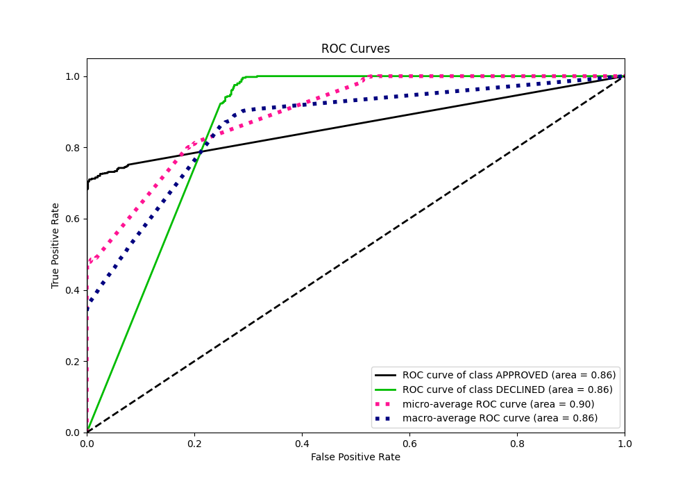
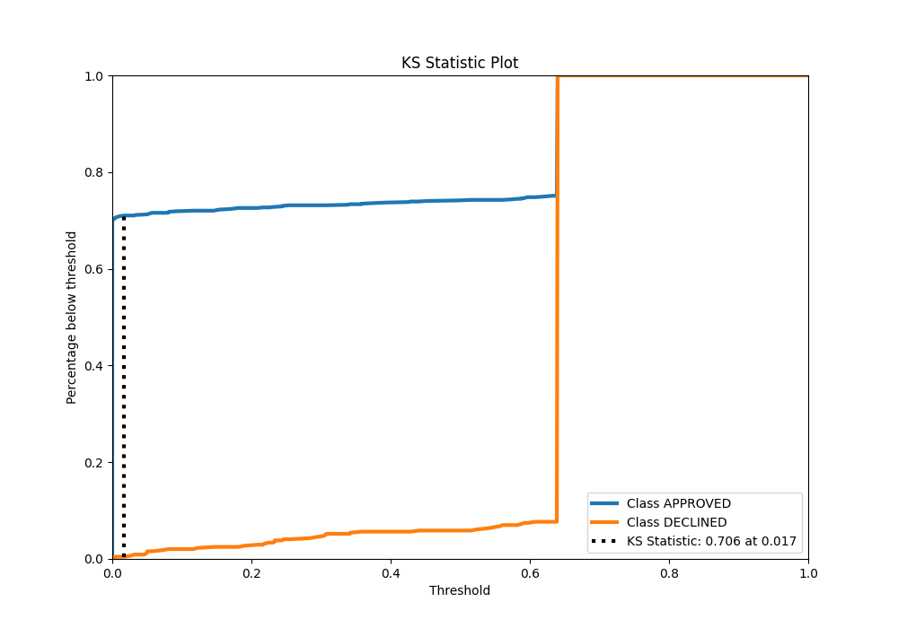
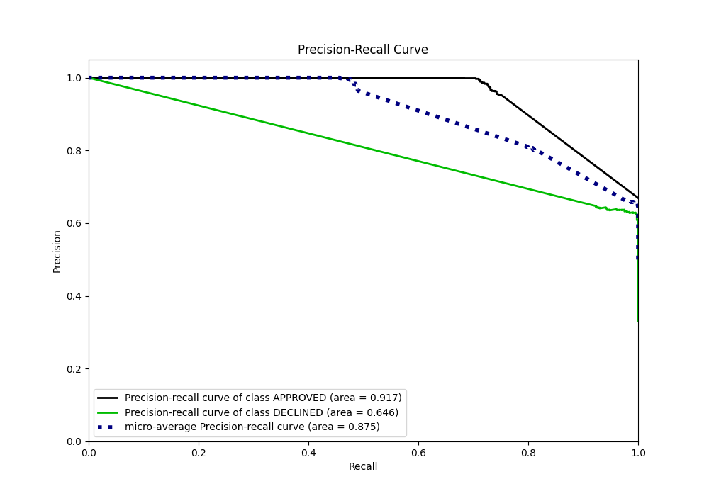
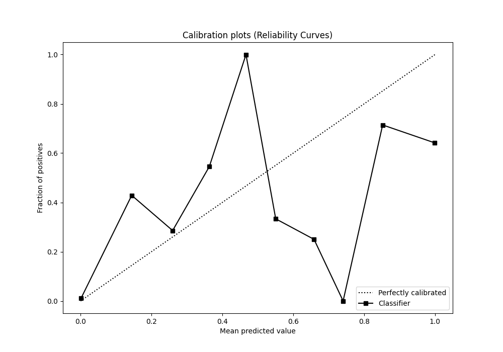
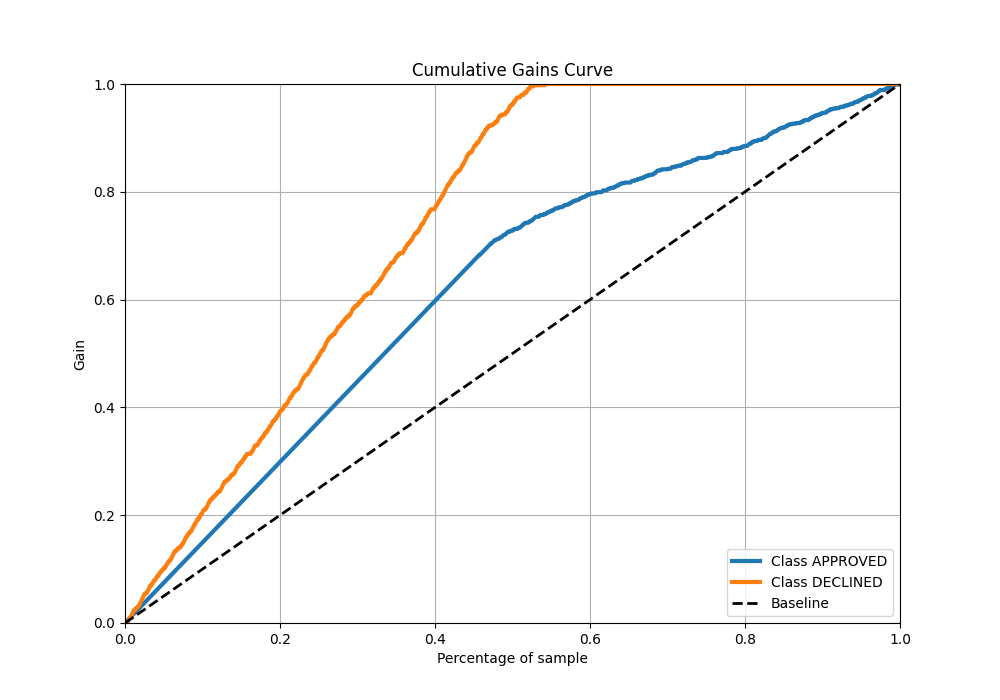
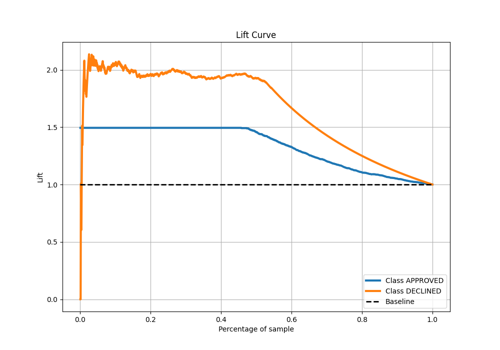

# Summary of 53_NeuralNetwork

[<< Go back](../README.md)

## Neural Network
- **n_jobs**: -1
- **dense_1_size**: 64
- **dense_2_size**: 4
- **learning_rate**: 0.05
- **explain_level**: 0

## Validation
 - **validation_type**: split
 - **train_ratio**: 0.8
 - **shuffle**: True
 - **stratify**: True

## Optimized metric
auc

## Training time

3.1 seconds

## Metric details
|           |    score |   threshold |
|:----------|---------:|------------:|
| logloss   | 0.369496 | nan         |
| auc       | 0.864294 | nan         |
| f1        | 0.770306 |   0.0144145 |
| accuracy  | 0.806716 |   0.213048  |
| precision | 0.643642 |   0.595018  |
| recall    | 1        |   0         |
| mcc       | 0.663605 |   0.0144145 |

## Metric details with threshold from accuracy metric
|           |    score |   threshold |
|:----------|---------:|------------:|
| logloss   | 0.369496 |  nan        |
| auc       | 0.864294 |  nan        |
| f1        | 0.768543 |    0.213048 |
| accuracy  | 0.806716 |    0.213048 |
| precision | 0.636095 |    0.213048 |
| recall    | 0.970655 |    0.213048 |
| mcc       | 0.655245 |    0.213048 |

## Confusion matrix (at threshold=0.213048)
|                     |   Predicted as APPROVED |   Predicted as DECLINED |
|:--------------------|------------------------:|------------------------:|
| Labeled as APPROVED |                     651 |                     246 |
| Labeled as DECLINED |                      13 |                     430 |

## Learning curves

## Confusion Matrix

## Normalized Confusion Matrix

## ROC Curve

## Kolmogorov-Smirnov Statistic

## Precision-Recall Curve

## Calibration Curve

## Cumulative Gains Curve

## Lift Curve

[<< Go back](../README.md)
