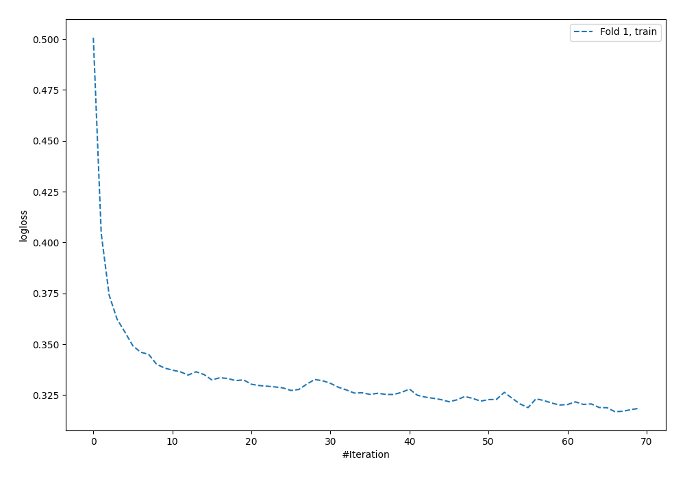
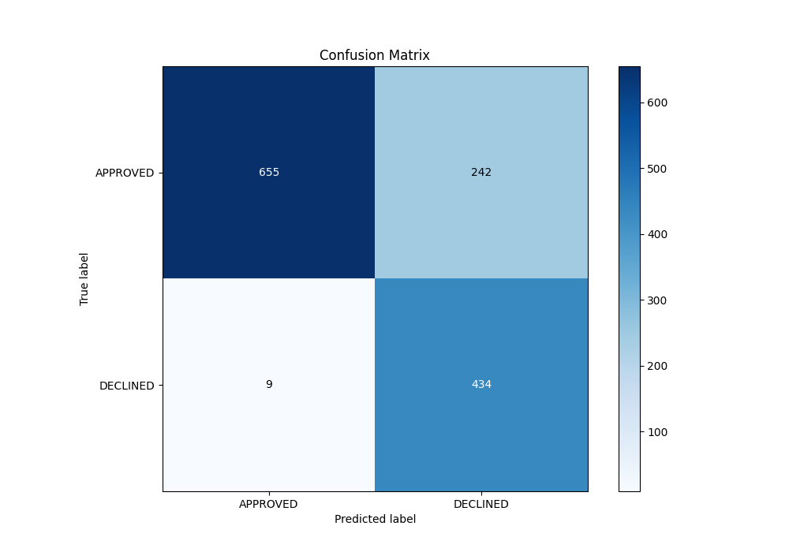
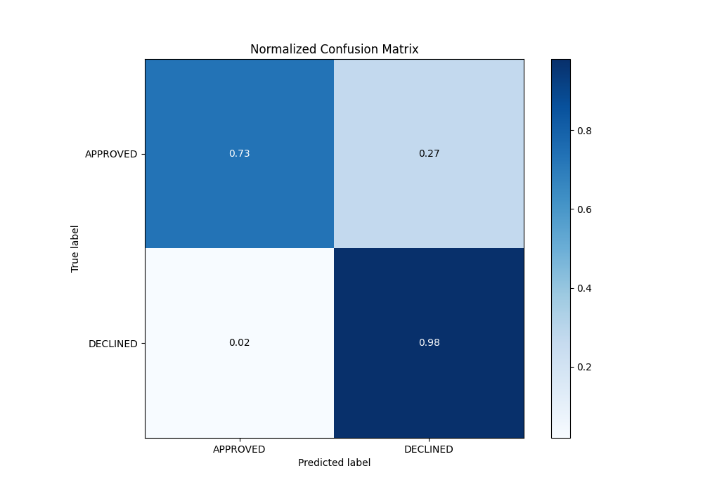
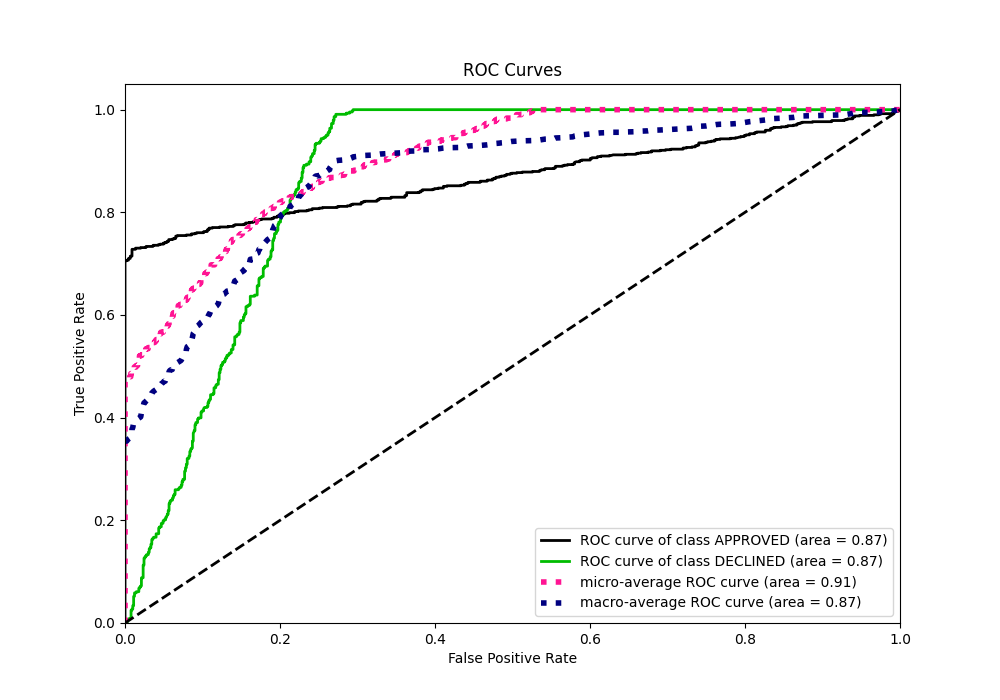
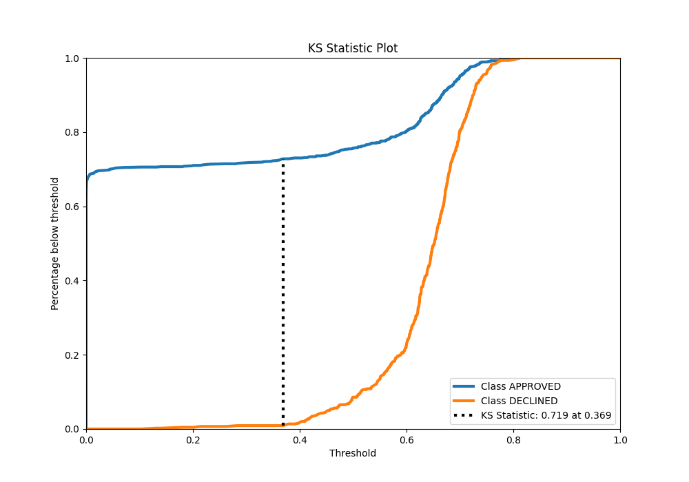
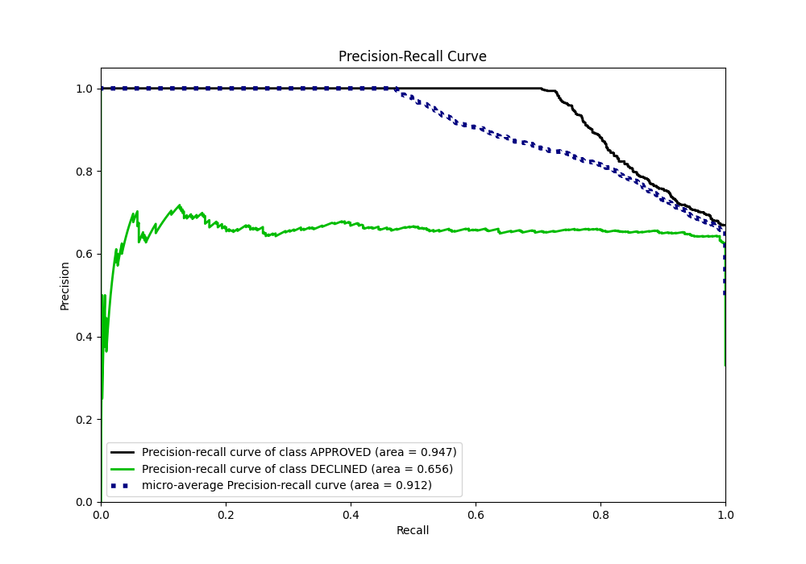
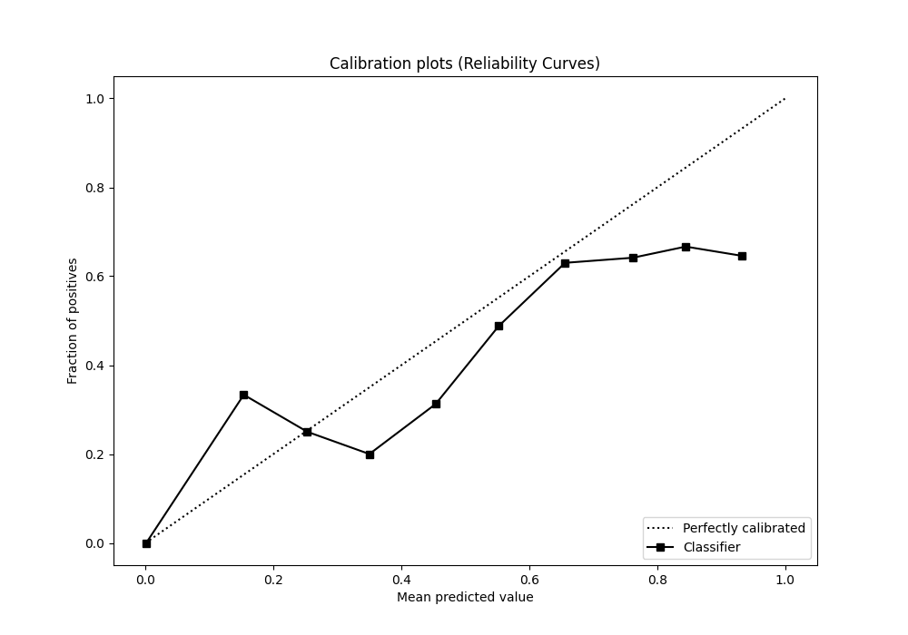
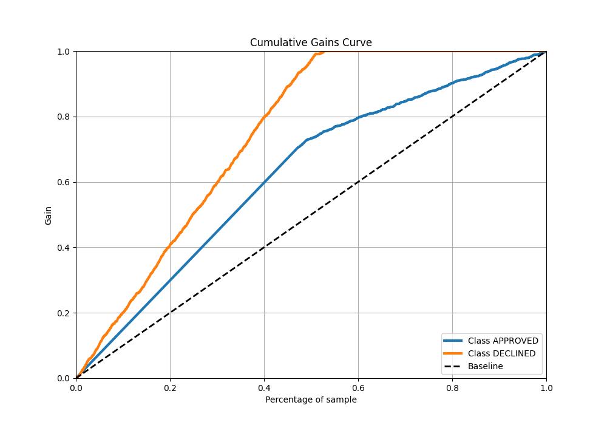
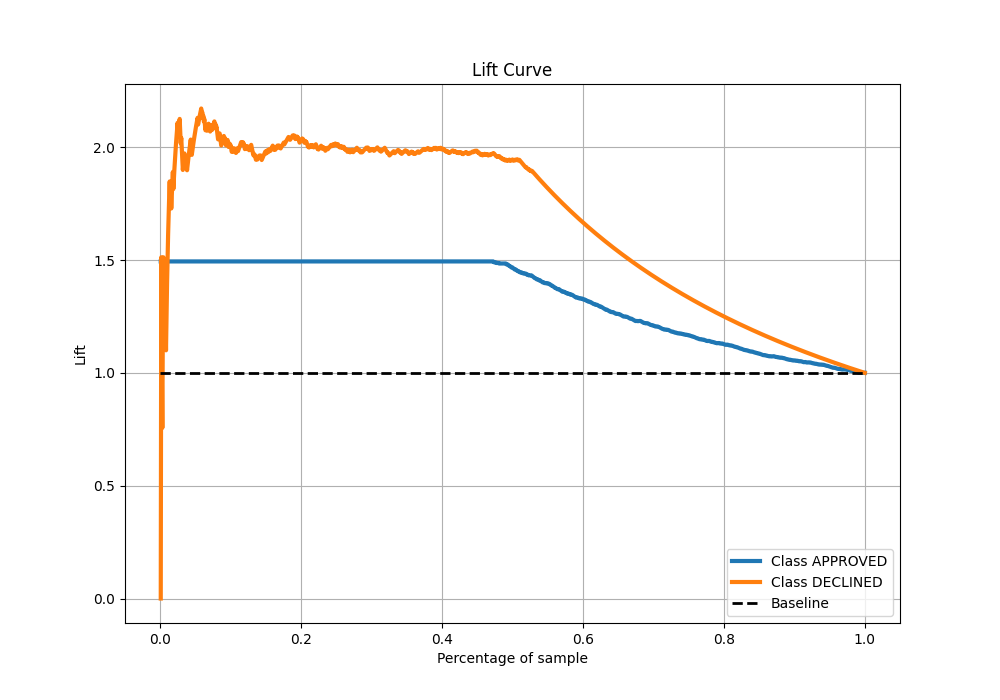

# Summary of 55_NeuralNetwork

[<< Go back](../README.md)

## Neural Network
- **n_jobs**: -1
- **dense_1_size**: 16
- **dense_2_size**: 8
- **learning_rate**: 0.01
- **explain_level**: 0

## Validation
 - **validation_type**: split
 - **train_ratio**: 0.8
 - **shuffle**: True
 - **stratify**: True

## Optimized metric
auc

## Training time

2.1 seconds

## Metric details
|           |    score |     threshold |
|:----------|---------:|--------------:|
| logloss   | 0.345937 | nan           |
| auc       | 0.870299 | nan           |
| f1        | 0.775693 |   0.406947    |
| accuracy  | 0.812687 |   0.406947    |
| precision | 0.717949 |   0.719528    |
| recall    | 1        |   6.59063e-53 |
| mcc       | 0.670408 |   0.347865    |

## Metric details with threshold from accuracy metric
|           |    score |   threshold |
|:----------|---------:|------------:|
| logloss   | 0.345937 |  nan        |
| auc       | 0.870299 |  nan        |
| f1        | 0.775693 |    0.406947 |
| accuracy  | 0.812687 |    0.406947 |
| precision | 0.642012 |    0.406947 |
| recall    | 0.979684 |    0.406947 |
| mcc       | 0.667937 |    0.406947 |

## Confusion matrix (at threshold=0.406947)
|                     |   Predicted as APPROVED |   Predicted as DECLINED |
|:--------------------|------------------------:|------------------------:|
| Labeled as APPROVED |                     655 |                     242 |
| Labeled as DECLINED |                       9 |                     434 |

## Learning curves

## Confusion Matrix

## Normalized Confusion Matrix

## ROC Curve

## Kolmogorov-Smirnov Statistic

## Precision-Recall Curve

## Calibration Curve

## Cumulative Gains Curve

## Lift Curve

[<< Go back](../README.md)
