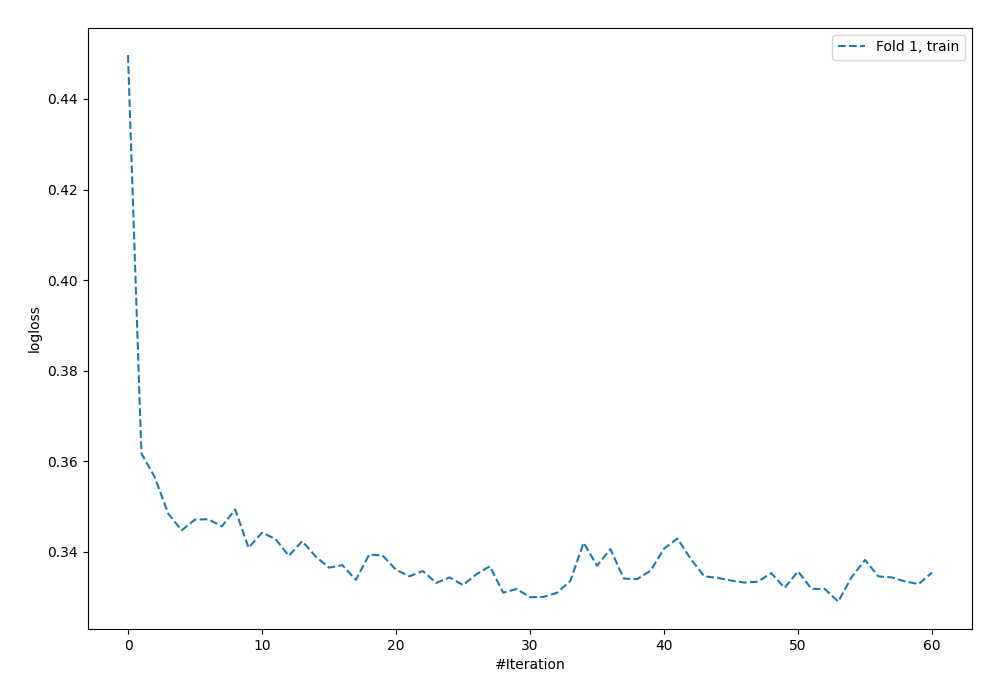
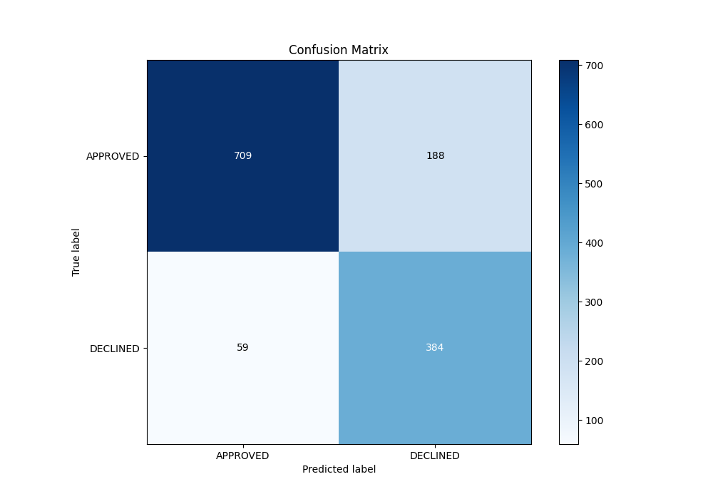
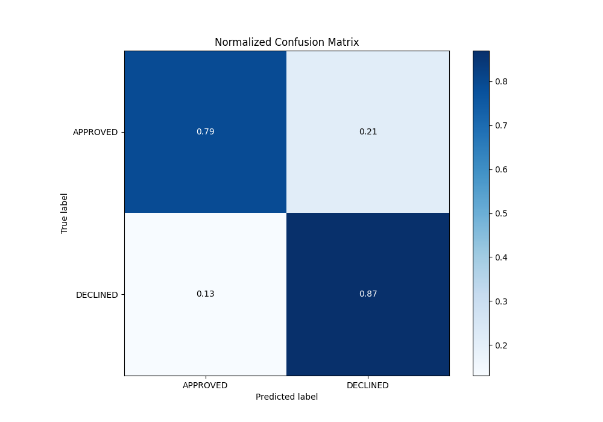
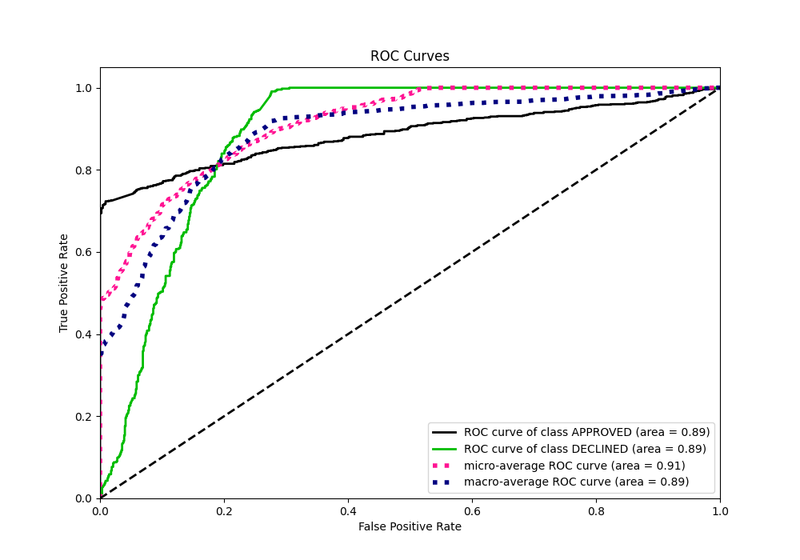
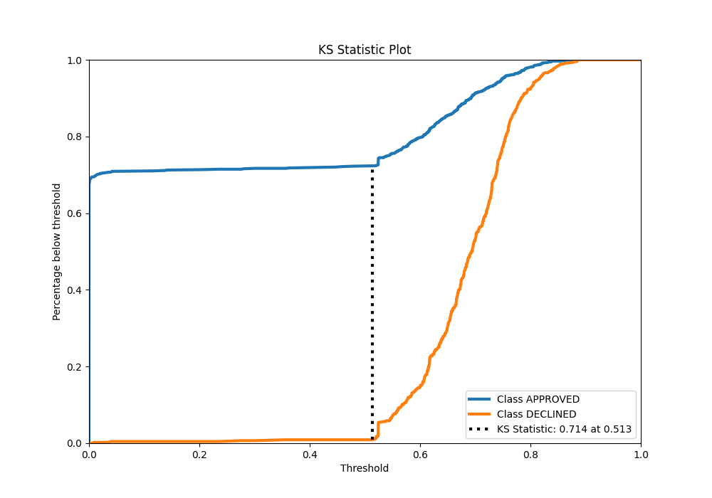
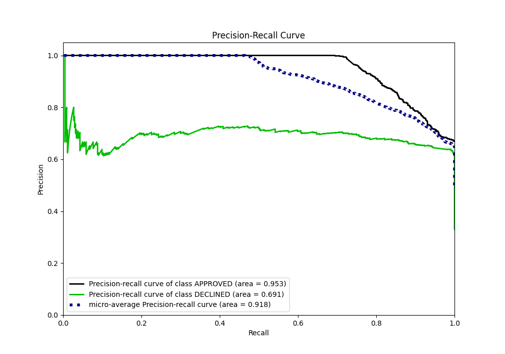
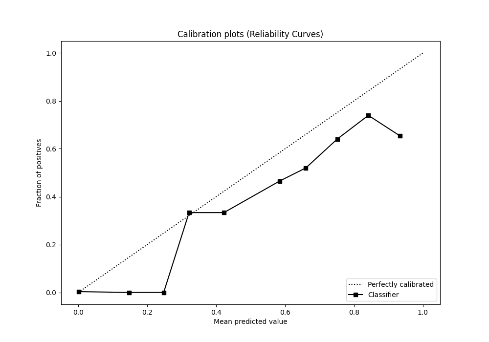
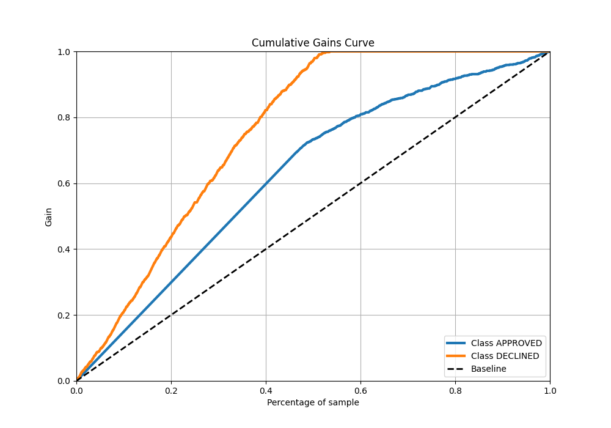
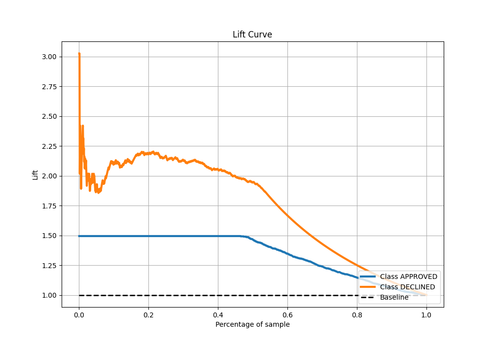

# Summary of 57_NeuralNetwork

[<< Go back](../README.md)

## Neural Network
- **n_jobs**: -1
- **dense_1_size**: 64
- **dense_2_size**: 16
- **learning_rate**: 0.05
- **explain_level**: 0

## Validation
 - **validation_type**: split
 - **train_ratio**: 0.8
 - **shuffle**: True
 - **stratify**: True

## Optimized metric
auc

## Training time

3.1 seconds

## Metric details
|           |    score |      threshold |
|:----------|---------:|---------------:|
| logloss   | 0.34387  | nan            |
| auc       | 0.886352 | nan            |
| f1        | 0.775618 |   0.467188     |
| accuracy  | 0.815672 |   0.589779     |
| precision | 0.727273 |   0.699847     |
| recall    | 1        |   1.72186e-150 |
| mcc       | 0.670408 |   0.467188     |

## Metric details with threshold from accuracy metric
|           |    score |   threshold |
|:----------|---------:|------------:|
| logloss   | 0.34387  |  nan        |
| auc       | 0.886352 |  nan        |
| f1        | 0.75665  |    0.589779 |
| accuracy  | 0.815672 |    0.589779 |
| precision | 0.671329 |    0.589779 |
| recall    | 0.866817 |    0.589779 |
| mcc       | 0.625081 |    0.589779 |

## Confusion matrix (at threshold=0.589779)
|                     |   Predicted as APPROVED |   Predicted as DECLINED |
|:--------------------|------------------------:|------------------------:|
| Labeled as APPROVED |                     709 |                     188 |
| Labeled as DECLINED |                      59 |                     384 |

## Learning curves

## Confusion Matrix

## Normalized Confusion Matrix

## ROC Curve

## Kolmogorov-Smirnov Statistic

## Precision-Recall Curve

## Calibration Curve

## Cumulative Gains Curve

## Lift Curve

[<< Go back](../README.md)
