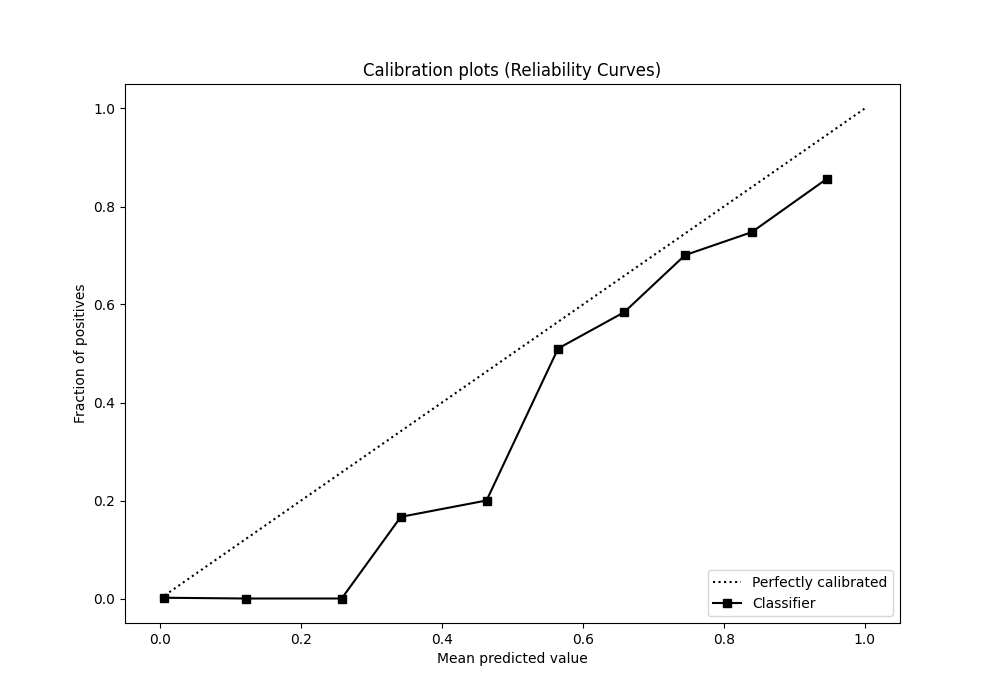

# Summary of 62_CatBoost

[<< Go back](../README.md)

## CatBoost
- **n_jobs**: -1
- **learning_rate**: 0.2
- **depth**: 8
- **rsm**: 1.0
- **loss_function**: Logloss
- **eval_metric**: AUC
- **explain_level**: 0

## Validation
 - **validation_type**: split
 - **train_ratio**: 0.8
 - **shuffle**: True
 - **stratify**: True

## Optimized metric
auc

## Training time

2.4 seconds

## Metric details
|           |    score |     threshold |
|:----------|---------:|--------------:|
| logloss   | 0.323503 | nan           |
| auc       | 0.899098 | nan           |
| f1        | 0.788427 |   0.468752    |
| accuracy  | 0.829104 |   0.54657     |
| precision | 0.815385 |   0.743722    |
| recall    | 1        |   8.07771e-05 |
| mcc       | 0.690147 |   0.334632    |

## Metric details with threshold from accuracy metric
|           |    score |   threshold |
|:----------|---------:|------------:|
| logloss   | 0.323503 |   nan       |
| auc       | 0.899098 |   nan       |
| f1        | 0.780019 |     0.54657 |
| accuracy  | 0.829104 |     0.54657 |
| precision | 0.67893  |     0.54657 |
| recall    | 0.916479 |     0.54657 |
| mcc       | 0.664737 |     0.54657 |

## Confusion matrix (at threshold=0.54657)
|                     |   Predicted as APPROVED |   Predicted as DECLINED |
|:--------------------|------------------------:|------------------------:|
| Labeled as APPROVED |                     705 |                     192 |
| Labeled as DECLINED |                      37 |                     406 |

## Learning curves

## Confusion Matrix

## Normalized Confusion Matrix

## ROC Curve

## Kolmogorov-Smirnov Statistic

## Precision-Recall Curve

## Calibration Curve

## Cumulative Gains Curve

## Lift Curve

[<< Go back](../README.md)
