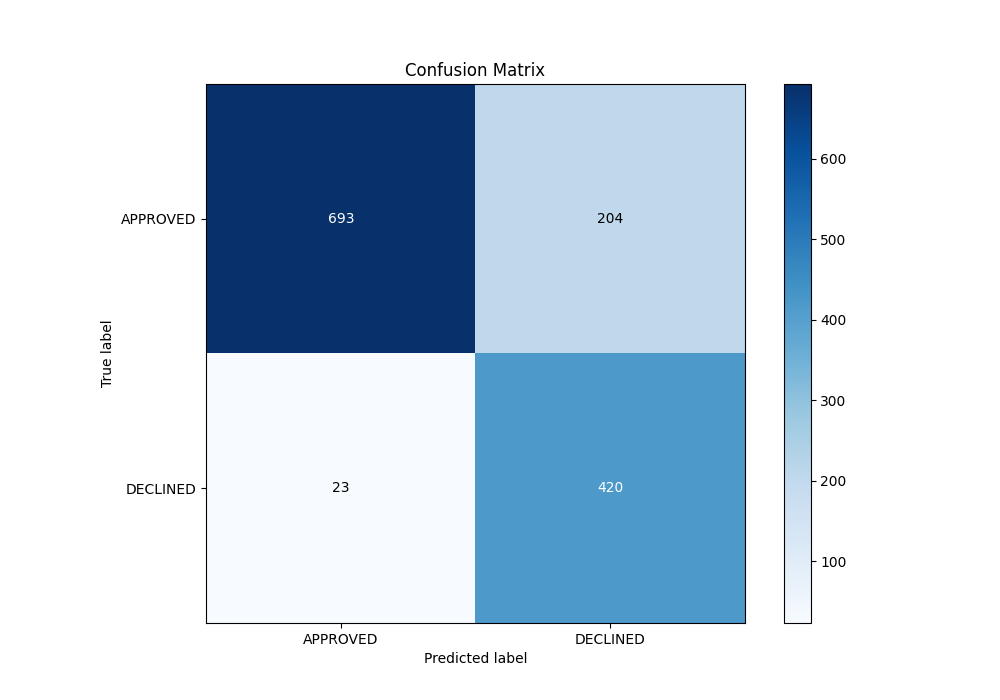
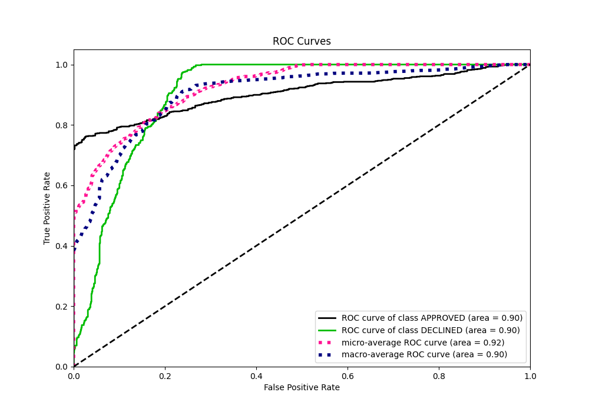

# Summary of 63_CatBoost

[<< Go back](../README.md)

## CatBoost
- **n_jobs**: -1
- **learning_rate**: 0.05
- **depth**: 6
- **rsm**: 1.0
- **loss_function**: Logloss
- **eval_metric**: AUC
- **explain_level**: 0

## Validation
 - **validation_type**: split
 - **train_ratio**: 0.8
 - **shuffle**: True
 - **stratify**: True

## Optimized metric
auc

## Training time

2.6 seconds

## Metric details
|           |    score |     threshold |
|:----------|---------:|--------------:|
| logloss   | 0.323591 | nan           |
| auc       | 0.904046 | nan           |
| f1        | 0.790485 |   0.547193    |
| accuracy  | 0.830597 |   0.562294    |
| precision | 0.826923 |   0.712795    |
| recall    | 1        |   0.000190908 |
| mcc       | 0.689143 |   0.547193    |

## Metric details with threshold from accuracy metric
|           |    score |   threshold |
|:----------|---------:|------------:|
| logloss   | 0.323591 |  nan        |
| auc       | 0.904046 |  nan        |
| f1        | 0.787254 |    0.562294 |
| accuracy  | 0.830597 |    0.562294 |
| precision | 0.673077 |    0.562294 |
| recall    | 0.948081 |    0.562294 |
| mcc       | 0.679638 |    0.562294 |

## Confusion matrix (at threshold=0.562294)
|                     |   Predicted as APPROVED |   Predicted as DECLINED |
|:--------------------|------------------------:|------------------------:|
| Labeled as APPROVED |                     693 |                     204 |
| Labeled as DECLINED |                      23 |                     420 |

## Learning curves

## Confusion Matrix

## Normalized Confusion Matrix

## ROC Curve

## Kolmogorov-Smirnov Statistic

## Precision-Recall Curve

## Calibration Curve

## Cumulative Gains Curve

## Lift Curve

[<< Go back](../README.md)
