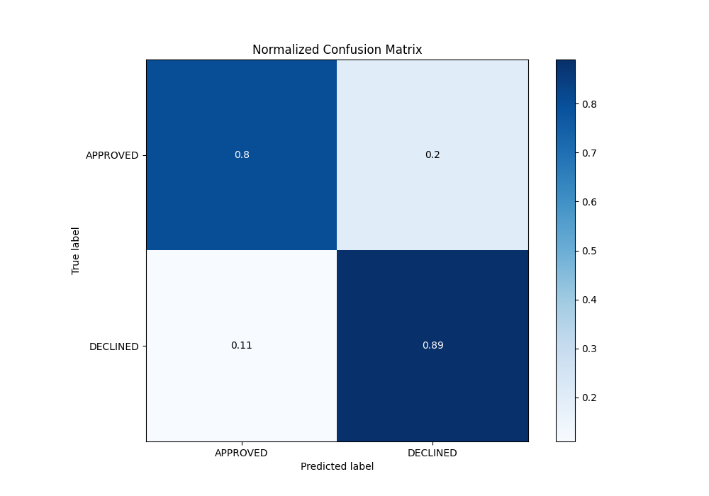

# Summary of 64_CatBoost

[<< Go back](../README.md)

## CatBoost
- **n_jobs**: -1
- **learning_rate**: 0.05
- **depth**: 8
- **rsm**: 1.0
- **loss_function**: Logloss
- **eval_metric**: AUC
- **explain_level**: 0

## Validation
 - **validation_type**: split
 - **train_ratio**: 0.8
 - **shuffle**: True
 - **stratify**: True

## Optimized metric
auc

## Training time

2.9 seconds

## Metric details
|           |    score |    threshold |
|:----------|---------:|-------------:|
| logloss   | 0.328369 | nan          |
| auc       | 0.905574 | nan          |
| f1        | 0.786618 |   0.542149   |
| accuracy  | 0.829104 |   0.589972   |
| precision | 0.884615 |   0.687427   |
| recall    | 1        |   0.00134688 |
| mcc       | 0.686974 |   0.469773   |

## Metric details with threshold from accuracy metric
|           |    score |   threshold |
|:----------|---------:|------------:|
| logloss   | 0.328369 |  nan        |
| auc       | 0.905574 |  nan        |
| f1        | 0.774384 |    0.589972 |
| accuracy  | 0.829104 |    0.589972 |
| precision | 0.687063 |    0.589972 |
| recall    | 0.887133 |    0.589972 |
| mcc       | 0.653946 |    0.589972 |

## Confusion matrix (at threshold=0.589972)
|                     |   Predicted as APPROVED |   Predicted as DECLINED |
|:--------------------|------------------------:|------------------------:|
| Labeled as APPROVED |                     718 |                     179 |
| Labeled as DECLINED |                      50 |                     393 |

## Learning curves

## Confusion Matrix

## Normalized Confusion Matrix

## ROC Curve

## Kolmogorov-Smirnov Statistic

## Precision-Recall Curve

## Calibration Curve

## Cumulative Gains Curve

## Lift Curve

[<< Go back](../README.md)
