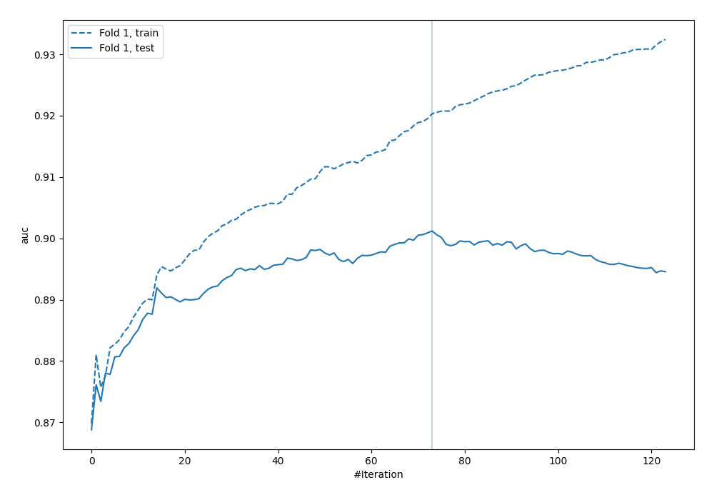
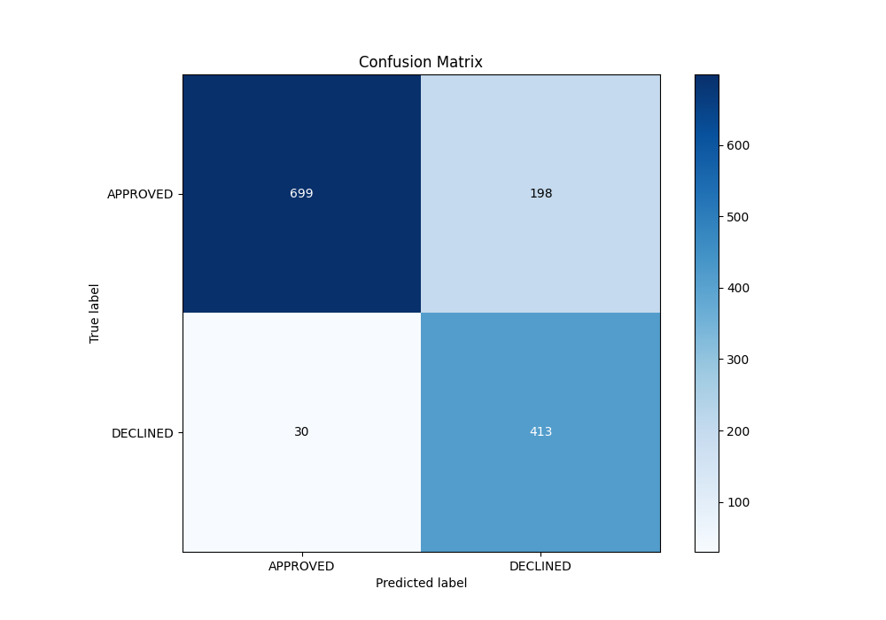
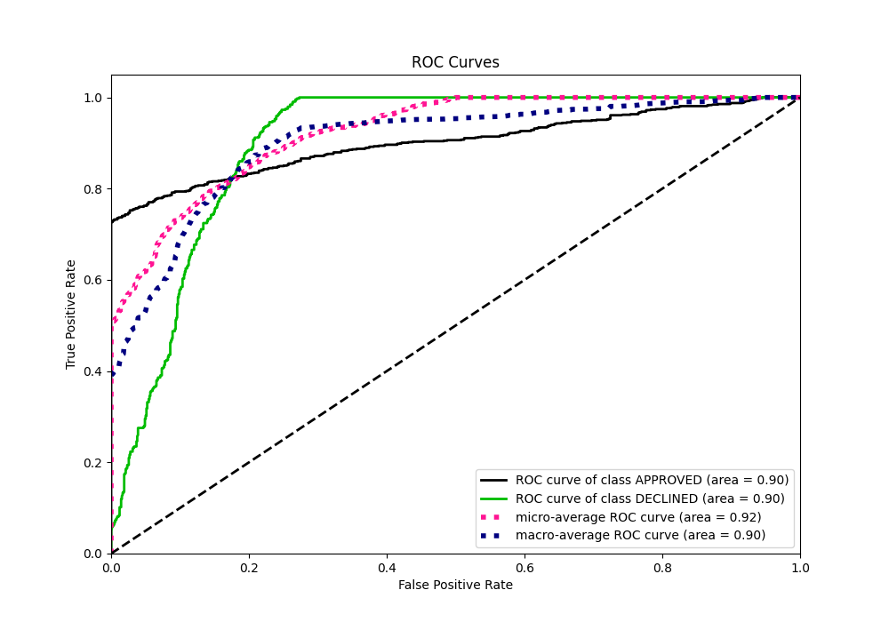
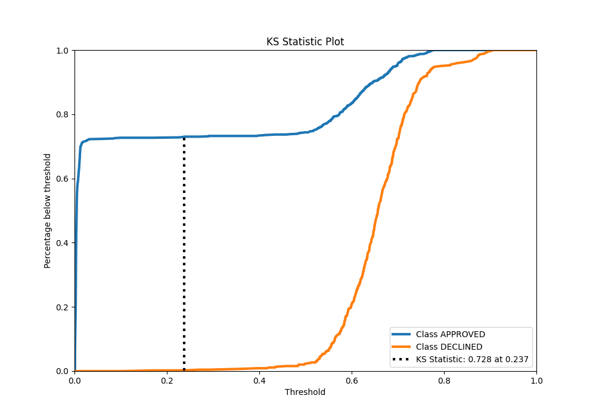
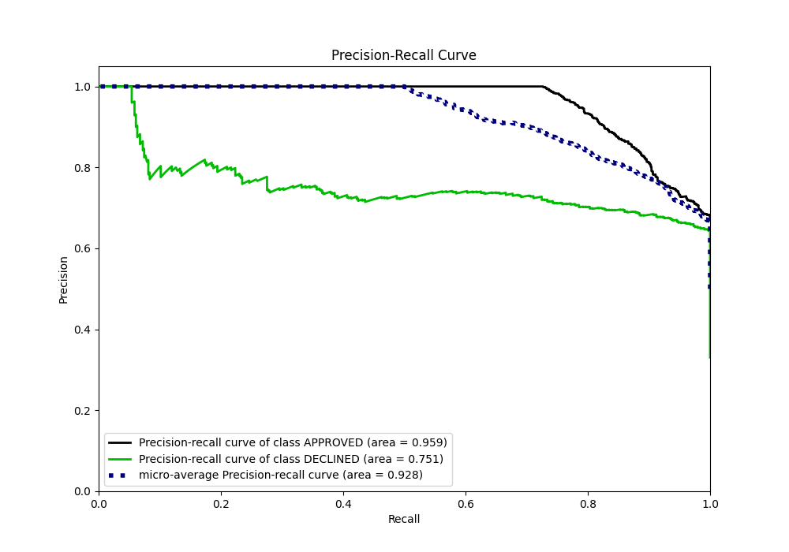
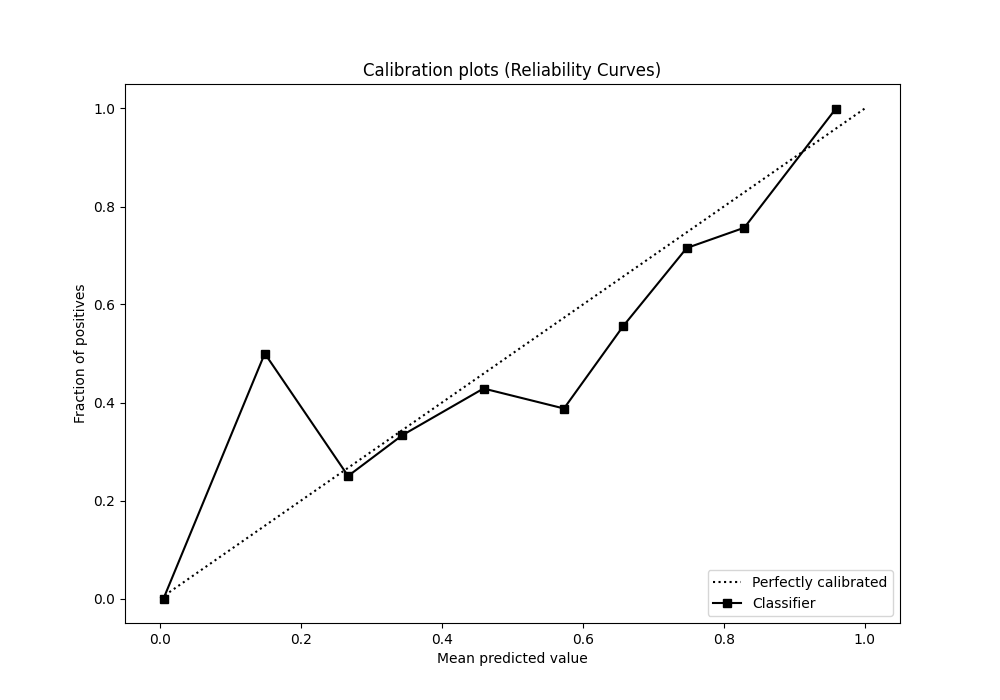
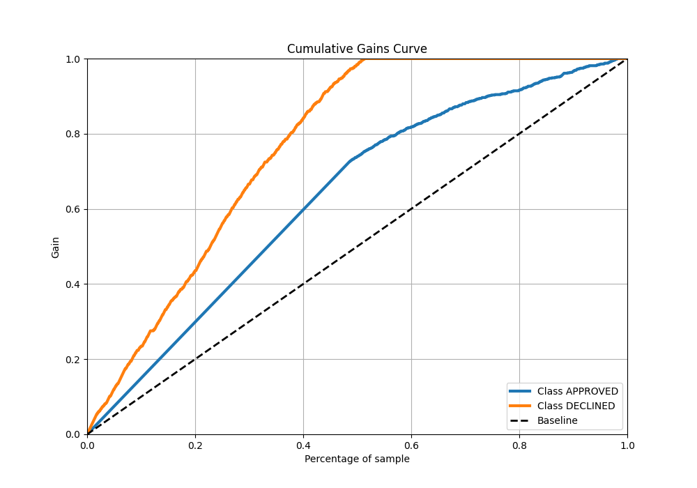
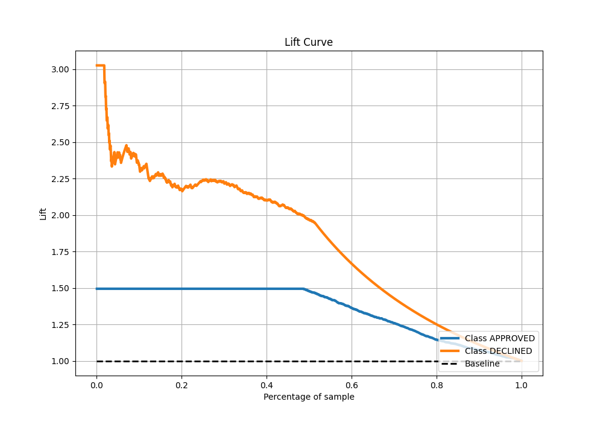

# Summary of 66_Xgboost

[<< Go back](../README.md)

## Extreme Gradient Boosting (Xgboost)
- **n_jobs**: -1
- **objective**: binary:logistic
- **eta**: 0.1
- **max_depth**: 4
- **min_child_weight**: 5
- **subsample**: 0.7
- **colsample_bytree**: 0.6
- **eval_metric**: auc
- **explain_level**: 0

## Validation
 - **validation_type**: split
 - **train_ratio**: 0.8
 - **shuffle**: True
 - **stratify**: True

## Optimized metric
auc

## Training time

1.9 seconds

## Metric details
|           |    score |     threshold |
|:----------|---------:|--------------:|
| logloss   | 0.322961 | nan           |
| auc       | 0.901198 | nan           |
| f1        | 0.784995 |   0.525308    |
| accuracy  | 0.829851 |   0.551493    |
| precision | 0.813187 |   0.726863    |
| recall    | 1        |   0.000711365 |
| mcc       | 0.683801 |   0.418707    |

## Metric details with threshold from accuracy metric
|           |    score |   threshold |
|:----------|---------:|------------:|
| logloss   | 0.322961 |  nan        |
| auc       | 0.901198 |  nan        |
| f1        | 0.783681 |    0.551493 |
| accuracy  | 0.829851 |    0.551493 |
| precision | 0.675941 |    0.551493 |
| recall    | 0.93228  |    0.551493 |
| mcc       | 0.672072 |    0.551493 |

## Confusion matrix (at threshold=0.551493)
|                     |   Predicted as APPROVED |   Predicted as DECLINED |
|:--------------------|------------------------:|------------------------:|
| Labeled as APPROVED |                     699 |                     198 |
| Labeled as DECLINED |                      30 |                     413 |

## Learning curves

## Confusion Matrix

## Normalized Confusion Matrix

## ROC Curve

## Kolmogorov-Smirnov Statistic

## Precision-Recall Curve

## Calibration Curve

## Cumulative Gains Curve

## Lift Curve

[<< Go back](../README.md)
