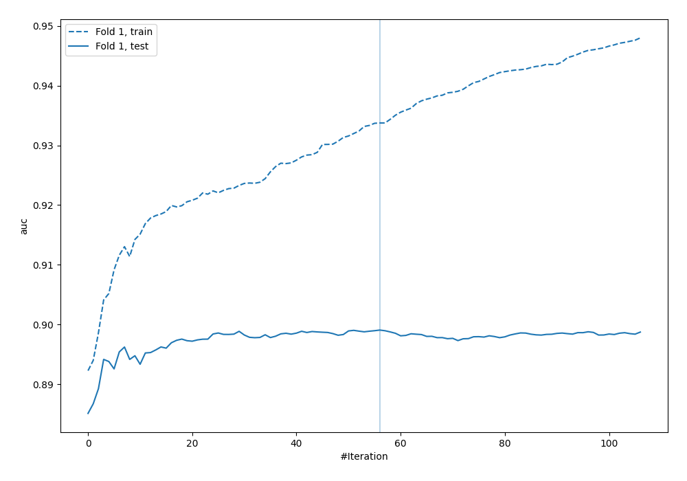
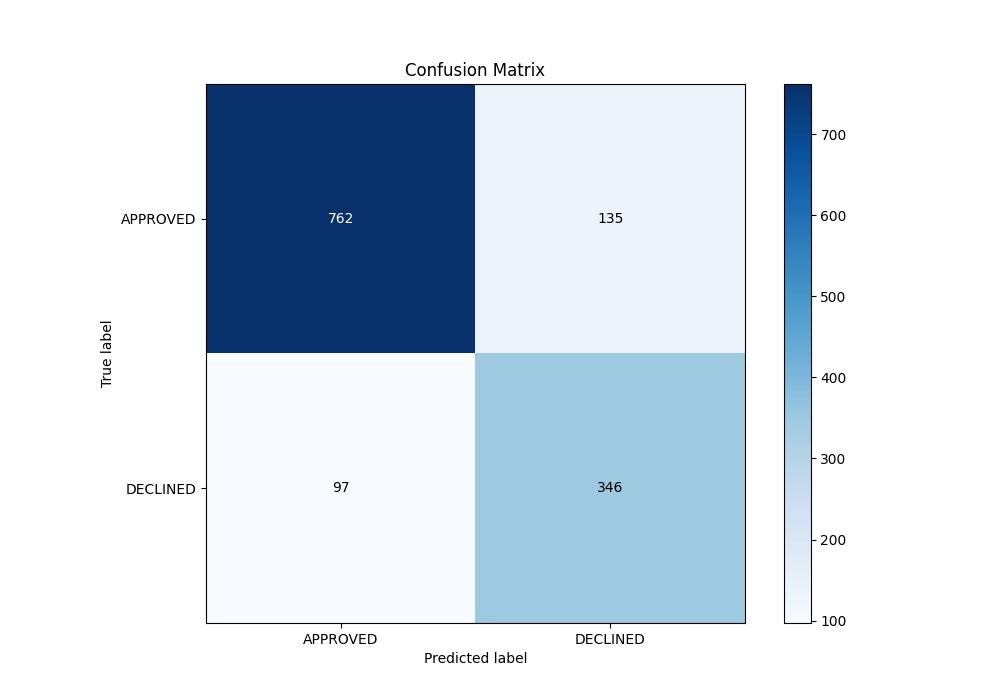
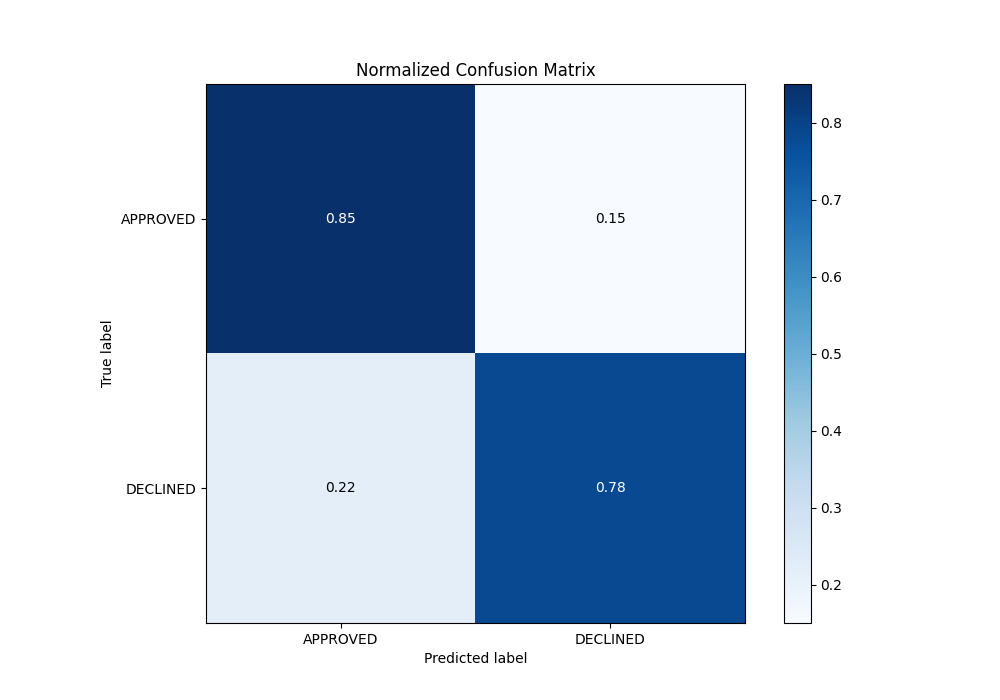
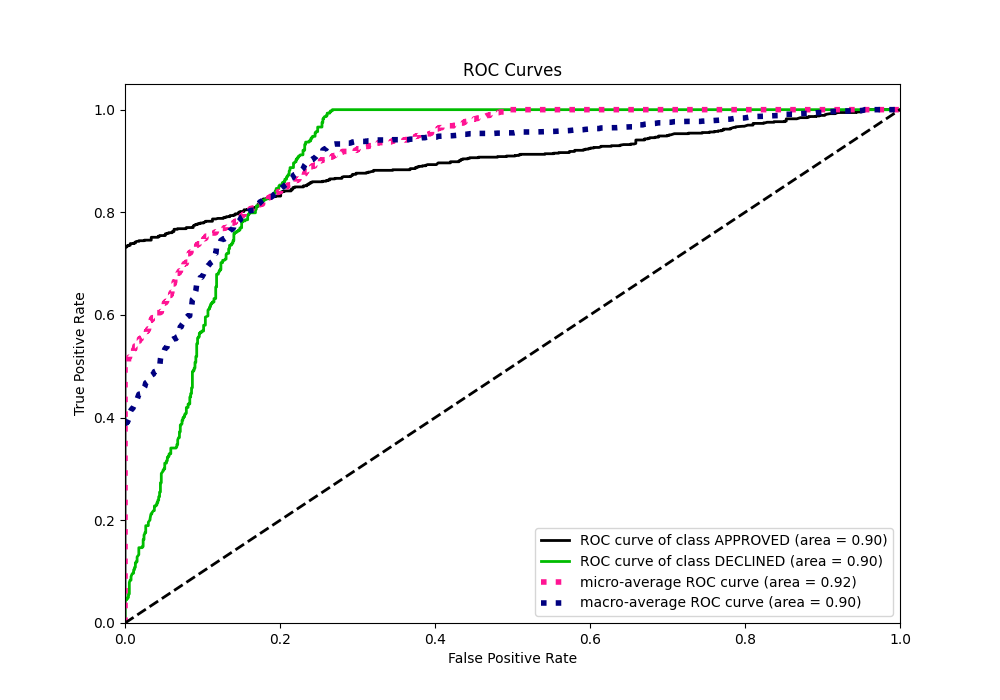
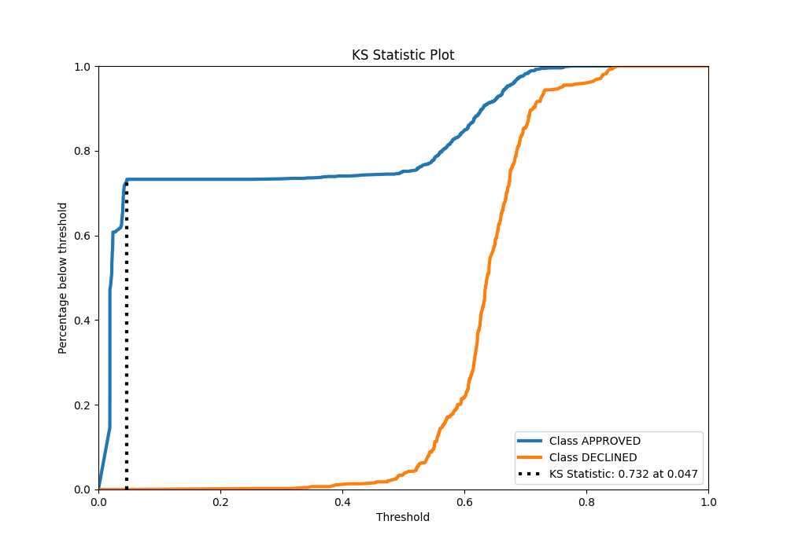
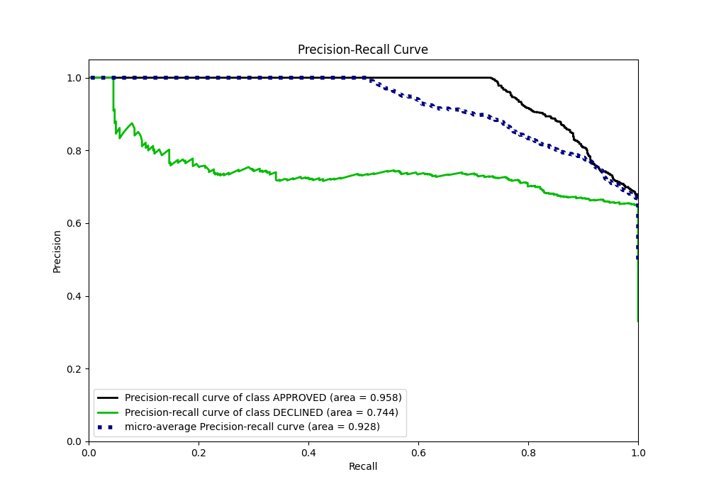
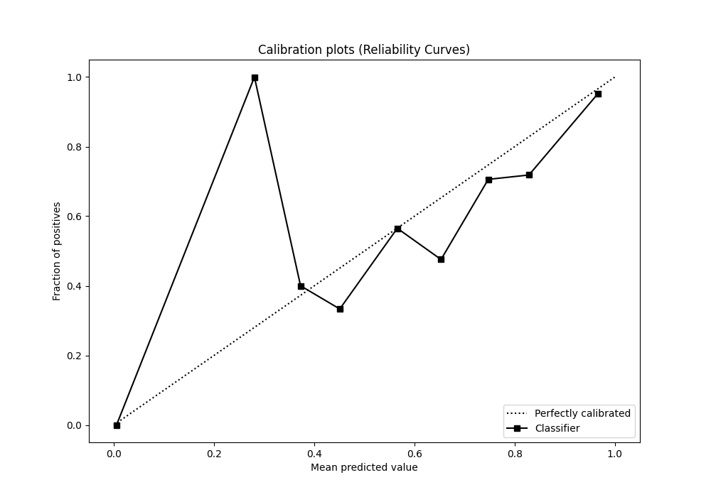
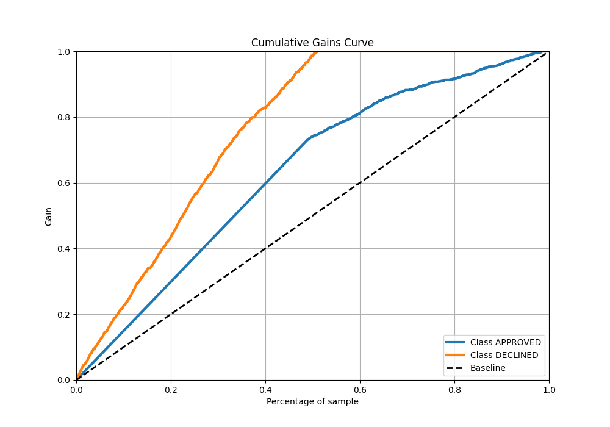
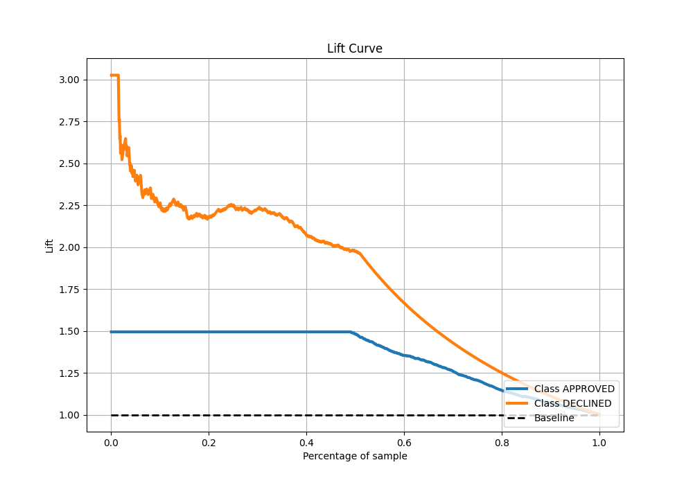

# Summary of 68_LightGBM

[<< Go back](../README.md)

## LightGBM
- **n_jobs**: -1
- **objective**: binary
- **num_leaves**: 15
- **learning_rate**: 0.05
- **feature_fraction**: 0.8
- **bagging_fraction**: 0.5
- **min_data_in_leaf**: 5
- **metric**: auc
- **custom_eval_metric_name**: None
- **explain_level**: 0

## Validation
 - **validation_type**: split
 - **train_ratio**: 0.8
 - **shuffle**: True
 - **stratify**: True

## Optimized metric
auc

## Training time

1.9 seconds

## Metric details
|           |    score |   threshold |
|:----------|---------:|------------:|
| logloss   | 0.33244  |  nan        |
| auc       | 0.89906  |  nan        |
| f1        | 0.786416 |    0.366221 |
| accuracy  | 0.826866 |    0.601349 |
| precision | 0.826923 |    0.716286 |
| recall    | 1        |    0.016869 |
| mcc       | 0.686974 |    0.366221 |

## Metric details with threshold from accuracy metric
|           |    score |   threshold |
|:----------|---------:|------------:|
| logloss   | 0.33244  |  nan        |
| auc       | 0.89906  |  nan        |
| f1        | 0.748918 |    0.601349 |
| accuracy  | 0.826866 |    0.601349 |
| precision | 0.719335 |    0.601349 |
| recall    | 0.781038 |    0.601349 |
| mcc       | 0.618357 |    0.601349 |

## Confusion matrix (at threshold=0.601349)
|                     |   Predicted as APPROVED |   Predicted as DECLINED |
|:--------------------|------------------------:|------------------------:|
| Labeled as APPROVED |                     762 |                     135 |
| Labeled as DECLINED |                      97 |                     346 |

## Learning curves

## Confusion Matrix

## Normalized Confusion Matrix

## ROC Curve

## Kolmogorov-Smirnov Statistic

## Precision-Recall Curve

## Calibration Curve

## Cumulative Gains Curve

## Lift Curve

[<< Go back](../README.md)
