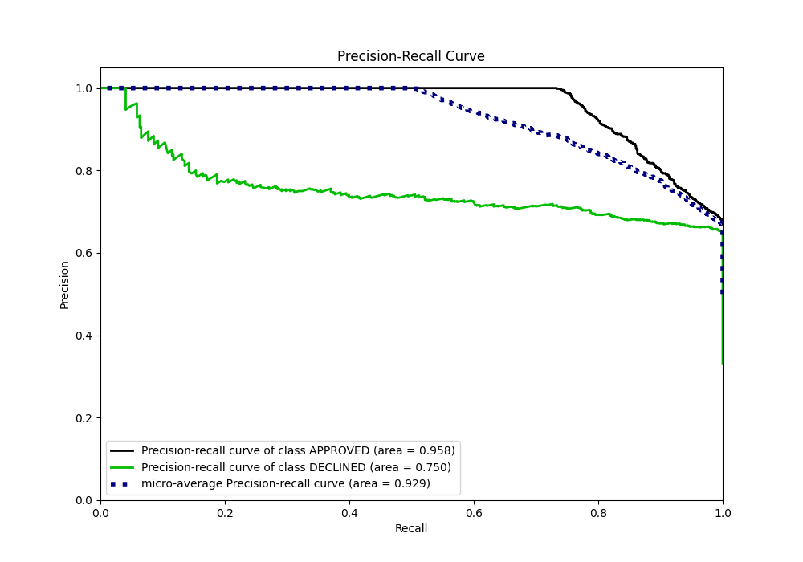

# Summary of 69_LightGBM

[<< Go back](../README.md)

## LightGBM
- **n_jobs**: -1
- **objective**: binary
- **num_leaves**: 15
- **learning_rate**: 0.2
- **feature_fraction**: 0.8
- **bagging_fraction**: 0.5
- **min_data_in_leaf**: 5
- **metric**: auc
- **custom_eval_metric_name**: None
- **explain_level**: 0

## Validation
 - **validation_type**: split
 - **train_ratio**: 0.8
 - **shuffle**: True
 - **stratify**: True

## Optimized metric
auc

## Training time

1.9 seconds

## Metric details
|           |    score |    threshold |
|:----------|---------:|-------------:|
| logloss   | 0.320126 | nan          |
| auc       | 0.898976 | nan          |
| f1        | 0.789991 |   0.381072   |
| accuracy  | 0.827612 |   0.47656    |
| precision | 0.865385 |   0.760367   |
| recall    | 1        |   0.00417405 |
| mcc       | 0.693319 |   0.381072   |

## Metric details with threshold from accuracy metric
|           |    score |   threshold |
|:----------|---------:|------------:|
| logloss   | 0.320126 |   nan       |
| auc       | 0.898976 |   nan       |
| f1        | 0.788655 |     0.47656 |
| accuracy  | 0.827612 |     0.47656 |
| precision | 0.663077 |     0.47656 |
| recall    | 0.972912 |     0.47656 |
| mcc       | 0.685969 |     0.47656 |

## Confusion matrix (at threshold=0.47656)
|                     |   Predicted as APPROVED |   Predicted as DECLINED |
|:--------------------|------------------------:|------------------------:|
| Labeled as APPROVED |                     678 |                     219 |
| Labeled as DECLINED |                      12 |                     431 |

## Learning curves

## Confusion Matrix

## Normalized Confusion Matrix

## ROC Curve

## Kolmogorov-Smirnov Statistic

## Precision-Recall Curve

## Calibration Curve

## Cumulative Gains Curve

## Lift Curve

[<< Go back](../README.md)
