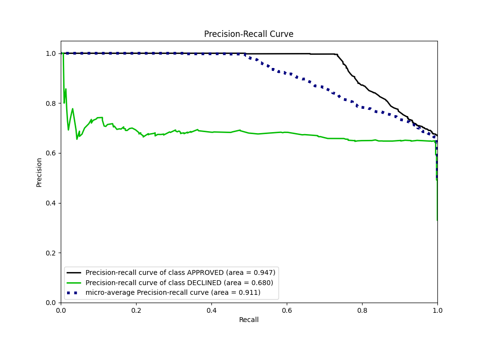

# Summary of 6_Default_ExtraTrees

[<< Go back](../README.md)

## Extra Trees Classifier (Extra Trees)
- **n_jobs**: -1
- **criterion**: gini
- **max_features**: 0.9
- **min_samples_split**: 30
- **max_depth**: 4
- **eval_metric_name**: auc
- **explain_level**: 0

## Validation
 - **validation_type**: split
 - **train_ratio**: 0.8
 - **shuffle**: True
 - **stratify**: True

## Optimized metric
auc

## Training time

1.7 seconds

## Metric details
|           |    score |   threshold |
|:----------|---------:|------------:|
| logloss   | 0.435148 |  nan        |
| auc       | 0.875197 |  nan        |
| f1        | 0.781753 |    0.492446 |
| accuracy  | 0.81791  |    0.492446 |
| precision | 0.741935 |    0.531236 |
| recall    | 1        |    0        |
| mcc       | 0.678496 |    0.492446 |

## Metric details with threshold from accuracy metric
|           |    score |   threshold |
|:----------|---------:|------------:|
| logloss   | 0.435148 |  nan        |
| auc       | 0.875197 |  nan        |
| f1        | 0.781753 |    0.492446 |
| accuracy  | 0.81791  |    0.492446 |
| precision | 0.647407 |    0.492446 |
| recall    | 0.986456 |    0.492446 |
| mcc       | 0.678496 |    0.492446 |

## Confusion matrix (at threshold=0.492446)
|                     |   Predicted as APPROVED |   Predicted as DECLINED |
|:--------------------|------------------------:|------------------------:|
| Labeled as APPROVED |                     659 |                     238 |
| Labeled as DECLINED |                       6 |                     437 |

## Learning curves

## Confusion Matrix

## Normalized Confusion Matrix

## ROC Curve

## Kolmogorov-Smirnov Statistic

## Precision-Recall Curve

## Calibration Curve

## Cumulative Gains Curve

## Lift Curve

[<< Go back](../README.md)
