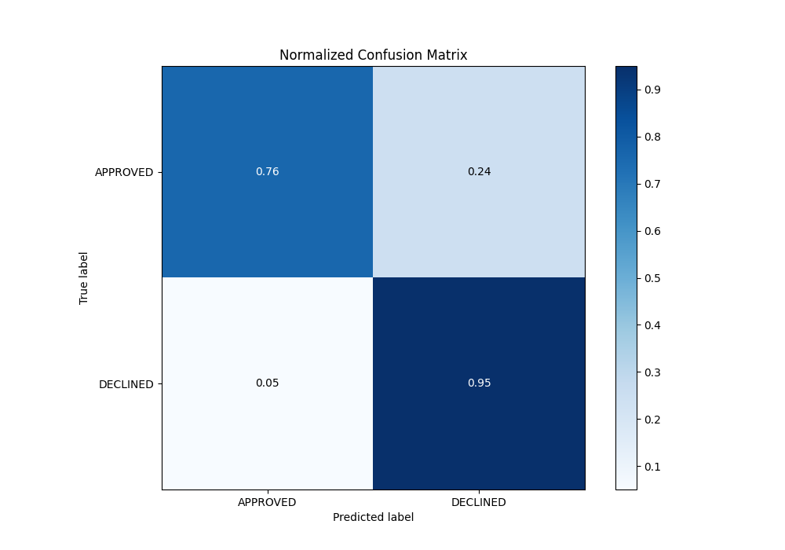

# Summary of 71_LightGBM

[<< Go back](../README.md)

## LightGBM
- **n_jobs**: -1
- **objective**: binary
- **num_leaves**: 127
- **learning_rate**: 0.2
- **feature_fraction**: 1.0
- **bagging_fraction**: 1.0
- **min_data_in_leaf**: 50
- **metric**: auc
- **custom_eval_metric_name**: None
- **explain_level**: 0

## Validation
 - **validation_type**: split
 - **train_ratio**: 0.8
 - **shuffle**: True
 - **stratify**: True

## Optimized metric
auc

## Training time

1.9 seconds

## Metric details
|           |    score |   threshold |
|:----------|---------:|------------:|
| logloss   | 0.337797 | nan         |
| auc       | 0.901019 | nan         |
| f1        | 0.786416 |   0.361492  |
| accuracy  | 0.822388 |   0.4413    |
| precision | 0.865385 |   0.775265  |
| recall    | 1        |   0.0317408 |
| mcc       | 0.686974 |   0.361492  |

## Metric details with threshold from accuracy metric
|           |    score |   threshold |
|:----------|---------:|------------:|
| logloss   | 0.337797 |    nan      |
| auc       | 0.901019 |    nan      |
| f1        | 0.77963  |      0.4413 |
| accuracy  | 0.822388 |      0.4413 |
| precision | 0.660911 |      0.4413 |
| recall    | 0.950339 |      0.4413 |
| mcc       | 0.668383 |      0.4413 |

## Confusion matrix (at threshold=0.4413)
|                     |   Predicted as APPROVED |   Predicted as DECLINED |
|:--------------------|------------------------:|------------------------:|
| Labeled as APPROVED |                     681 |                     216 |
| Labeled as DECLINED |                      22 |                     421 |

## Learning curves

## Confusion Matrix

## Normalized Confusion Matrix

## ROC Curve

## Kolmogorov-Smirnov Statistic

## Precision-Recall Curve

## Calibration Curve

## Cumulative Gains Curve

## Lift Curve

[<< Go back](../README.md)
