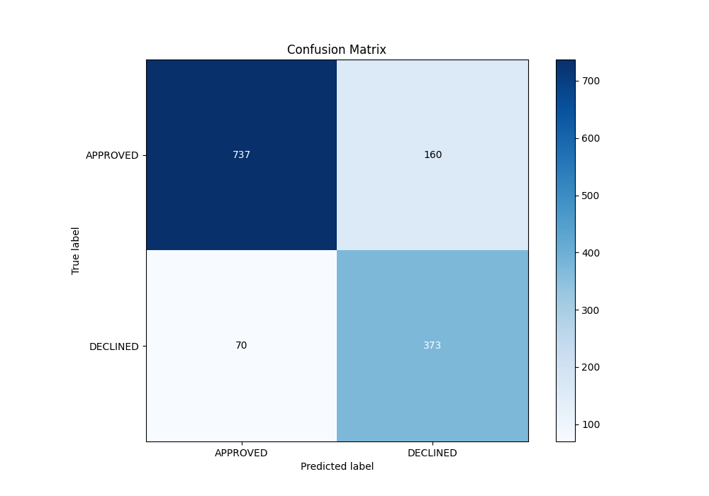
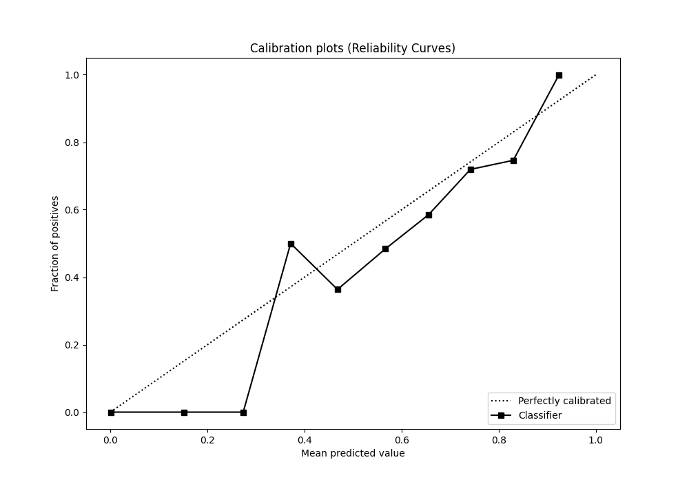

# Summary of 73_Xgboost

[<< Go back](../README.md)

## Extreme Gradient Boosting (Xgboost)
- **n_jobs**: -1
- **objective**: binary:logistic
- **eta**: 0.075
- **max_depth**: 7
- **min_child_weight**: 1
- **subsample**: 1.0
- **colsample_bytree**: 1.0
- **eval_metric**: auc
- **explain_level**: 0

## Validation
 - **validation_type**: split
 - **train_ratio**: 0.8
 - **shuffle**: True
 - **stratify**: True

## Optimized metric
auc

## Training time

1.9 seconds

## Metric details
|           |    score |    threshold |
|:----------|---------:|-------------:|
| logloss   | 0.324693 | nan          |
| auc       | 0.899842 | nan          |
| f1        | 0.784995 |   0.521051   |
| accuracy  | 0.828358 |   0.58773    |
| precision | 0.846154 |   0.750449   |
| recall    | 1        |   0.00499181 |
| mcc       | 0.683104 |   0.015833   |

## Metric details with threshold from accuracy metric
|           |    score |   threshold |
|:----------|---------:|------------:|
| logloss   | 0.324693 |   nan       |
| auc       | 0.899842 |   nan       |
| f1        | 0.764344 |     0.58773 |
| accuracy  | 0.828358 |     0.58773 |
| precision | 0.699812 |     0.58773 |
| recall    | 0.841986 |     0.58773 |
| mcc       | 0.637842 |     0.58773 |

## Confusion matrix (at threshold=0.58773)
|                     |   Predicted as APPROVED |   Predicted as DECLINED |
|:--------------------|------------------------:|------------------------:|
| Labeled as APPROVED |                     737 |                     160 |
| Labeled as DECLINED |                      70 |                     373 |

## Learning curves

## Confusion Matrix

## Normalized Confusion Matrix

## ROC Curve

## Kolmogorov-Smirnov Statistic

## Precision-Recall Curve

## Calibration Curve

## Cumulative Gains Curve

## Lift Curve

[<< Go back](../README.md)
