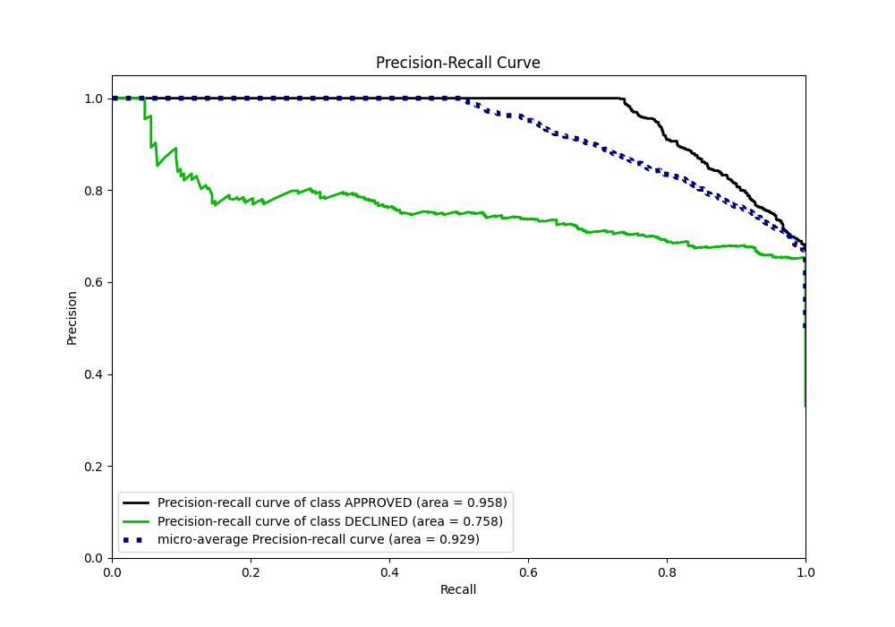

# Summary of 75_LightGBM

[<< Go back](../README.md)

## LightGBM
- **n_jobs**: -1
- **objective**: binary
- **num_leaves**: 31
- **learning_rate**: 0.1
- **feature_fraction**: 0.9
- **bagging_fraction**: 0.9
- **min_data_in_leaf**: 20
- **metric**: auc
- **custom_eval_metric_name**: None
- **explain_level**: 0

## Validation
 - **validation_type**: split
 - **train_ratio**: 0.8
 - **shuffle**: True
 - **stratify**: True

## Optimized metric
auc

## Training time

1.9 seconds

## Metric details
|           |    score |   threshold |
|:----------|---------:|------------:|
| logloss   | 0.353484 | nan         |
| auc       | 0.901382 | nan         |
| f1        | 0.789991 |   0.342722  |
| accuracy  | 0.827612 |   0.487829  |
| precision | 0.846154 |   0.700415  |
| recall    | 1        |   0.0534225 |
| mcc       | 0.693319 |   0.342722  |

## Metric details with threshold from accuracy metric
|           |    score |   threshold |
|:----------|---------:|------------:|
| logloss   | 0.353484 |  nan        |
| auc       | 0.901382 |  nan        |
| f1        | 0.778098 |    0.487829 |
| accuracy  | 0.827612 |    0.487829 |
| precision | 0.677258 |    0.487829 |
| recall    | 0.914221 |    0.487829 |
| mcc       | 0.661546 |    0.487829 |

## Confusion matrix (at threshold=0.487829)
|                     |   Predicted as APPROVED |   Predicted as DECLINED |
|:--------------------|------------------------:|------------------------:|
| Labeled as APPROVED |                     704 |                     193 |
| Labeled as DECLINED |                      38 |                     405 |

## Learning curves

## Confusion Matrix

## Normalized Confusion Matrix

## ROC Curve

## Kolmogorov-Smirnov Statistic

## Precision-Recall Curve

## Calibration Curve

## Cumulative Gains Curve

## Lift Curve

[<< Go back](../README.md)
