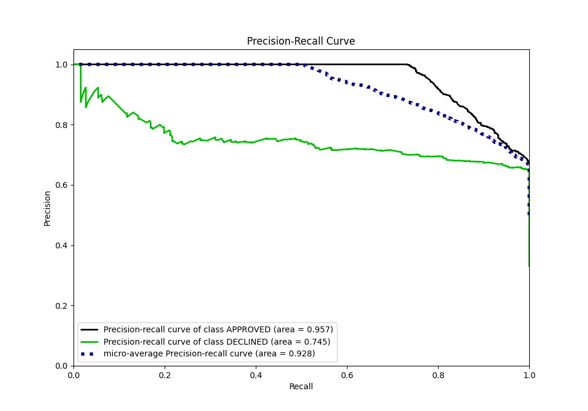

# Summary of 76_RandomForest

[<< Go back](../README.md)

## Random Forest
- **n_jobs**: -1
- **criterion**: gini
- **max_features**: 0.8
- **min_samples_split**: 40
- **max_depth**: 6
- **eval_metric_name**: auc
- **explain_level**: 0

## Validation
 - **validation_type**: split
 - **train_ratio**: 0.8
 - **shuffle**: True
 - **stratify**: True

## Optimized metric
auc

## Training time

2.6 seconds

## Metric details
|           |    score |   threshold |
|:----------|---------:|------------:|
| logloss   | 0.324883 |  nan        |
| auc       | 0.898265 |  nan        |
| f1        | 0.788204 |    0.501603 |
| accuracy  | 0.826119 |    0.61821  |
| precision | 0.894737 |    0.690416 |
| recall    | 1        |    0        |
| mcc       | 0.690147 |    0.501603 |

## Metric details with threshold from accuracy metric
|           |    score |   threshold |
|:----------|---------:|------------:|
| logloss   | 0.324883 |   nan       |
| auc       | 0.898265 |   nan       |
| f1        | 0.781631 |     0.61821 |
| accuracy  | 0.826119 |     0.61821 |
| precision | 0.668269 |     0.61821 |
| recall    | 0.941309 |     0.61821 |
| mcc       | 0.670097 |     0.61821 |

## Confusion matrix (at threshold=0.61821)
|                     |   Predicted as APPROVED |   Predicted as DECLINED |
|:--------------------|------------------------:|------------------------:|
| Labeled as APPROVED |                     690 |                     207 |
| Labeled as DECLINED |                      26 |                     417 |

## Learning curves

## Confusion Matrix

## Normalized Confusion Matrix

## ROC Curve

## Kolmogorov-Smirnov Statistic

## Precision-Recall Curve

## Calibration Curve

## Cumulative Gains Curve

## Lift Curve

[<< Go back](../README.md)
