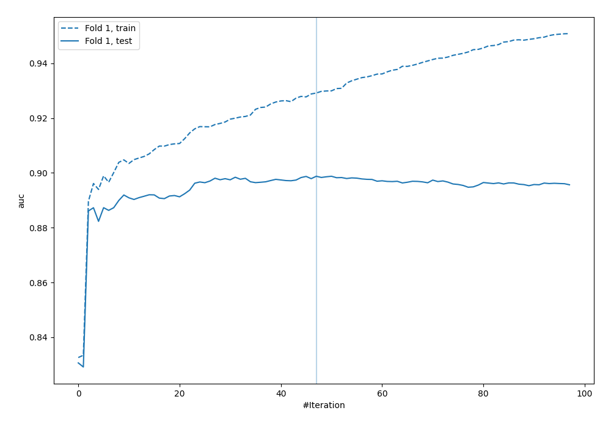
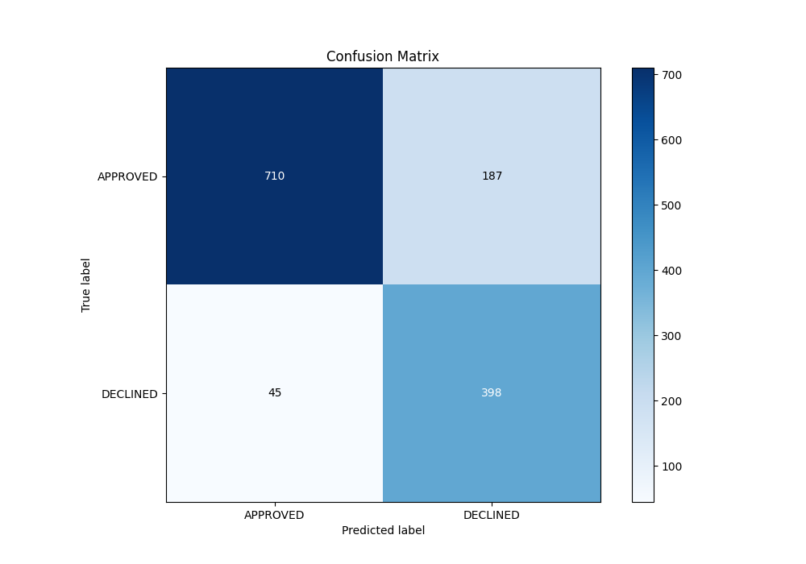
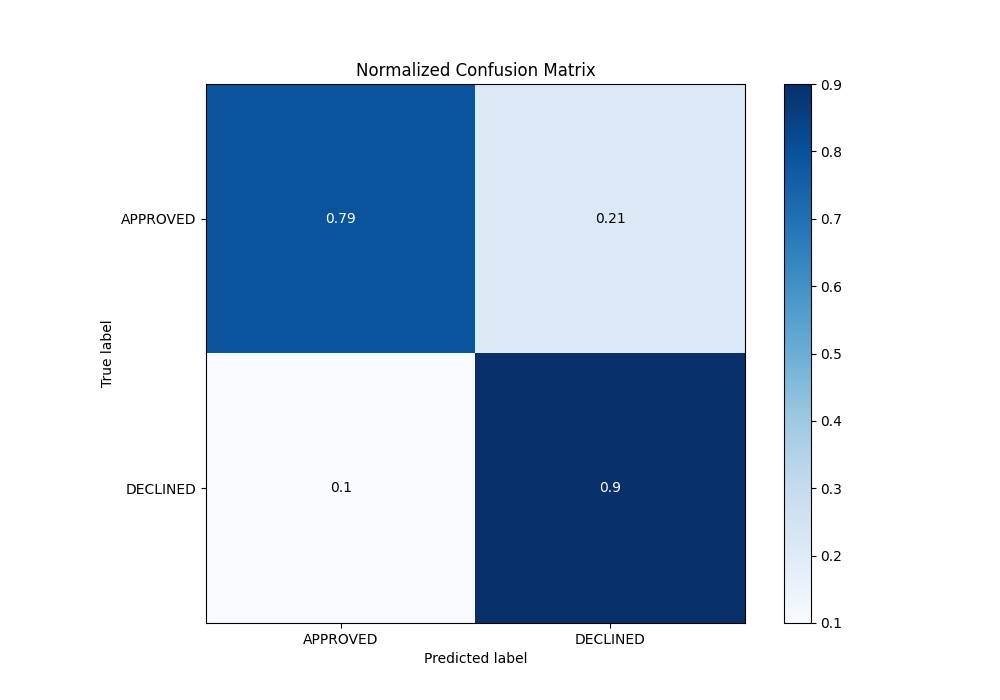
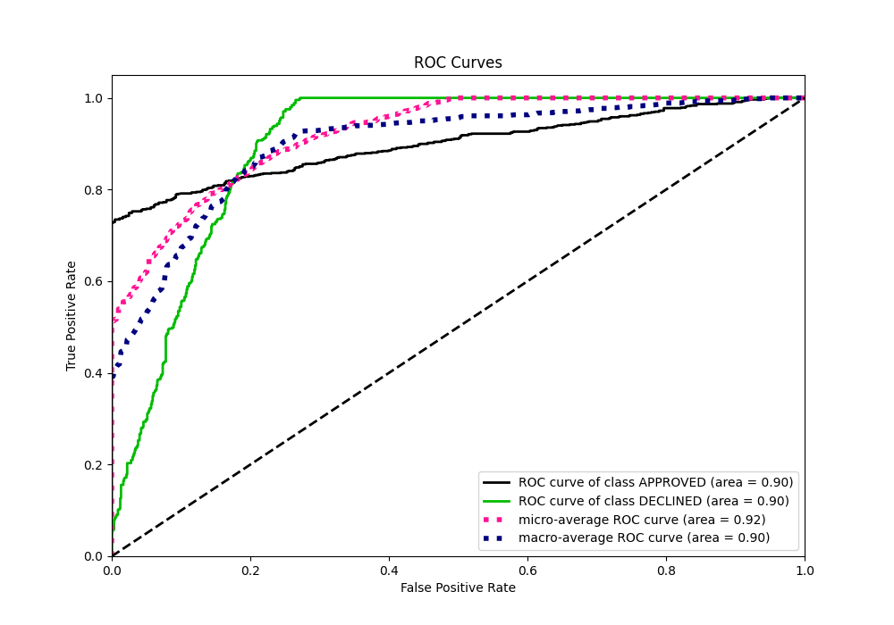
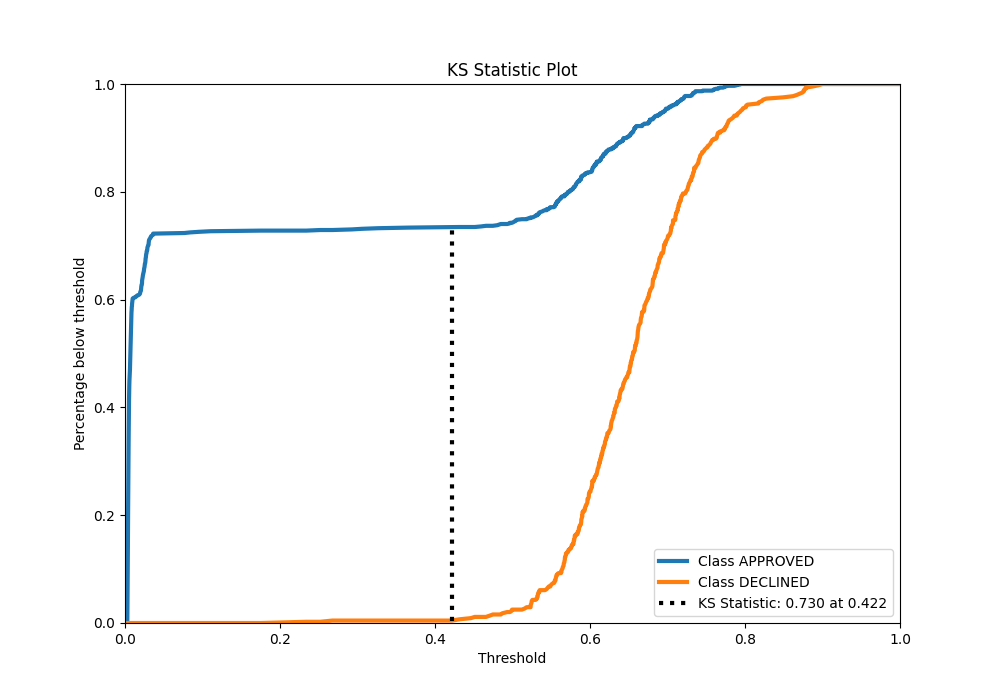
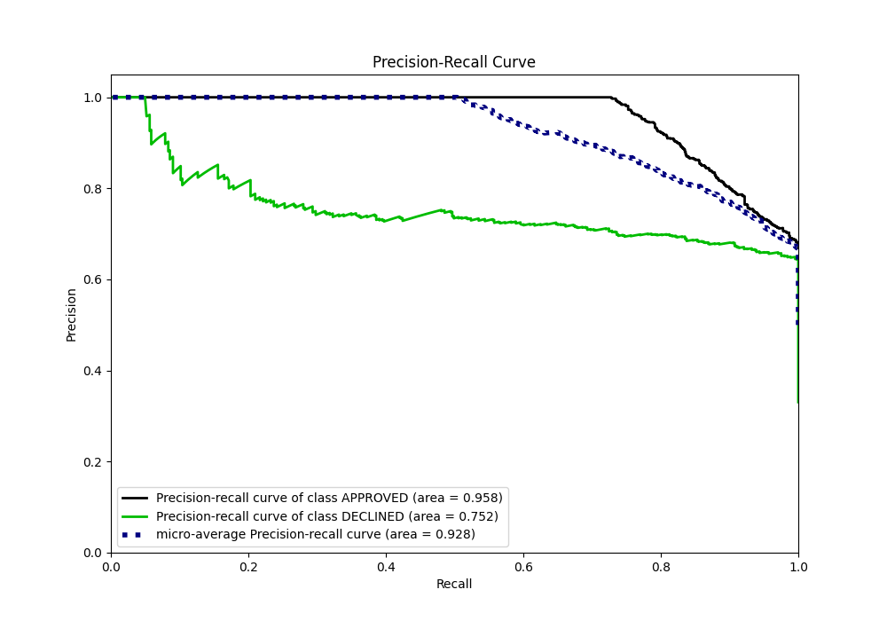
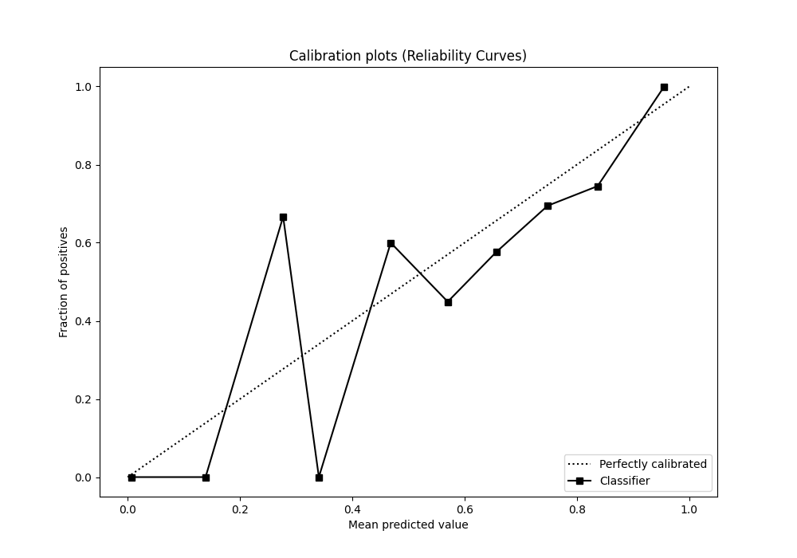
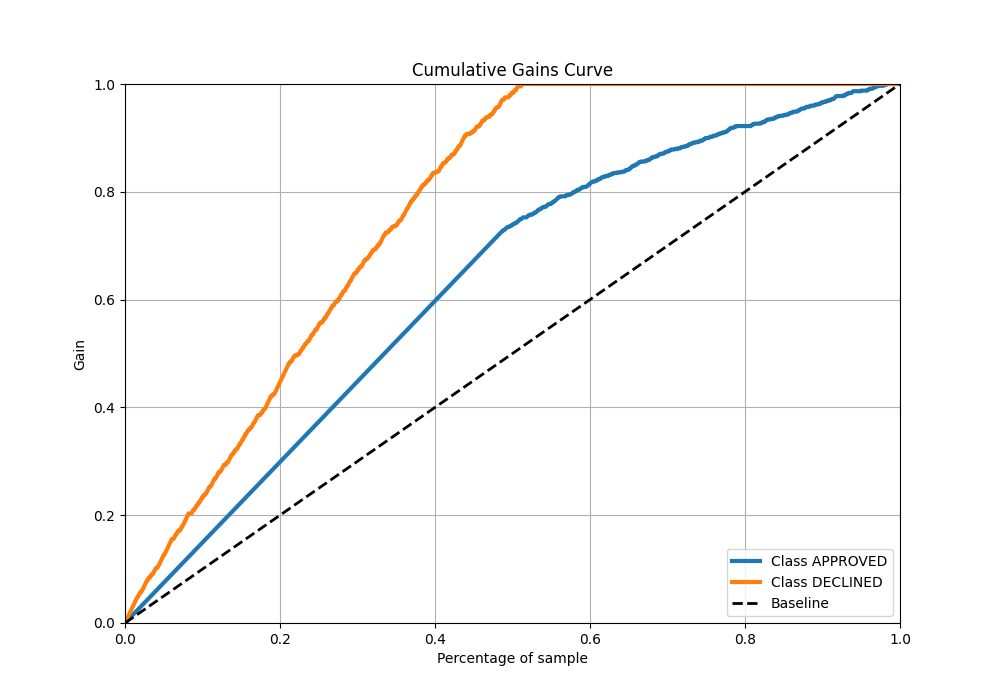
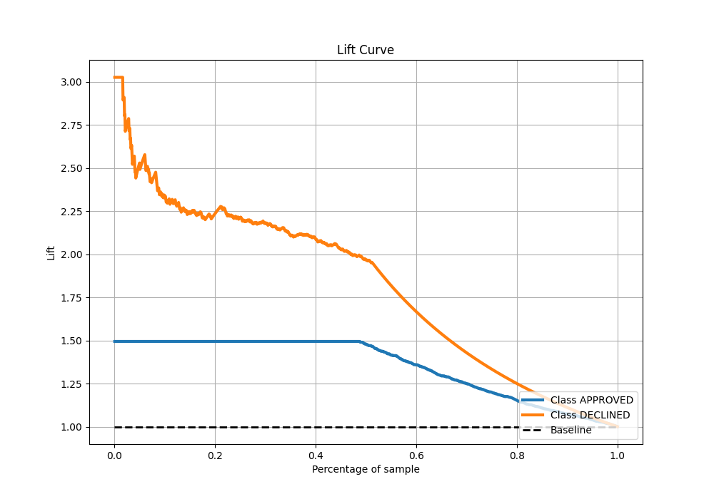

# Summary of 78_Xgboost

[<< Go back](../README.md)

## Extreme Gradient Boosting (Xgboost)
- **n_jobs**: -1
- **objective**: binary:logistic
- **eta**: 0.1
- **max_depth**: 6
- **min_child_weight**: 5
- **subsample**: 0.7
- **colsample_bytree**: 0.6
- **eval_metric**: auc
- **explain_level**: 0

## Validation
 - **validation_type**: split
 - **train_ratio**: 0.8
 - **shuffle**: True
 - **stratify**: True

## Optimized metric
auc

## Training time

2.1 seconds

## Metric details
|           |    score |    threshold |
|:----------|---------:|-------------:|
| logloss   | 0.3257   | nan          |
| auc       | 0.898771 | nan          |
| f1        | 0.783166 |   0.523871   |
| accuracy  | 0.826866 |   0.564785   |
| precision | 0.846154 |   0.739188   |
| recall    | 1        |   0.00254941 |
| mcc       | 0.683104 |   0.102938   |

## Metric details with threshold from accuracy metric
|           |    score |   threshold |
|:----------|---------:|------------:|
| logloss   | 0.3257   |  nan        |
| auc       | 0.898771 |  nan        |
| f1        | 0.774319 |    0.564785 |
| accuracy  | 0.826866 |    0.564785 |
| precision | 0.680342 |    0.564785 |
| recall    | 0.89842  |    0.564785 |
| mcc       | 0.654429 |    0.564785 |

## Confusion matrix (at threshold=0.564785)
|                     |   Predicted as APPROVED |   Predicted as DECLINED |
|:--------------------|------------------------:|------------------------:|
| Labeled as APPROVED |                     710 |                     187 |
| Labeled as DECLINED |                      45 |                     398 |

## Learning curves

## Confusion Matrix

## Normalized Confusion Matrix

## ROC Curve

## Kolmogorov-Smirnov Statistic

## Precision-Recall Curve

## Calibration Curve

## Cumulative Gains Curve

## Lift Curve

[<< Go back](../README.md)
