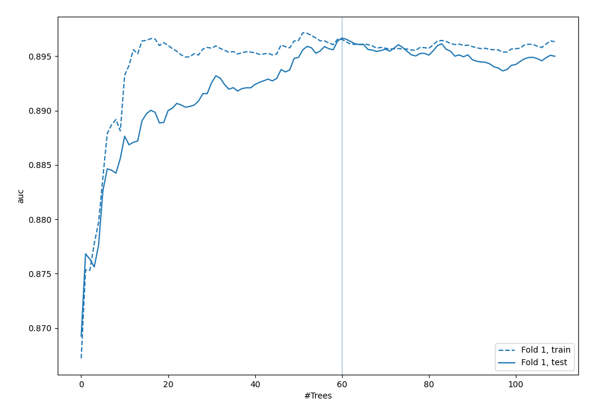
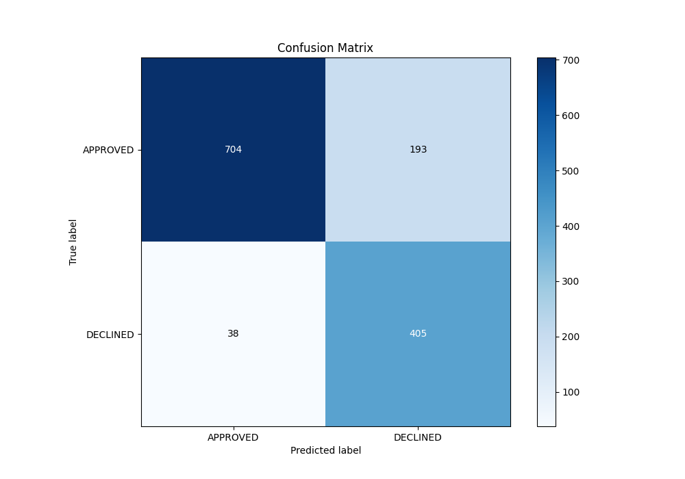
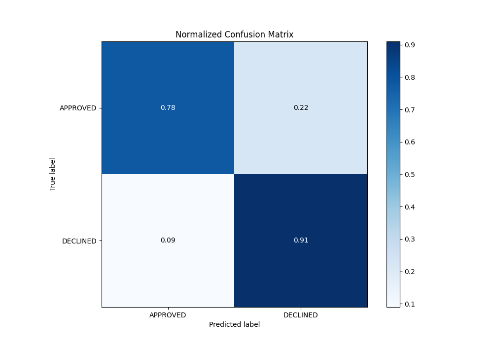
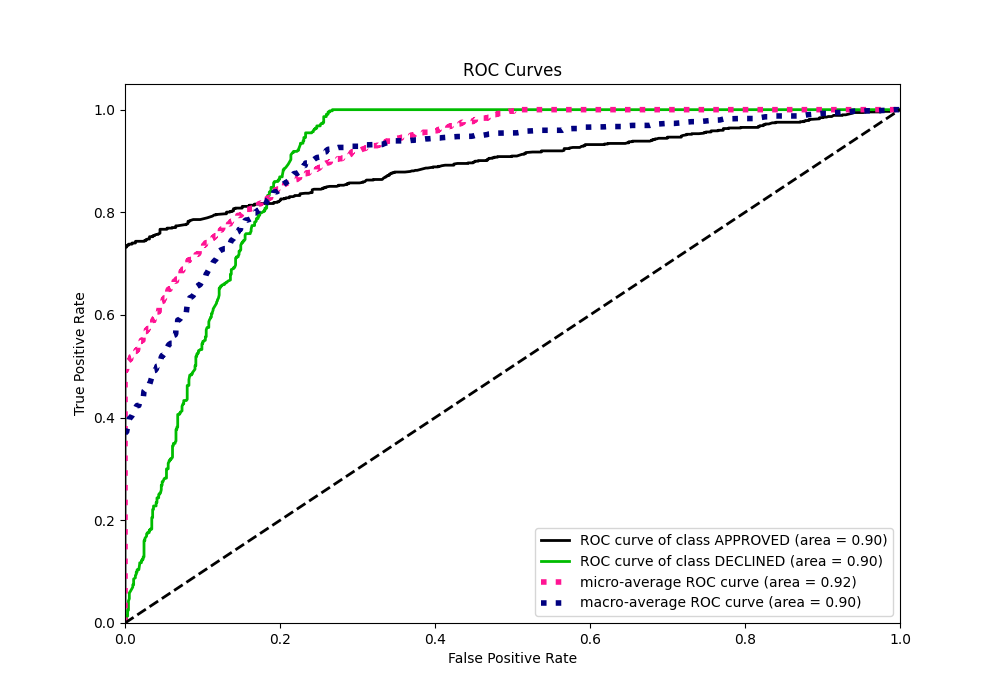
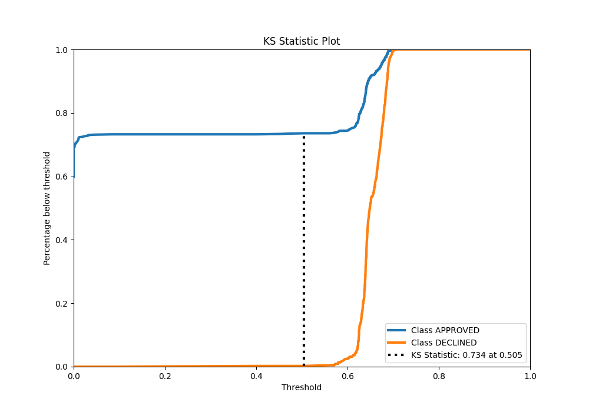
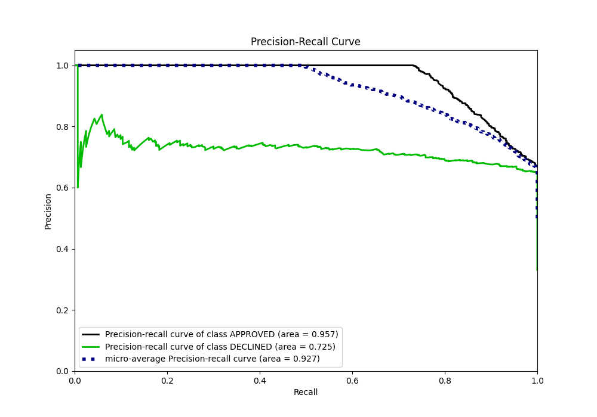
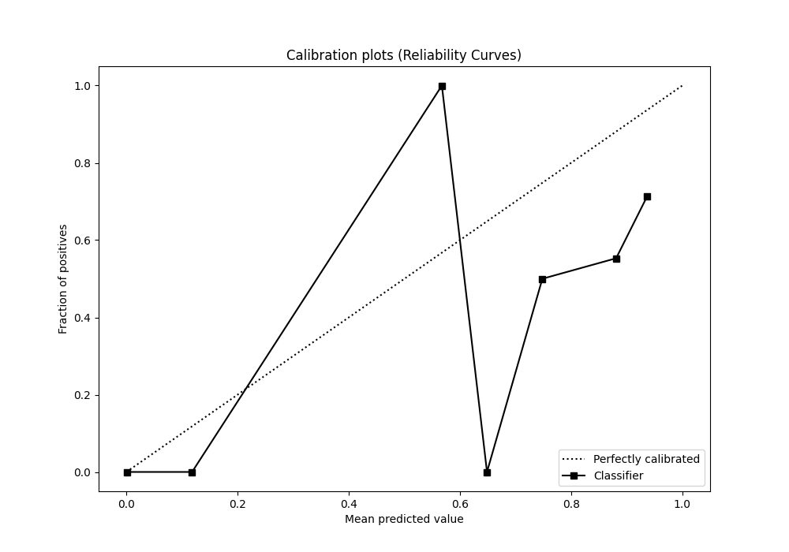
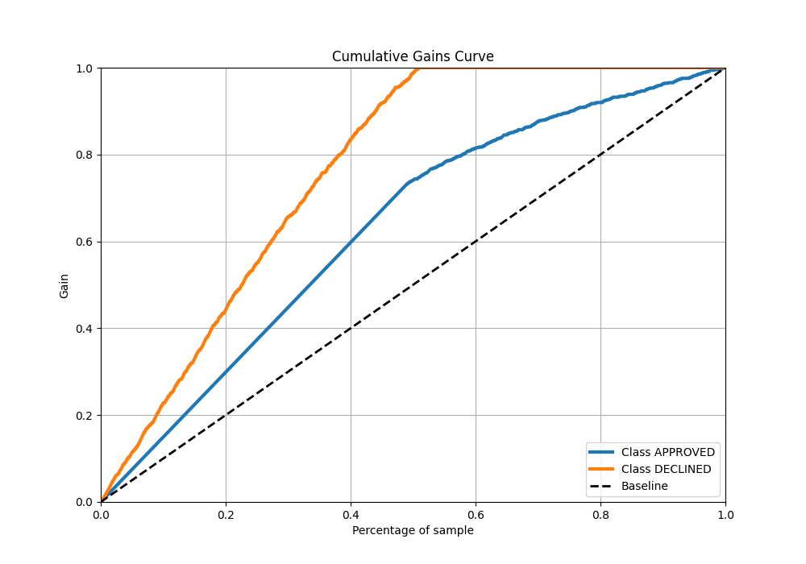
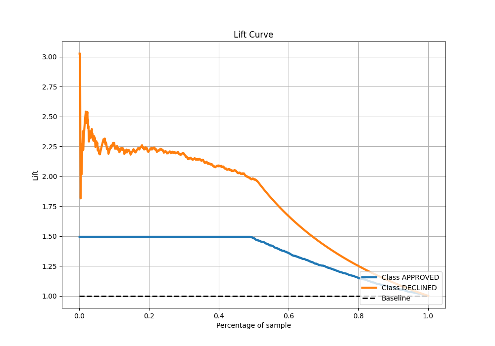

# Summary of 79_RandomForest

[<< Go back](../README.md)

## Random Forest
- **n_jobs**: -1
- **criterion**: gini
- **max_features**: 0.9
- **min_samples_split**: 20
- **max_depth**: 5
- **eval_metric_name**: auc
- **explain_level**: 0

## Validation
 - **validation_type**: split
 - **train_ratio**: 0.8
 - **shuffle**: True
 - **stratify**: True

## Optimized metric
auc

## Training time

3.2 seconds

## Metric details
|           |    score |   threshold |
|:----------|---------:|------------:|
| logloss   | 0.326356 |  nan        |
| auc       | 0.896666 |  nan        |
| f1        | 0.788204 |    0.571388 |
| accuracy  | 0.827612 |    0.624405 |
| precision | 0.769231 |    0.687546 |
| recall    | 1        |    0        |
| mcc       | 0.690147 |    0.571388 |

## Metric details with threshold from accuracy metric
|           |    score |   threshold |
|:----------|---------:|------------:|
| logloss   | 0.326356 |  nan        |
| auc       | 0.896666 |  nan        |
| f1        | 0.778098 |    0.624405 |
| accuracy  | 0.827612 |    0.624405 |
| precision | 0.677258 |    0.624405 |
| recall    | 0.914221 |    0.624405 |
| mcc       | 0.661546 |    0.624405 |

## Confusion matrix (at threshold=0.624405)
|                     |   Predicted as APPROVED |   Predicted as DECLINED |
|:--------------------|------------------------:|------------------------:|
| Labeled as APPROVED |                     704 |                     193 |
| Labeled as DECLINED |                      38 |                     405 |

## Learning curves

## Confusion Matrix

## Normalized Confusion Matrix

## ROC Curve

## Kolmogorov-Smirnov Statistic

## Precision-Recall Curve

## Calibration Curve

## Cumulative Gains Curve

## Lift Curve

[<< Go back](../README.md)
