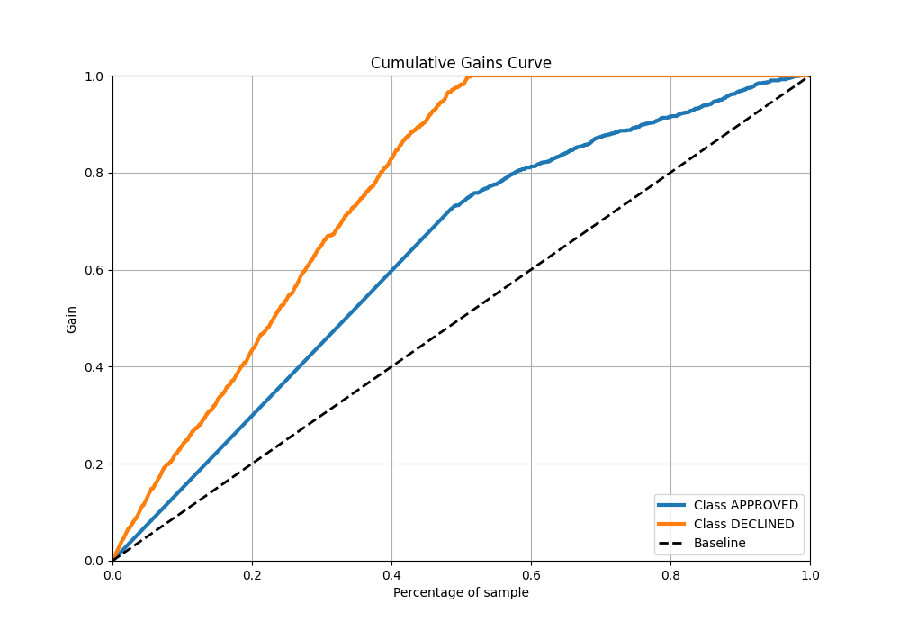
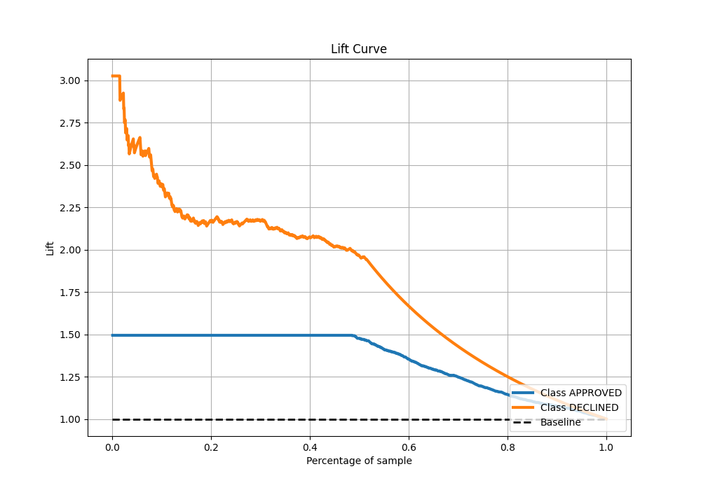

# Summary of 7_Xgboost

[<< Go back](../README.md)

## Extreme Gradient Boosting (Xgboost)
- **n_jobs**: -1
- **objective**: binary:logistic
- **eta**: 0.1
- **max_depth**: 7
- **min_child_weight**: 5
- **subsample**: 1.0
- **colsample_bytree**: 0.5
- **eval_metric**: auc
- **explain_level**: 0

## Validation
 - **validation_type**: split
 - **train_ratio**: 0.8
 - **shuffle**: True
 - **stratify**: True

## Optimized metric
auc

## Training time

1.0 seconds

## Metric details
|           |    score |     threshold |
|:----------|---------:|--------------:|
| logloss   | 0.325211 | nan           |
| auc       | 0.895343 | nan           |
| f1        | 0.783166 |   0.441888    |
| accuracy  | 0.825373 |   0.54028     |
| precision | 0.865385 |   0.787548    |
| recall    | 1        |   0.000464004 |
| mcc       | 0.67993  |   0.149542    |

## Metric details with threshold from accuracy metric
|           |    score |   threshold |
|:----------|---------:|------------:|
| logloss   | 0.325211 |   nan       |
| auc       | 0.895343 |   nan       |
| f1        | 0.766467 |     0.54028 |
| accuracy  | 0.825373 |     0.54028 |
| precision | 0.686941 |     0.54028 |
| recall    | 0.866817 |     0.54028 |
| mcc       | 0.64085  |     0.54028 |

## Confusion matrix (at threshold=0.54028)
|                     |   Predicted as APPROVED |   Predicted as DECLINED |
|:--------------------|------------------------:|------------------------:|
| Labeled as APPROVED |                     722 |                     175 |
| Labeled as DECLINED |                      59 |                     384 |

## Learning curves

## Confusion Matrix

## Normalized Confusion Matrix

## ROC Curve

## Kolmogorov-Smirnov Statistic

## Precision-Recall Curve

## Calibration Curve

## Cumulative Gains Curve

## Lift Curve

[<< Go back](../README.md)
