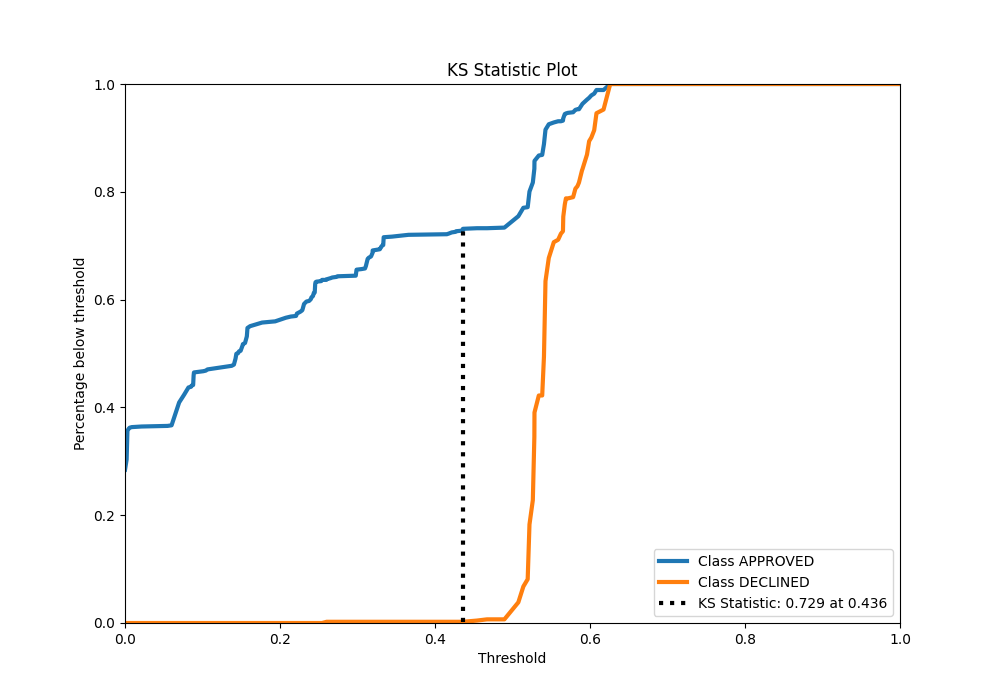

# Summary of 80_ExtraTrees

[<< Go back](../README.md)

## Extra Trees Classifier (Extra Trees)
- **n_jobs**: -1
- **criterion**: gini
- **max_features**: 0.9
- **min_samples_split**: 20
- **max_depth**: 5
- **eval_metric_name**: auc
- **explain_level**: 0

## Validation
 - **validation_type**: split
 - **train_ratio**: 0.8
 - **shuffle**: True
 - **stratify**: True

## Optimized metric
auc

## Training time

2.5 seconds

## Metric details
|           |    score |   threshold |
|:----------|---------:|------------:|
| logloss   | 0.396301 |  nan        |
| auc       | 0.879862 |  nan        |
| f1        | 0.782369 |    0.507545 |
| accuracy  | 0.823881 |    0.514006 |
| precision | 0.705882 |    0.608364 |
| recall    | 1        |    0        |
| mcc       | 0.67993  |    0.424106 |

## Metric details with threshold from accuracy metric
|           |    score |   threshold |
|:----------|---------:|------------:|
| logloss   | 0.396301 |  nan        |
| auc       | 0.879862 |  nan        |
| f1        | 0.777778 |    0.514006 |
| accuracy  | 0.823881 |    0.514006 |
| precision | 0.667205 |    0.514006 |
| recall    | 0.93228  |    0.514006 |
| mcc       | 0.662993 |    0.514006 |

## Confusion matrix (at threshold=0.514006)
|                     |   Predicted as APPROVED |   Predicted as DECLINED |
|:--------------------|------------------------:|------------------------:|
| Labeled as APPROVED |                     691 |                     206 |
| Labeled as DECLINED |                      30 |                     413 |

## Learning curves

## Confusion Matrix

## Normalized Confusion Matrix

## ROC Curve

## Kolmogorov-Smirnov Statistic

## Precision-Recall Curve

## Calibration Curve

## Cumulative Gains Curve

## Lift Curve

[<< Go back](../README.md)
