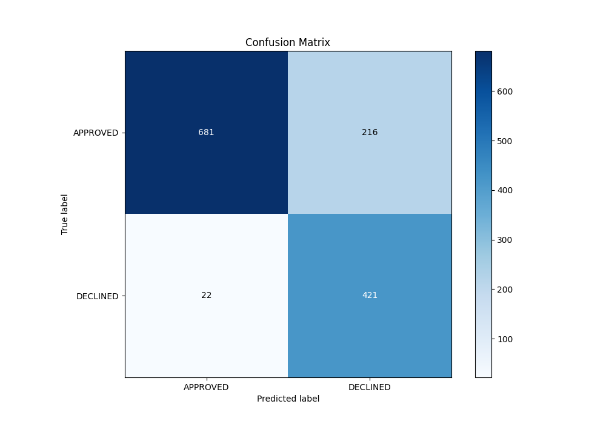

# Summary of 82_ExtraTrees

[<< Go back](../README.md)

## Extra Trees Classifier (Extra Trees)
- **n_jobs**: -1
- **criterion**: gini
- **max_features**: 0.8
- **min_samples_split**: 40
- **max_depth**: 6
- **eval_metric_name**: auc
- **explain_level**: 0

## Validation
 - **validation_type**: split
 - **train_ratio**: 0.8
 - **shuffle**: True
 - **stratify**: True

## Optimized metric
auc

## Training time

4.3 seconds

## Metric details
|           |    score |     threshold |
|:----------|---------:|--------------:|
| logloss   | 0.391301 | nan           |
| auc       | 0.876612 | nan           |
| f1        | 0.783002 |   0.531922    |
| accuracy  | 0.822388 |   0.533261    |
| precision | 0.769231 |   0.59752     |
| recall    | 1        |   7.49115e-05 |
| mcc       | 0.680628 |   0.526005    |

## Metric details with threshold from accuracy metric
|           |    score |   threshold |
|:----------|---------:|------------:|
| logloss   | 0.391301 |  nan        |
| auc       | 0.876612 |  nan        |
| f1        | 0.77963  |    0.533261 |
| accuracy  | 0.822388 |    0.533261 |
| precision | 0.660911 |    0.533261 |
| recall    | 0.950339 |    0.533261 |
| mcc       | 0.668383 |    0.533261 |

## Confusion matrix (at threshold=0.533261)
|                     |   Predicted as APPROVED |   Predicted as DECLINED |
|:--------------------|------------------------:|------------------------:|
| Labeled as APPROVED |                     681 |                     216 |
| Labeled as DECLINED |                      22 |                     421 |

## Learning curves

## Confusion Matrix

## Normalized Confusion Matrix

## ROC Curve

## Kolmogorov-Smirnov Statistic

## Precision-Recall Curve

## Calibration Curve

## Cumulative Gains Curve

## Lift Curve

[<< Go back](../README.md)
