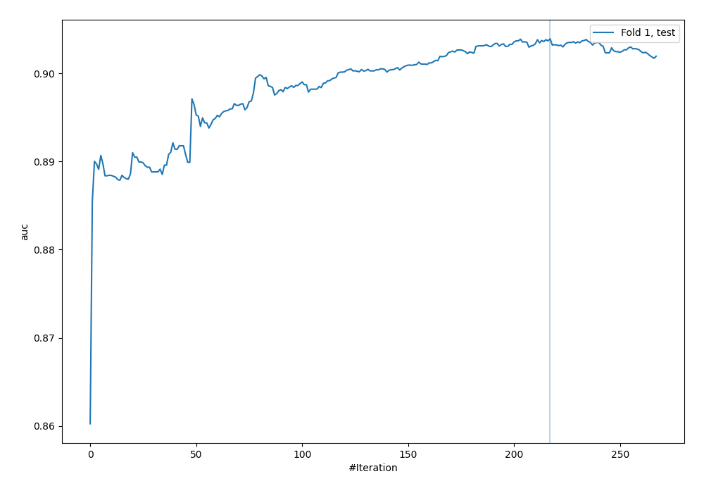
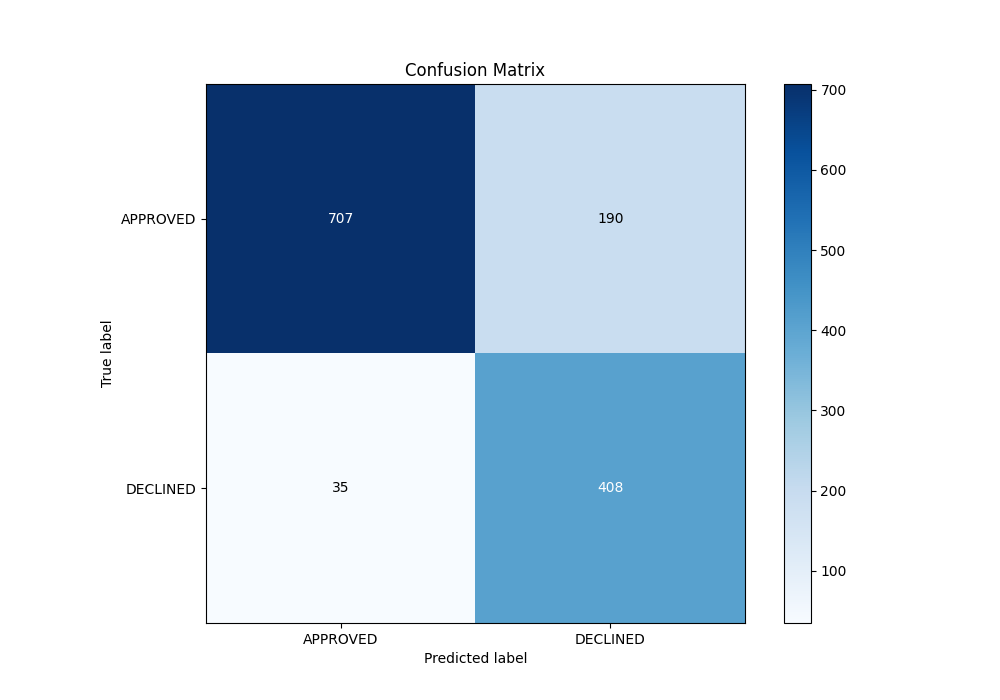
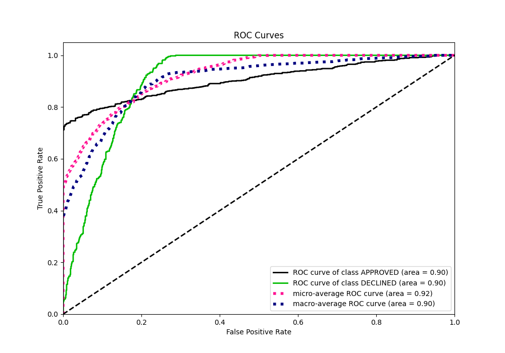
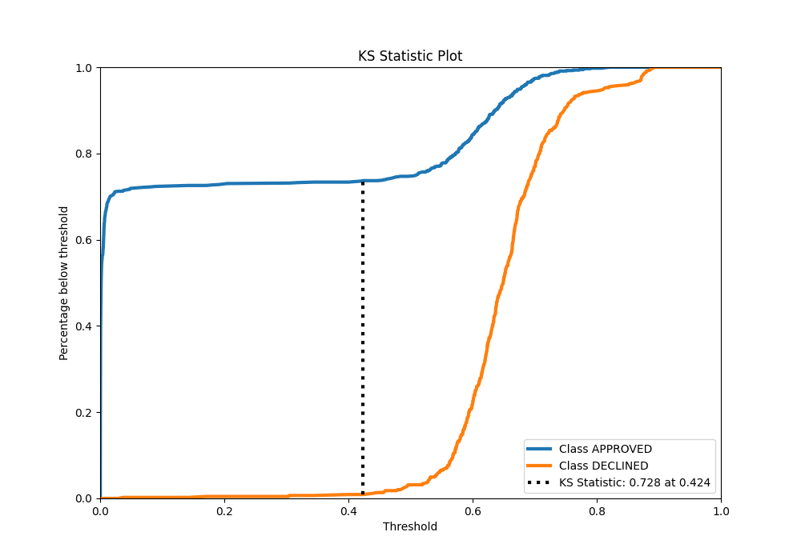
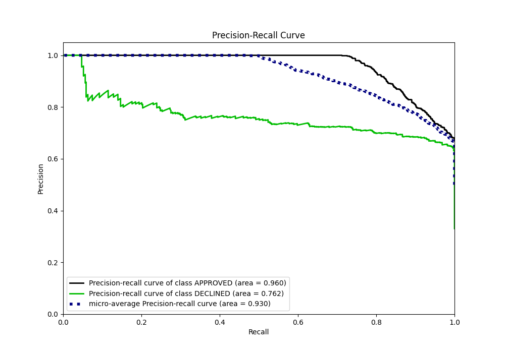
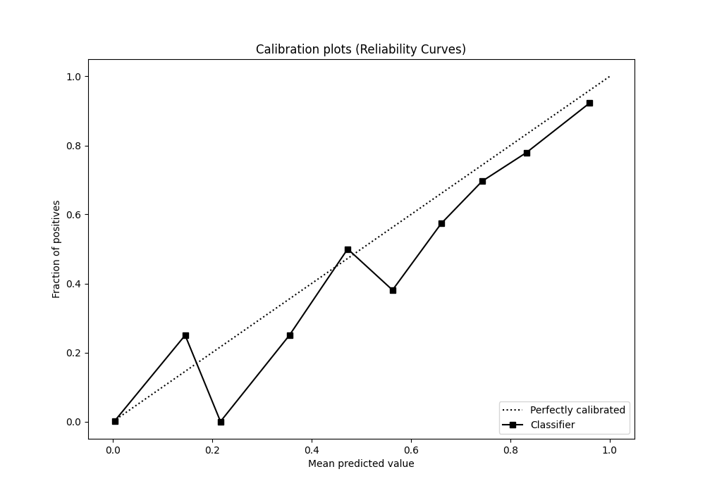
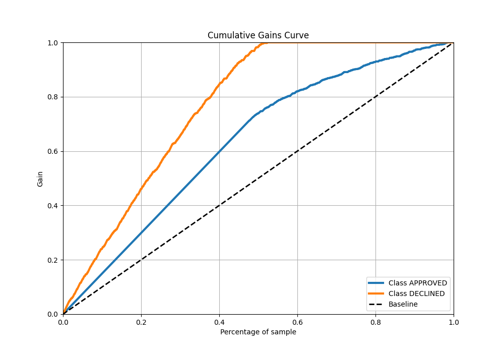
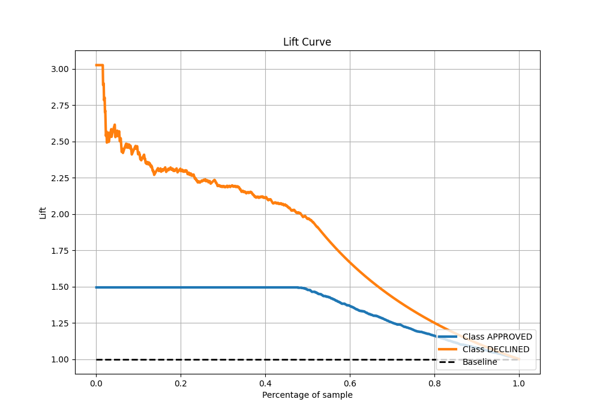

# Summary of 83_CatBoost

[<< Go back](../README.md)

## CatBoost
- **n_jobs**: -1
- **learning_rate**: 0.05
- **depth**: 7
- **rsm**: 1.0
- **loss_function**: Logloss
- **eval_metric**: AUC
- **explain_level**: 0

## Validation
 - **validation_type**: split
 - **train_ratio**: 0.8
 - **shuffle**: True
 - **stratify**: True

## Optimized metric
auc

## Training time

3.2 seconds

## Metric details
|           |    score |     threshold |
|:----------|---------:|--------------:|
| logloss   | 0.322759 | nan           |
| auc       | 0.90391  | nan           |
| f1        | 0.786618 |   0.478566    |
| accuracy  | 0.83209  |   0.562561    |
| precision | 0.846154 |   0.737857    |
| recall    | 1        |   0.000115136 |
| mcc       | 0.684756 |   0.478566    |

## Metric details with threshold from accuracy metric
|           |    score |   threshold |
|:----------|---------:|------------:|
| logloss   | 0.322759 |  nan        |
| auc       | 0.90391  |  nan        |
| f1        | 0.783862 |    0.562561 |
| accuracy  | 0.83209  |    0.562561 |
| precision | 0.682274 |    0.562561 |
| recall    | 0.920993 |    0.562561 |
| mcc       | 0.671119 |    0.562561 |

## Confusion matrix (at threshold=0.562561)
|                     |   Predicted as APPROVED |   Predicted as DECLINED |
|:--------------------|------------------------:|------------------------:|
| Labeled as APPROVED |                     707 |                     190 |
| Labeled as DECLINED |                      35 |                     408 |

## Learning curves

## Confusion Matrix

## Normalized Confusion Matrix

## ROC Curve

## Kolmogorov-Smirnov Statistic

## Precision-Recall Curve

## Calibration Curve

## Cumulative Gains Curve

## Lift Curve

[<< Go back](../README.md)
