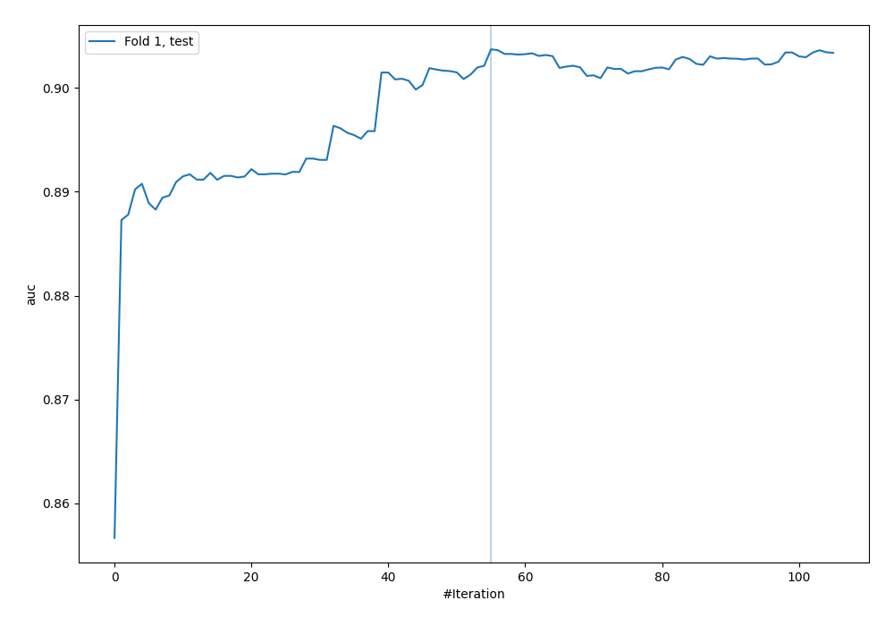
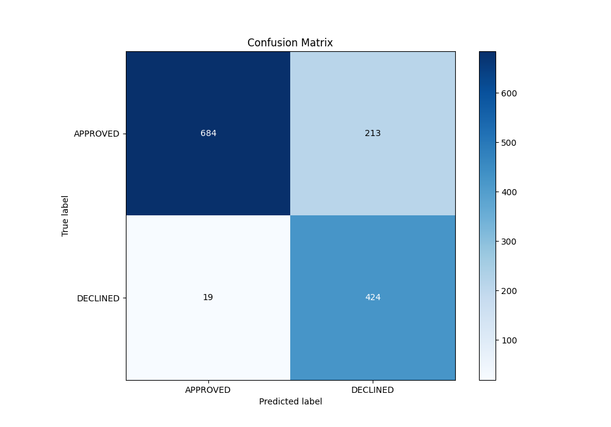
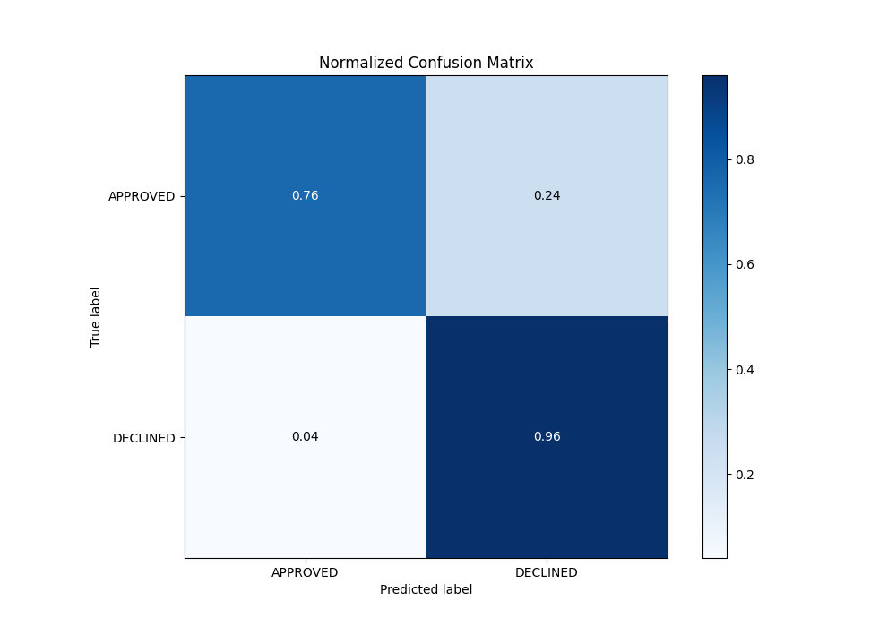
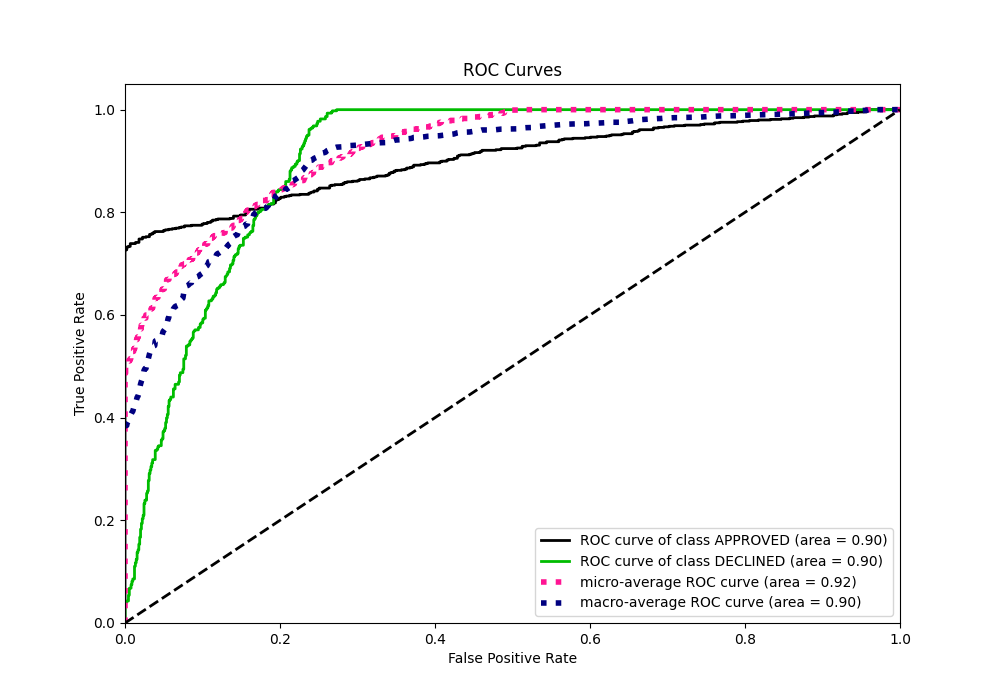
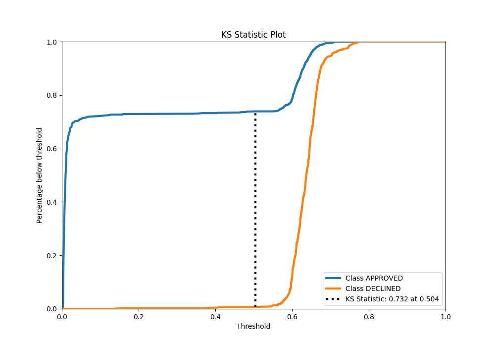
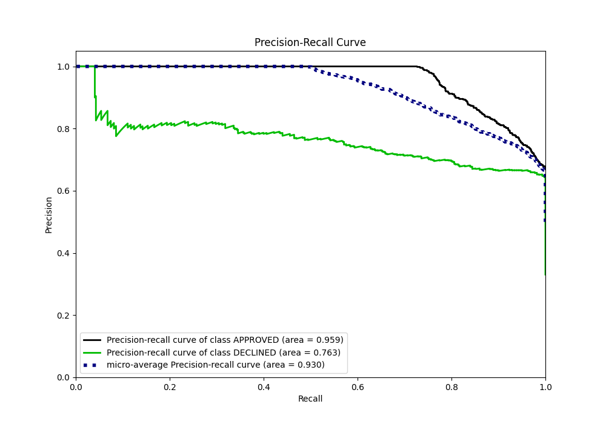
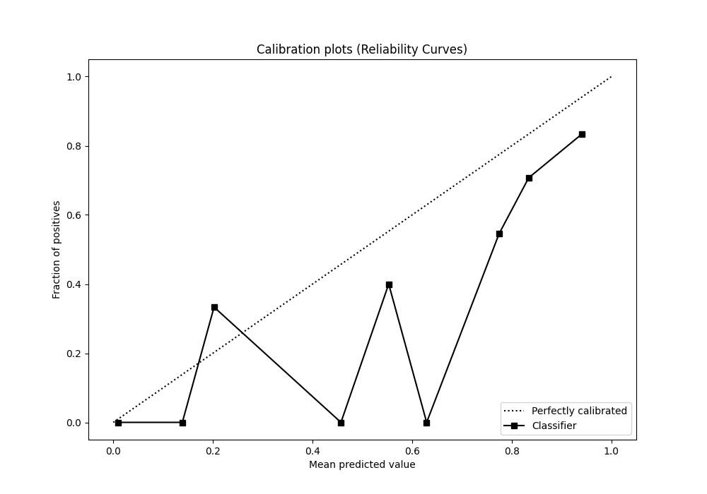
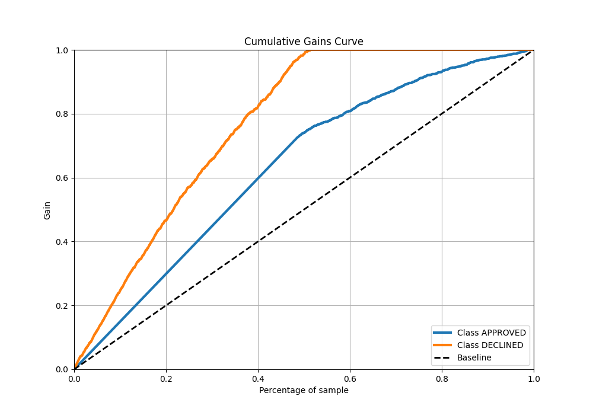
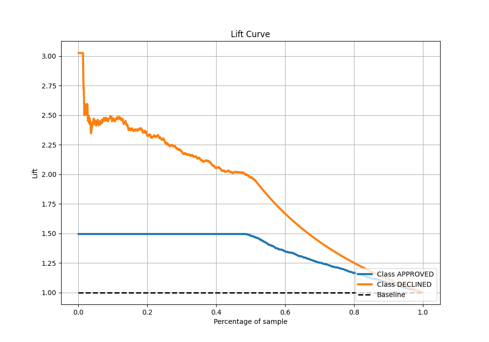

# Summary of 84_CatBoost

[<< Go back](../README.md)

## CatBoost
- **n_jobs**: -1
- **learning_rate**: 0.05
- **depth**: 9
- **rsm**: 1.0
- **loss_function**: Logloss
- **eval_metric**: AUC
- **explain_level**: 0

## Validation
 - **validation_type**: split
 - **train_ratio**: 0.8
 - **shuffle**: True
 - **stratify**: True

## Optimized metric
auc

## Training time

2.8 seconds

## Metric details
|           |    score |    threshold |
|:----------|---------:|-------------:|
| logloss   | 0.330387 | nan          |
| auc       | 0.903715 | nan          |
| f1        | 0.786618 |   0.568398   |
| accuracy  | 0.826866 |   0.586885   |
| precision | 0.819355 |   0.655752   |
| recall    | 1        |   0.00192483 |
| mcc       | 0.686974 |   0.480733   |

## Metric details with threshold from accuracy metric
|           |    score |   threshold |
|:----------|---------:|------------:|
| logloss   | 0.330387 |  nan        |
| auc       | 0.903715 |  nan        |
| f1        | 0.785185 |    0.586885 |
| accuracy  | 0.826866 |    0.586885 |
| precision | 0.66562  |    0.586885 |
| recall    | 0.957111 |    0.586885 |
| mcc       | 0.677912 |    0.586885 |

## Confusion matrix (at threshold=0.586885)
|                     |   Predicted as APPROVED |   Predicted as DECLINED |
|:--------------------|------------------------:|------------------------:|
| Labeled as APPROVED |                     684 |                     213 |
| Labeled as DECLINED |                      19 |                     424 |

## Learning curves

## Confusion Matrix

## Normalized Confusion Matrix

## ROC Curve

## Kolmogorov-Smirnov Statistic

## Precision-Recall Curve

## Calibration Curve

## Cumulative Gains Curve

## Lift Curve

[<< Go back](../README.md)
