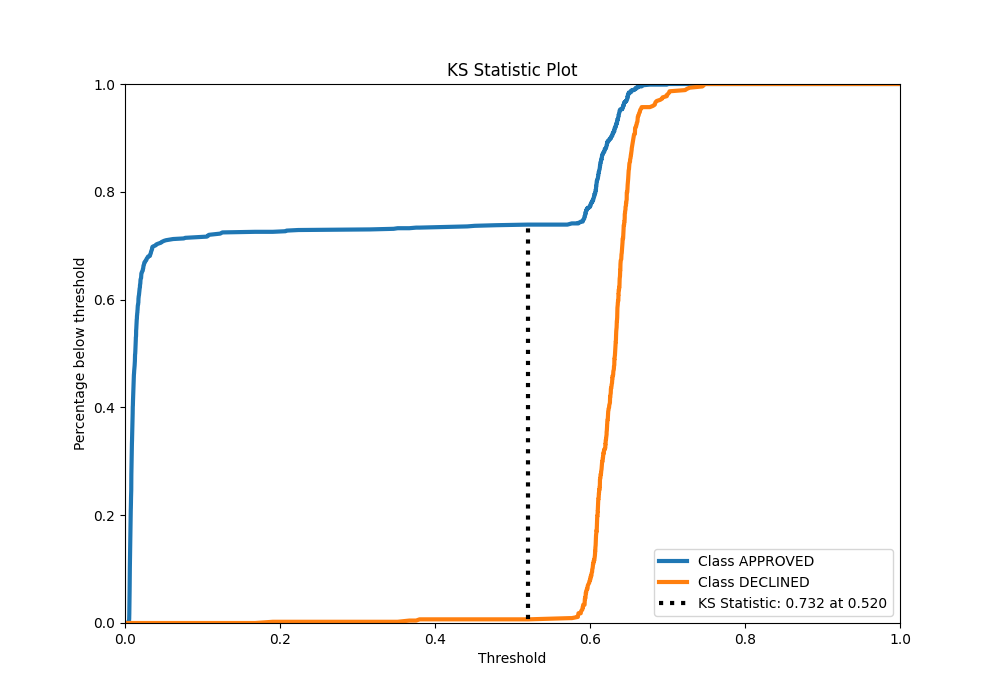

# Summary of 85_CatBoost

[<< Go back](../README.md)

## CatBoost
- **n_jobs**: -1
- **learning_rate**: 0.1
- **depth**: 7
- **rsm**: 1.0
- **loss_function**: Logloss
- **eval_metric**: AUC
- **explain_level**: 0

## Validation
 - **validation_type**: split
 - **train_ratio**: 0.8
 - **shuffle**: True
 - **stratify**: True

## Optimized metric
auc

## Training time

2.3 seconds

## Metric details
|           |    score |    threshold |
|:----------|---------:|-------------:|
| logloss   | 0.334552 | nan          |
| auc       | 0.901735 | nan          |
| f1        | 0.786416 |   0.465184   |
| accuracy  | 0.823134 |   0.592777   |
| precision | 0.830769 |   0.653808   |
| recall    | 1        |   0.00428417 |
| mcc       | 0.686974 |   0.465184   |

## Metric details with threshold from accuracy metric
|           |    score |   threshold |
|:----------|---------:|------------:|
| logloss   | 0.334552 |  nan        |
| auc       | 0.901735 |  nan        |
| f1        | 0.783166 |    0.592777 |
| accuracy  | 0.823134 |    0.592777 |
| precision | 0.658462 |    0.592777 |
| recall    | 0.96614  |    0.592777 |
| mcc       | 0.676446 |    0.592777 |

## Confusion matrix (at threshold=0.592777)
|                     |   Predicted as APPROVED |   Predicted as DECLINED |
|:--------------------|------------------------:|------------------------:|
| Labeled as APPROVED |                     675 |                     222 |
| Labeled as DECLINED |                      15 |                     428 |

## Learning curves

## Confusion Matrix

## Normalized Confusion Matrix

## ROC Curve

## Kolmogorov-Smirnov Statistic

## Precision-Recall Curve

## Calibration Curve

## Cumulative Gains Curve

## Lift Curve

[<< Go back](../README.md)
