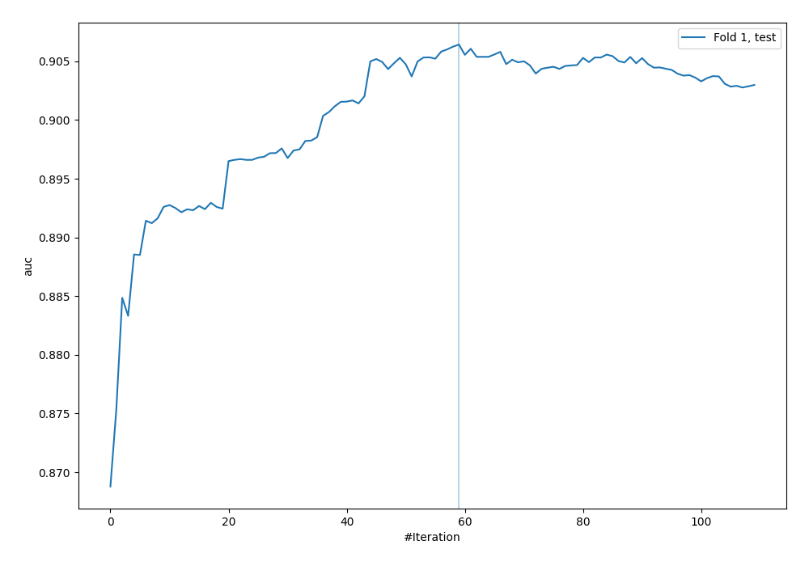
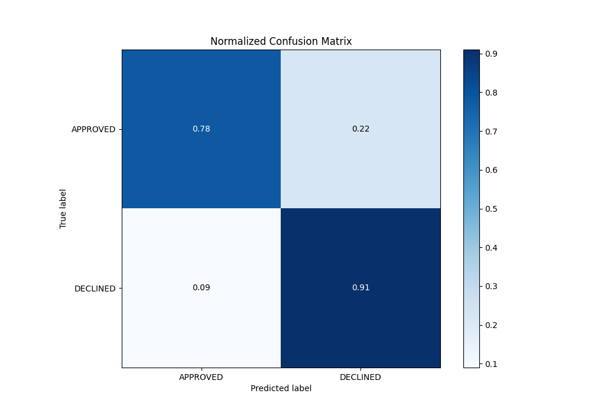
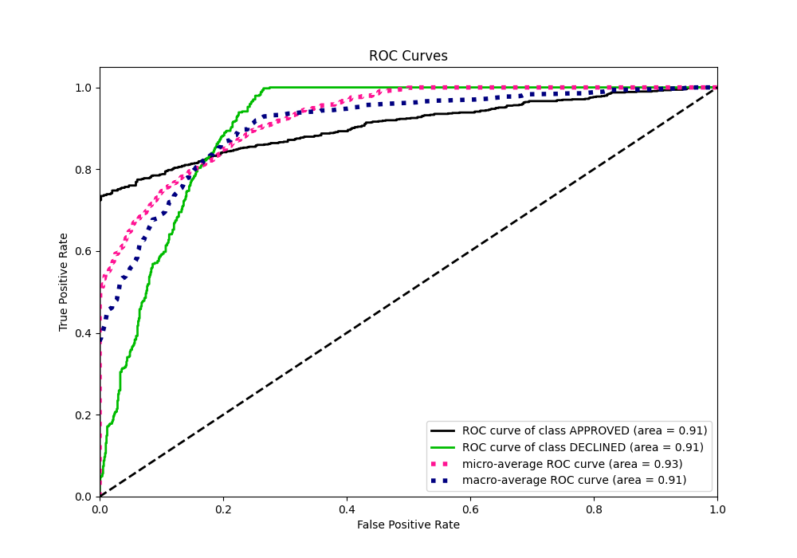
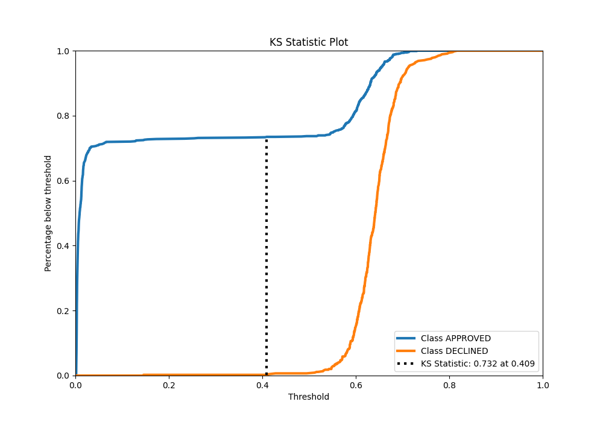
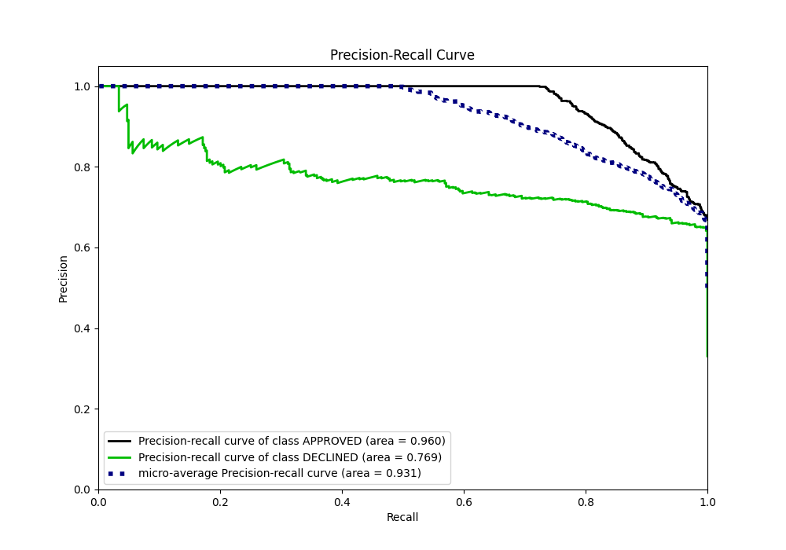
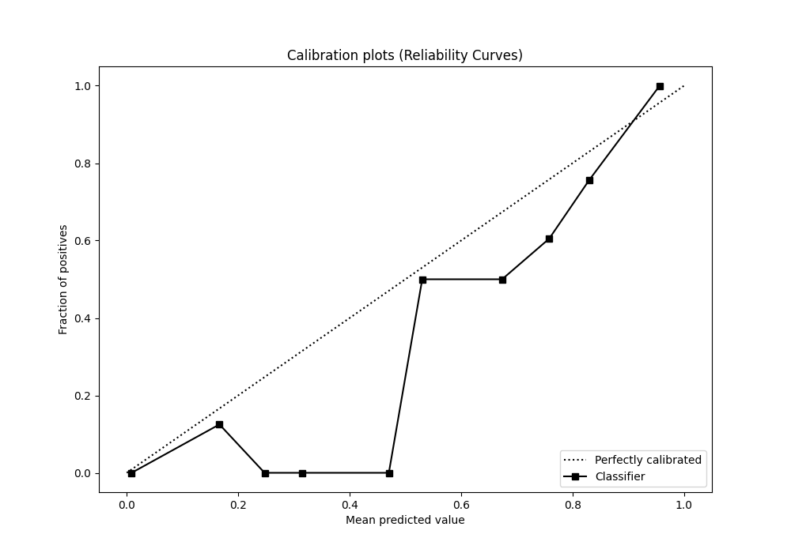
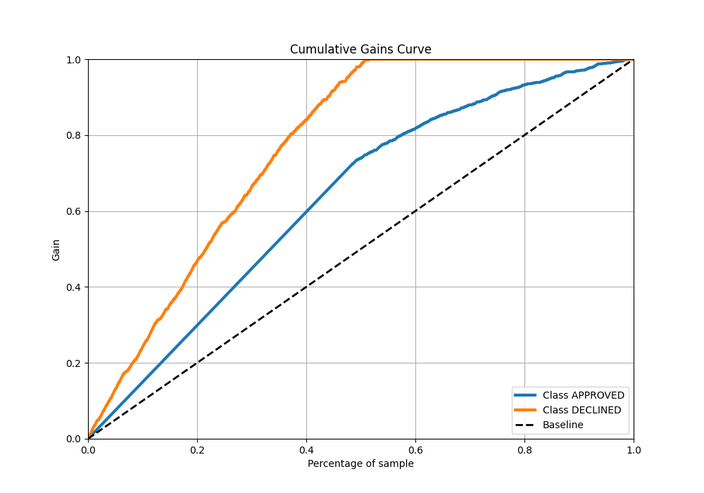
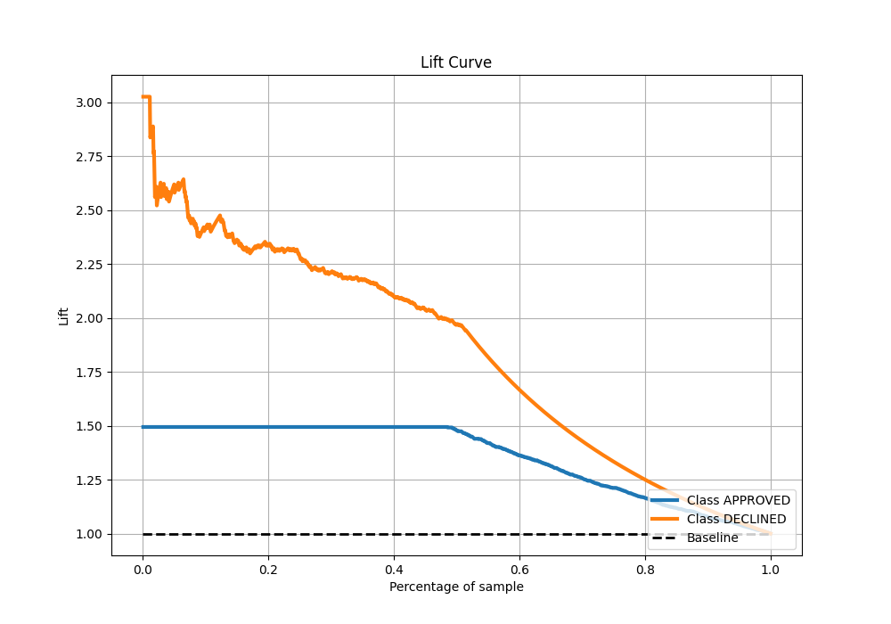

# Summary of 88_CatBoost

[<< Go back](../README.md)

## CatBoost
- **n_jobs**: -1
- **learning_rate**: 0.05
- **depth**: 9
- **rsm**: 1.0
- **loss_function**: Logloss
- **eval_metric**: AUC
- **explain_level**: 0

## Validation
 - **validation_type**: split
 - **train_ratio**: 0.8
 - **shuffle**: True
 - **stratify**: True

## Optimized metric
auc

## Training time

3.3 seconds

## Metric details
|           |    score |    threshold |
|:----------|---------:|-------------:|
| logloss   | 0.327825 | nan          |
| auc       | 0.906431 | nan          |
| f1        | 0.786416 |   0.503229   |
| accuracy  | 0.827612 |   0.587118   |
| precision | 0.861538 |   0.687022   |
| recall    | 1        |   0.00131297 |
| mcc       | 0.686974 |   0.503229   |

## Metric details with threshold from accuracy metric
|           |    score |   threshold |
|:----------|---------:|------------:|
| logloss   | 0.327825 |  nan        |
| auc       | 0.906431 |  nan        |
| f1        | 0.778098 |    0.587118 |
| accuracy  | 0.827612 |    0.587118 |
| precision | 0.677258 |    0.587118 |
| recall    | 0.914221 |    0.587118 |
| mcc       | 0.661546 |    0.587118 |

## Confusion matrix (at threshold=0.587118)
|                     |   Predicted as APPROVED |   Predicted as DECLINED |
|:--------------------|------------------------:|------------------------:|
| Labeled as APPROVED |                     704 |                     193 |
| Labeled as DECLINED |                      38 |                     405 |

## Learning curves

## Confusion Matrix

## Normalized Confusion Matrix

## ROC Curve

## Kolmogorov-Smirnov Statistic

## Precision-Recall Curve

## Calibration Curve

## Cumulative Gains Curve

## Lift Curve

[<< Go back](../README.md)
