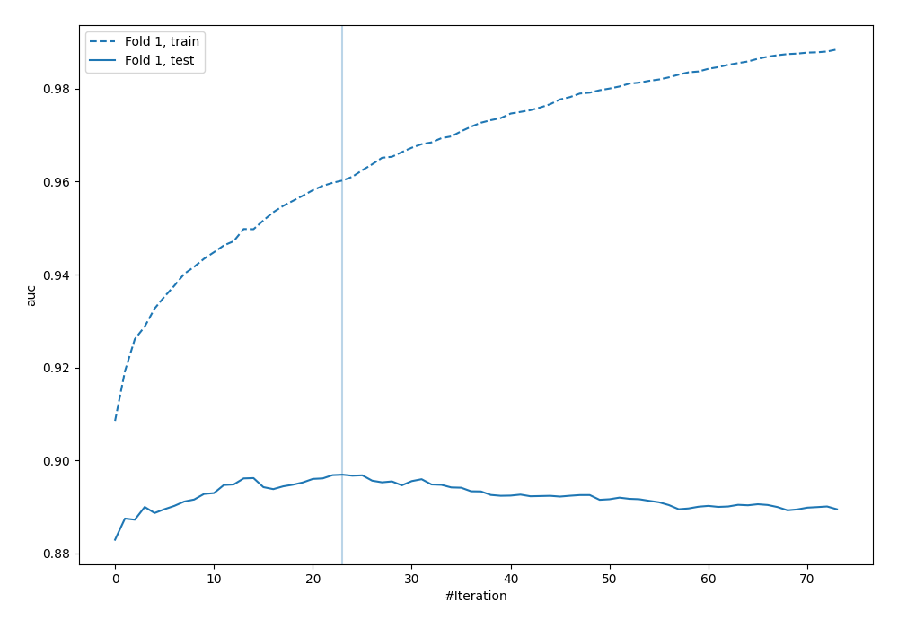
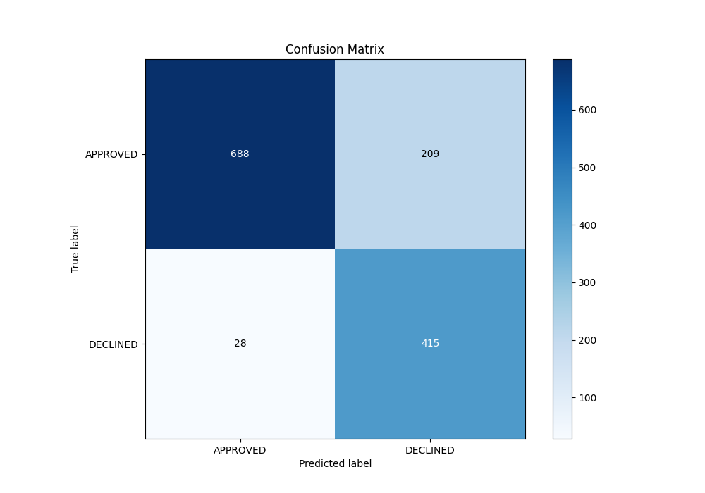
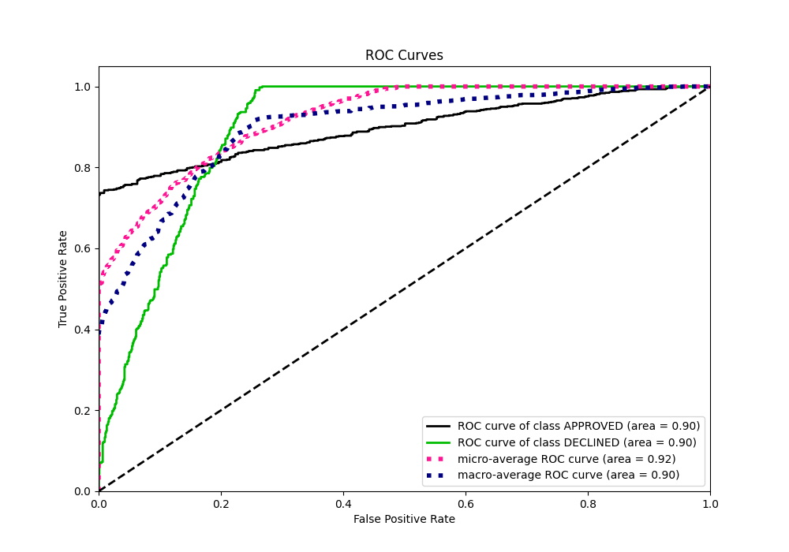
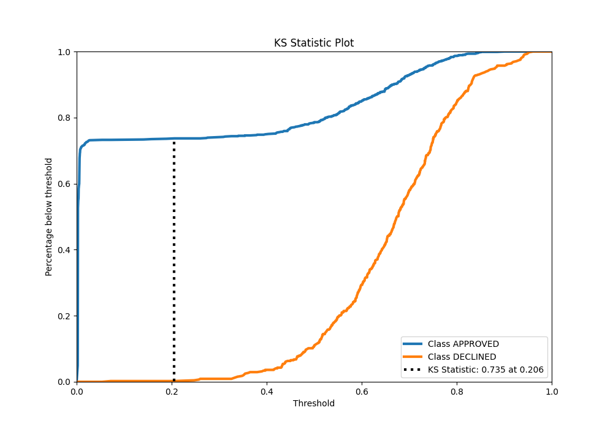
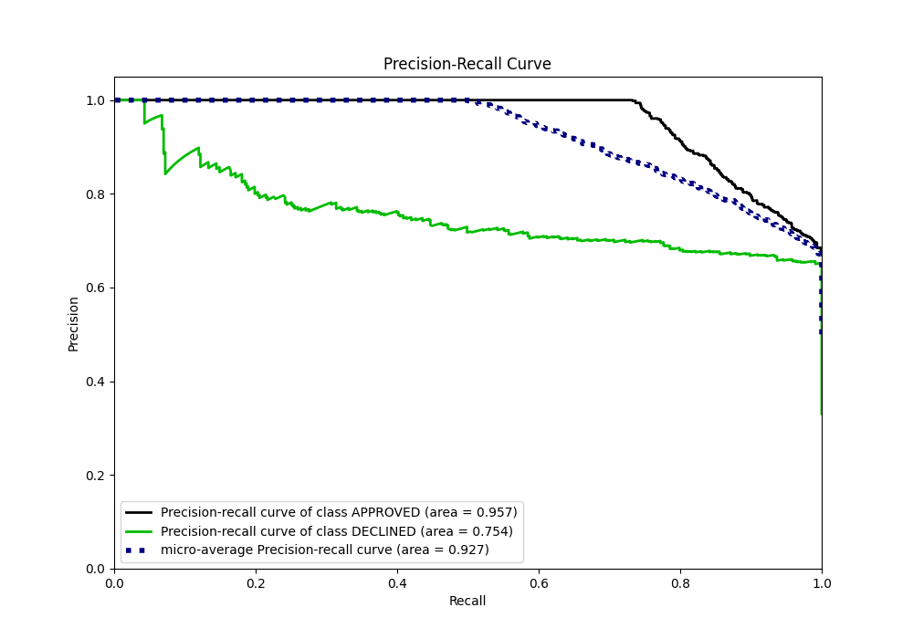
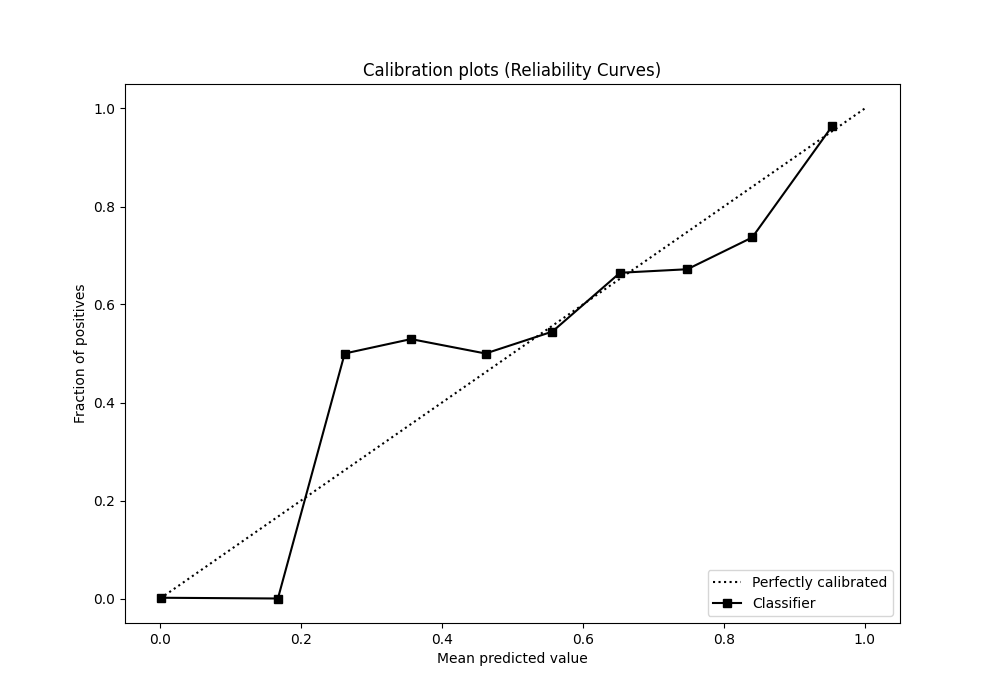
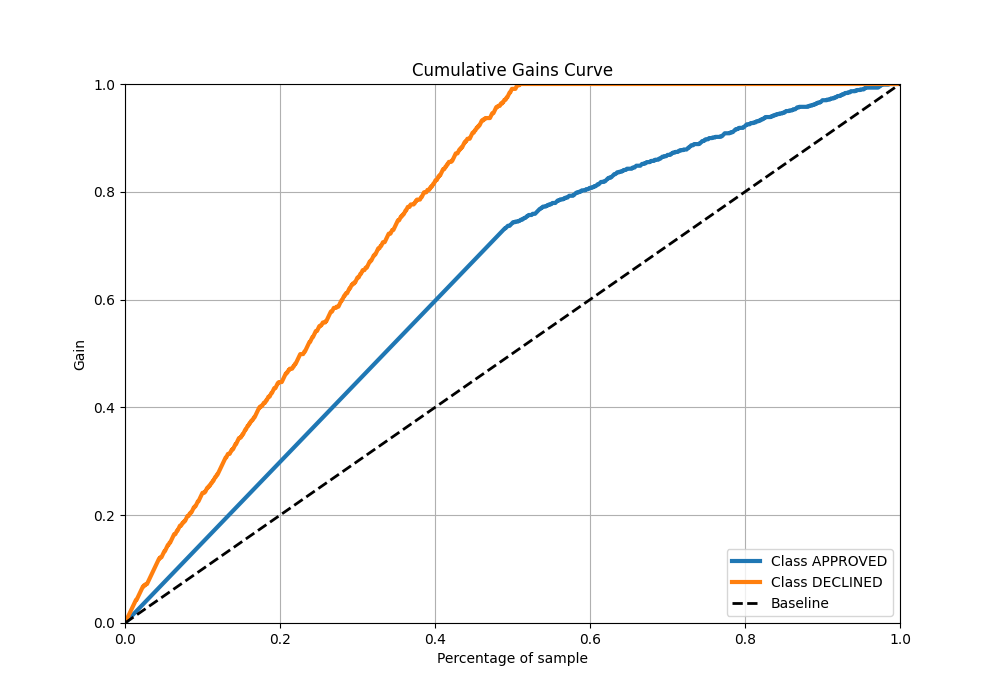
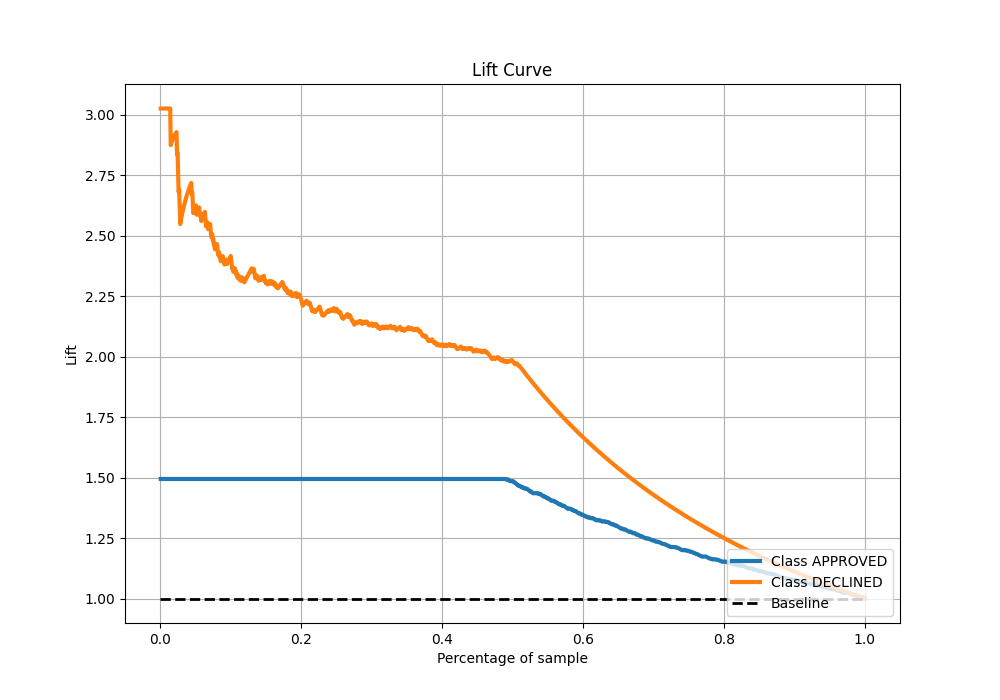

# Summary of 89_LightGBM

[<< Go back](../README.md)

## LightGBM
- **n_jobs**: -1
- **objective**: binary
- **num_leaves**: 31
- **learning_rate**: 0.2
- **feature_fraction**: 0.9
- **bagging_fraction**: 0.9
- **min_data_in_leaf**: 20
- **metric**: auc
- **custom_eval_metric_name**: None
- **explain_level**: 0

## Validation
 - **validation_type**: split
 - **train_ratio**: 0.8
 - **shuffle**: True
 - **stratify**: True

## Optimized metric
auc

## Training time

1.9 seconds

## Metric details
|           |    score |    threshold |
|:----------|---------:|-------------:|
| logloss   | 0.323766 | nan          |
| auc       | 0.896929 | nan          |
| f1        | 0.786416 |   0.258734   |
| accuracy  | 0.823134 |   0.449348   |
| precision | 0.884615 |   0.827321   |
| recall    | 1        |   0.00205823 |
| mcc       | 0.686974 |   0.258734   |

## Metric details with threshold from accuracy metric
|           |    score |   threshold |
|:----------|---------:|------------:|
| logloss   | 0.323766 |  nan        |
| auc       | 0.896929 |  nan        |
| f1        | 0.777882 |    0.449348 |
| accuracy  | 0.823134 |    0.449348 |
| precision | 0.665064 |    0.449348 |
| recall    | 0.936795 |    0.449348 |
| mcc       | 0.663737 |    0.449348 |

## Confusion matrix (at threshold=0.449348)
|                     |   Predicted as APPROVED |   Predicted as DECLINED |
|:--------------------|------------------------:|------------------------:|
| Labeled as APPROVED |                     688 |                     209 |
| Labeled as DECLINED |                      28 |                     415 |

## Learning curves

## Confusion Matrix

## Normalized Confusion Matrix

## ROC Curve

## Kolmogorov-Smirnov Statistic

## Precision-Recall Curve

## Calibration Curve

## Cumulative Gains Curve

## Lift Curve

[<< Go back](../README.md)
