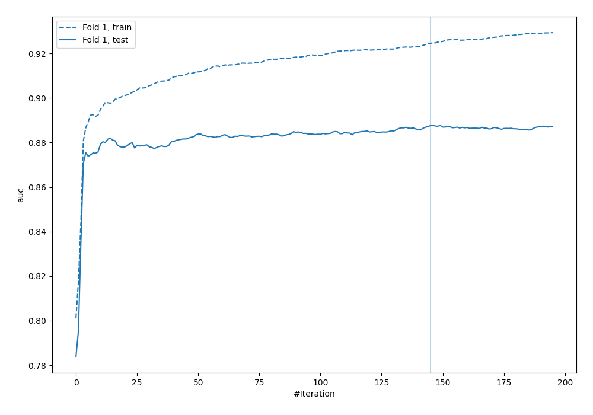
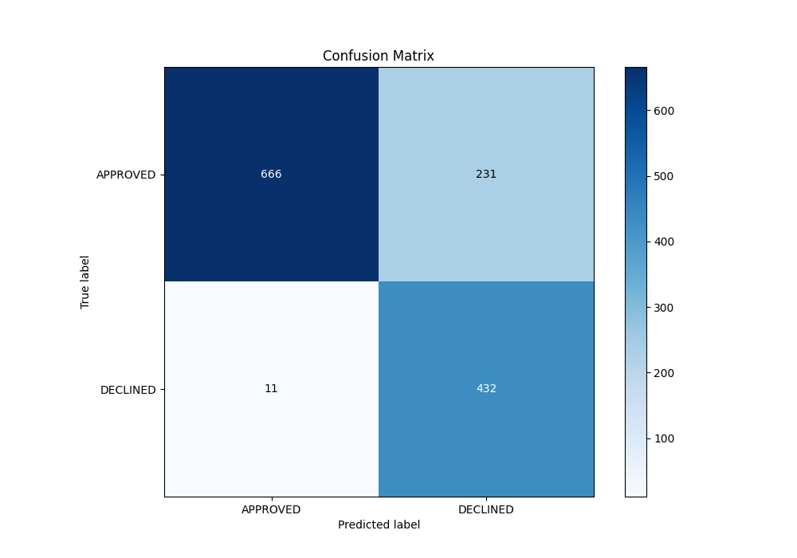
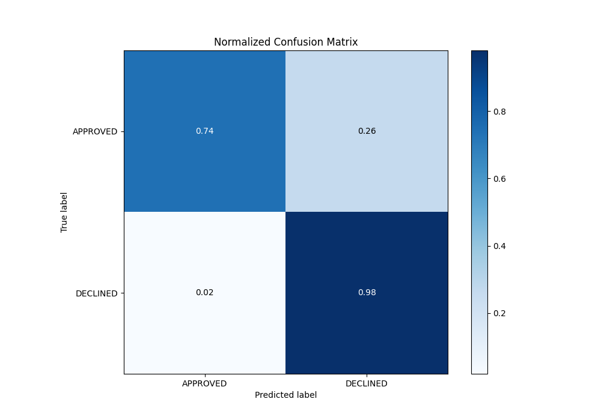
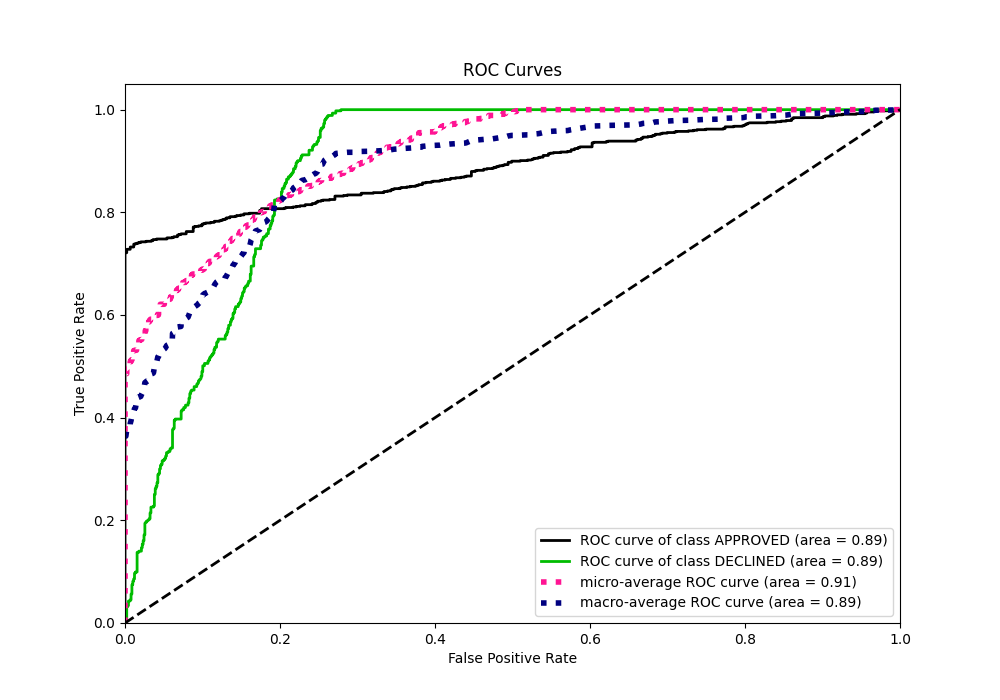
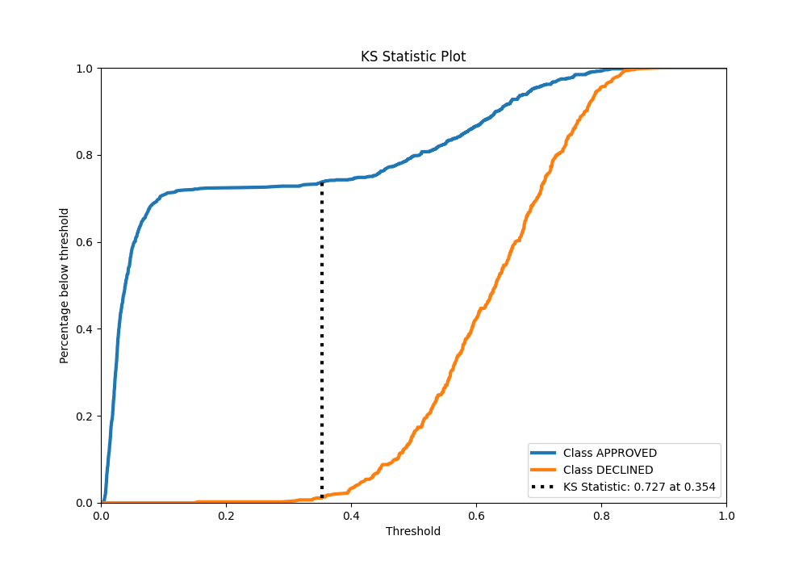
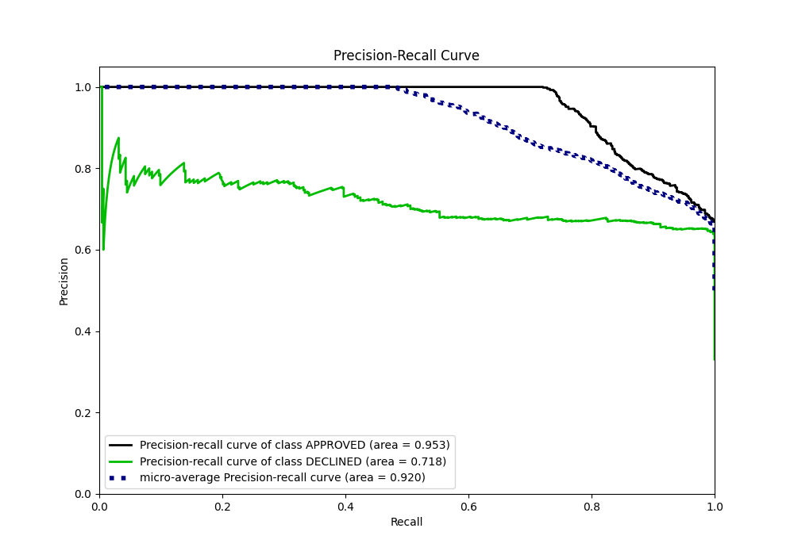
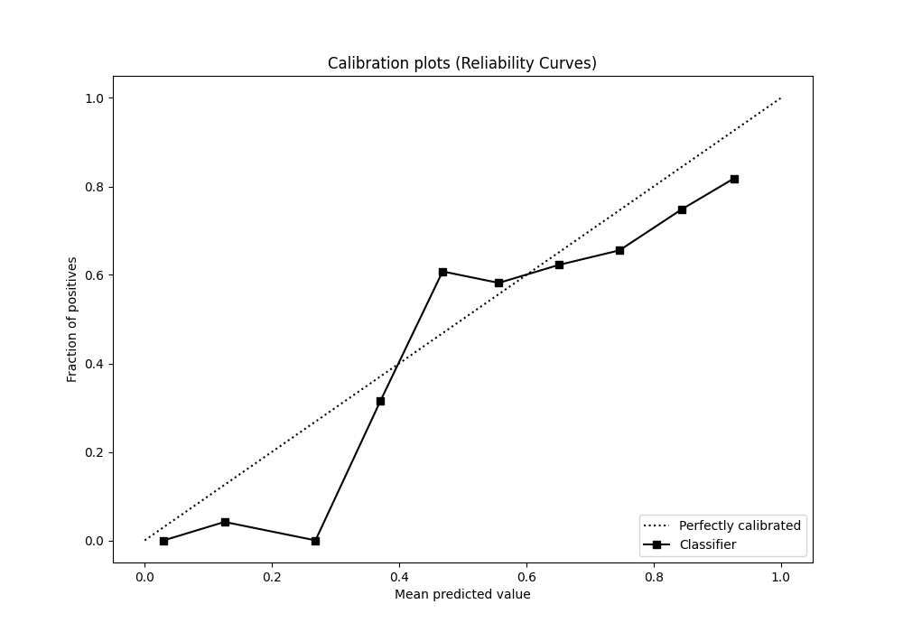
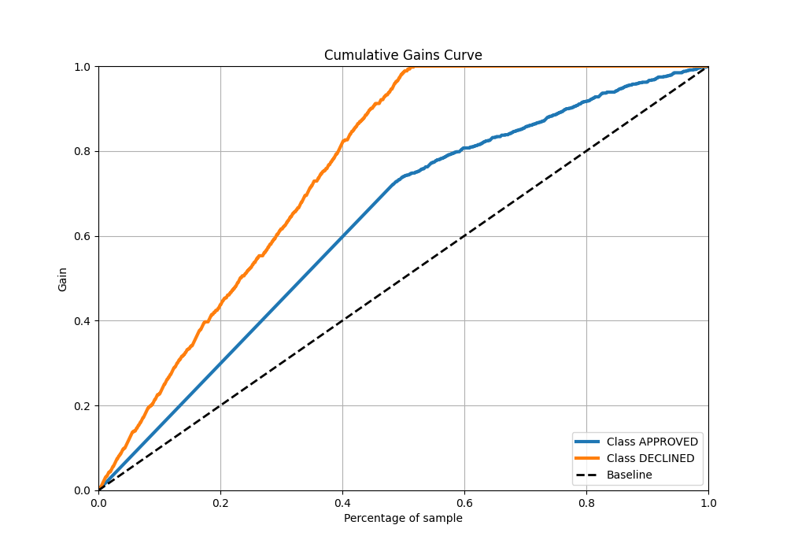
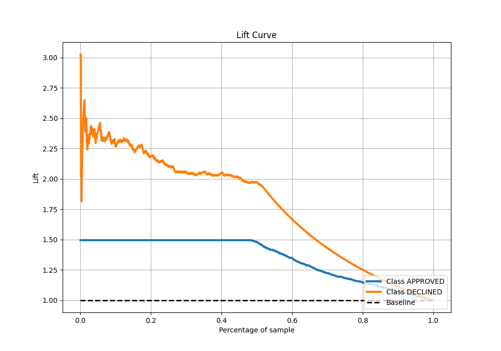

# Summary of 8_Xgboost

[<< Go back](../README.md)

## Extreme Gradient Boosting (Xgboost)
- **n_jobs**: -1
- **objective**: binary:logistic
- **eta**: 0.15
- **max_depth**: 6
- **min_child_weight**: 25
- **subsample**: 0.5
- **colsample_bytree**: 0.5
- **eval_metric**: auc
- **explain_level**: 0

## Validation
 - **validation_type**: split
 - **train_ratio**: 0.8
 - **shuffle**: True
 - **stratify**: True

## Optimized metric
auc

## Training time

1.2 seconds

## Metric details
|           |    score |   threshold |
|:----------|---------:|------------:|
| logloss   | 0.349545 | nan         |
| auc       | 0.887658 | nan         |
| f1        | 0.782842 |   0.349087  |
| accuracy  | 0.819403 |   0.39559   |
| precision | 0.794872 |   0.757102  |
| recall    | 1        |   0.0039759 |
| mcc       | 0.680628 |   0.349087  |

## Metric details with threshold from accuracy metric
|           |    score |   threshold |
|:----------|---------:|------------:|
| logloss   | 0.349545 |   nan       |
| auc       | 0.887658 |   nan       |
| f1        | 0.781193 |     0.39559 |
| accuracy  | 0.819403 |     0.39559 |
| precision | 0.651584 |     0.39559 |
| recall    | 0.975169 |     0.39559 |
| mcc       | 0.675237 |     0.39559 |

## Confusion matrix (at threshold=0.39559)
|                     |   Predicted as APPROVED |   Predicted as DECLINED |
|:--------------------|------------------------:|------------------------:|
| Labeled as APPROVED |                     666 |                     231 |
| Labeled as DECLINED |                      11 |                     432 |

## Learning curves

## Confusion Matrix

## Normalized Confusion Matrix

## ROC Curve

## Kolmogorov-Smirnov Statistic

## Precision-Recall Curve

## Calibration Curve

## Cumulative Gains Curve

## Lift Curve

[<< Go back](../README.md)
