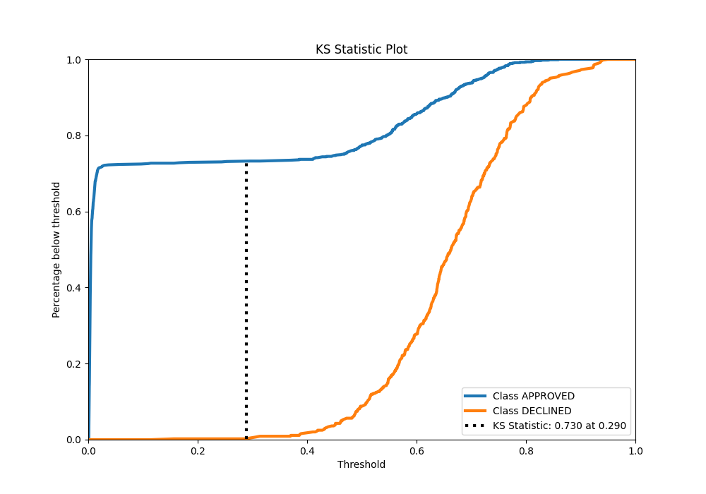

# Summary of 90_Xgboost

[<< Go back](../README.md)

## Extreme Gradient Boosting (Xgboost)
- **n_jobs**: -1
- **objective**: binary:logistic
- **eta**: 0.1
- **max_depth**: 7
- **min_child_weight**: 5
- **subsample**: 0.7
- **colsample_bytree**: 0.6
- **eval_metric**: auc
- **explain_level**: 0

## Validation
 - **validation_type**: split
 - **train_ratio**: 0.8
 - **shuffle**: True
 - **stratify**: True

## Optimized metric
auc

## Training time

2.0 seconds

## Metric details
|           |    score |     threshold |
|:----------|---------:|--------------:|
| logloss   | 0.322519 | nan           |
| auc       | 0.9003   | nan           |
| f1        | 0.782842 |   0.377841    |
| accuracy  | 0.820149 |   0.562801    |
| precision | 0.897436 |   0.780863    |
| recall    | 1        |   0.000820524 |
| mcc       | 0.683104 |   0.111968    |

## Metric details with threshold from accuracy metric
|           |    score |   threshold |
|:----------|---------:|------------:|
| logloss   | 0.322519 |  nan        |
| auc       | 0.9003   |  nan        |
| f1        | 0.74974  |    0.562801 |
| accuracy  | 0.820149 |    0.562801 |
| precision | 0.694231 |    0.562801 |
| recall    | 0.814898 |    0.562801 |
| mcc       | 0.615553 |    0.562801 |

## Confusion matrix (at threshold=0.562801)
|                     |   Predicted as APPROVED |   Predicted as DECLINED |
|:--------------------|------------------------:|------------------------:|
| Labeled as APPROVED |                     738 |                     159 |
| Labeled as DECLINED |                      82 |                     361 |

## Learning curves

## Confusion Matrix

## Normalized Confusion Matrix

## ROC Curve

## Kolmogorov-Smirnov Statistic

## Precision-Recall Curve

## Calibration Curve

## Cumulative Gains Curve

## Lift Curve

[<< Go back](../README.md)
