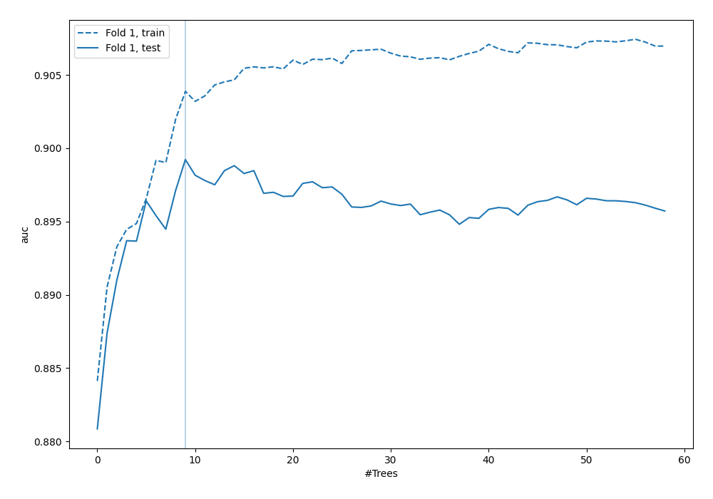
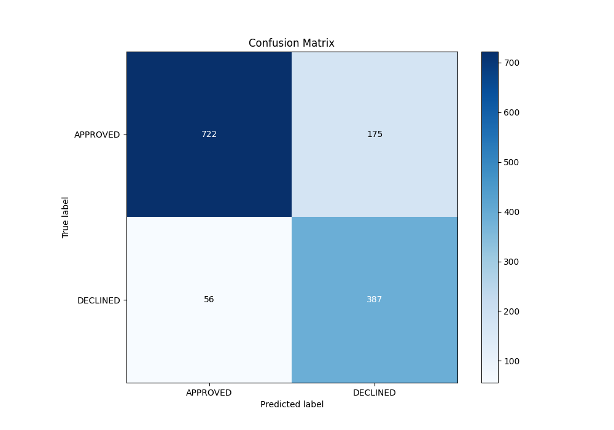
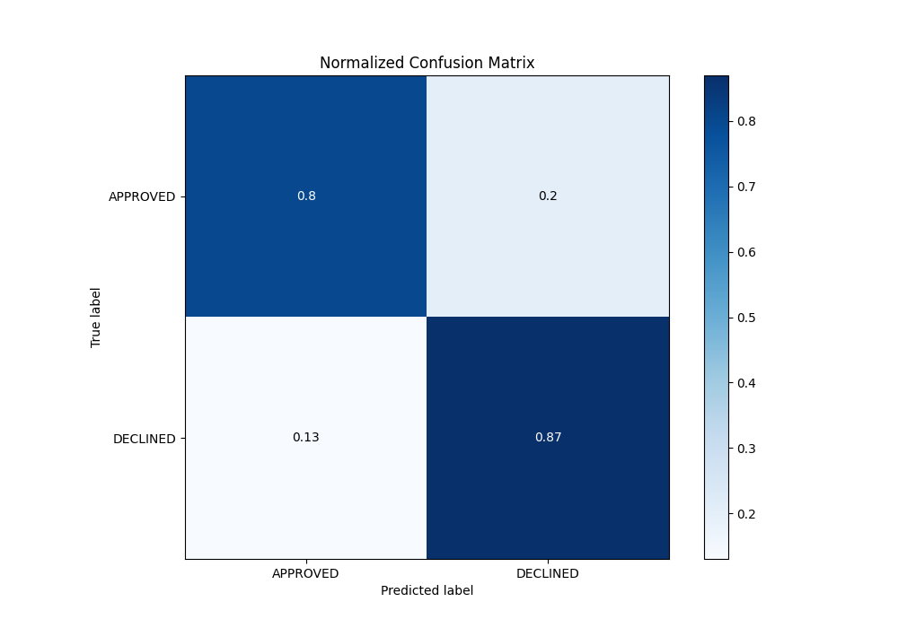
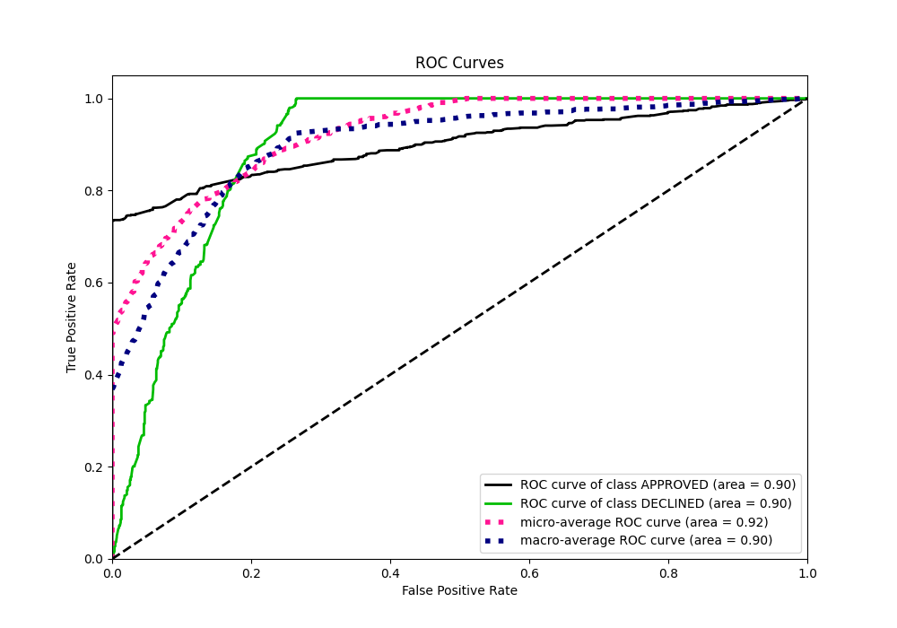
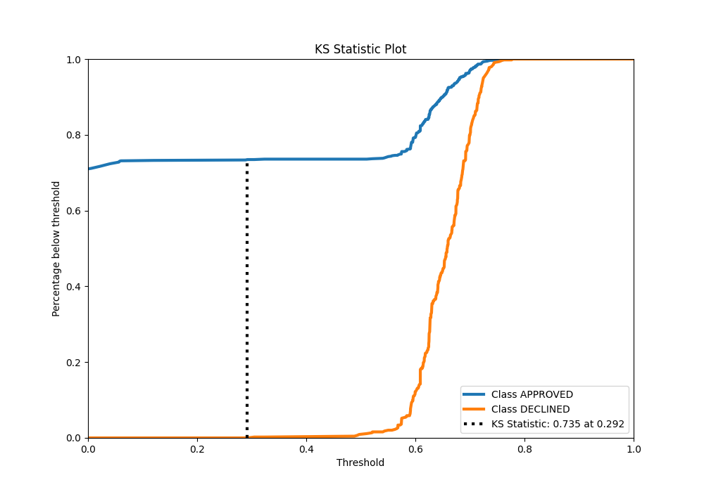
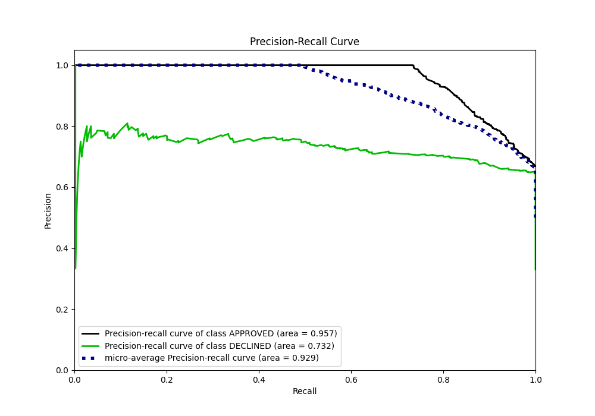
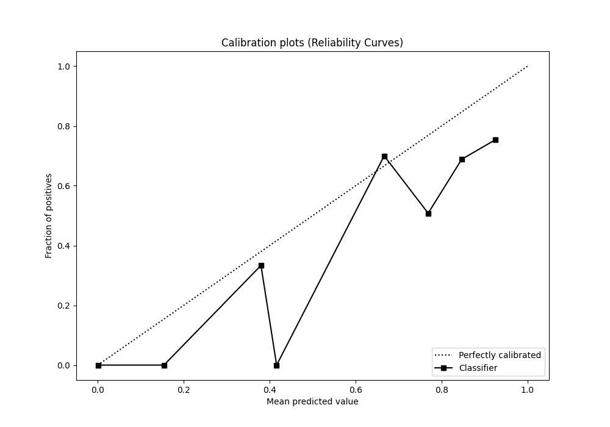
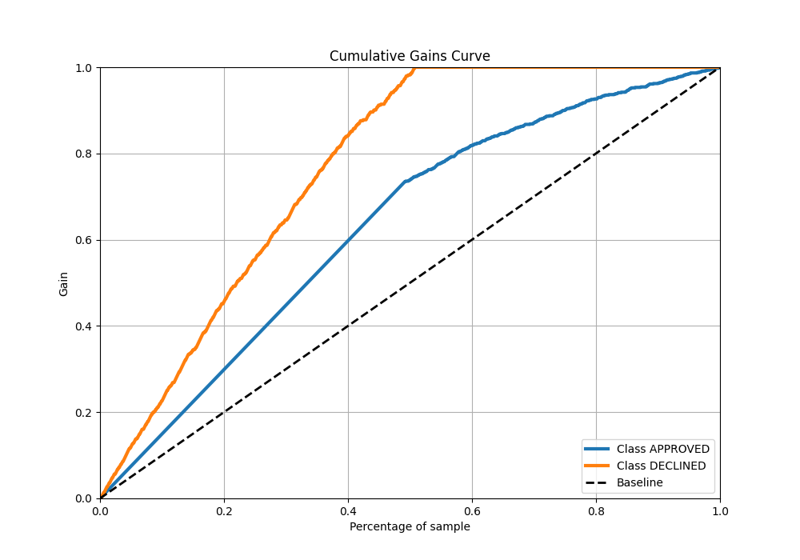
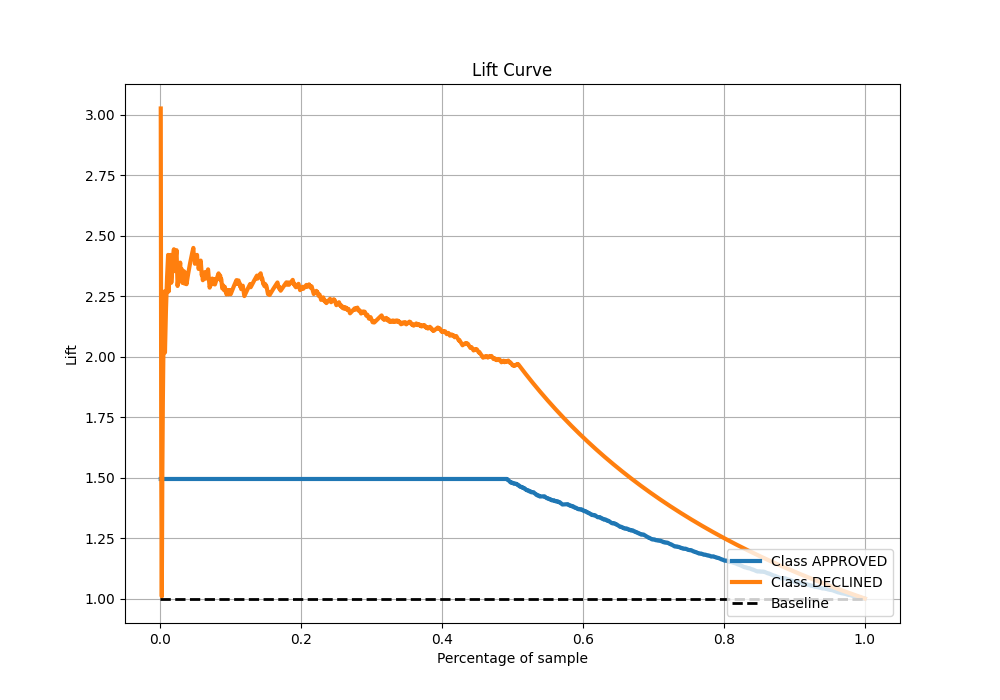

# Summary of 91_RandomForest

[<< Go back](../README.md)

## Random Forest
- **n_jobs**: -1
- **criterion**: entropy
- **max_features**: 0.7
- **min_samples_split**: 50
- **max_depth**: 7
- **eval_metric_name**: auc
- **explain_level**: 0

## Validation
 - **validation_type**: split
 - **train_ratio**: 0.8
 - **shuffle**: True
 - **stratify**: True

## Optimized metric
auc

## Training time

2.5 seconds

## Metric details
|           |    score |   threshold |
|:----------|---------:|------------:|
| logloss   | 0.323379 | nan         |
| auc       | 0.89923  | nan         |
| f1        | 0.78481  |   0.559913  |
| accuracy  | 0.827612 |   0.602154  |
| precision | 0.8      |   0.714384  |
| recall    | 1        |   0         |
| mcc       | 0.685147 |   0.0566667 |

## Metric details with threshold from accuracy metric
|           |    score |   threshold |
|:----------|---------:|------------:|
| logloss   | 0.323379 |  nan        |
| auc       | 0.89923  |  nan        |
| f1        | 0.770149 |    0.602154 |
| accuracy  | 0.827612 |    0.602154 |
| precision | 0.688612 |    0.602154 |
| recall    | 0.873589 |    0.602154 |
| mcc       | 0.646824 |    0.602154 |

## Confusion matrix (at threshold=0.602154)
|                     |   Predicted as APPROVED |   Predicted as DECLINED |
|:--------------------|------------------------:|------------------------:|
| Labeled as APPROVED |                     722 |                     175 |
| Labeled as DECLINED |                      56 |                     387 |

## Learning curves

## Confusion Matrix

## Normalized Confusion Matrix

## ROC Curve

## Kolmogorov-Smirnov Statistic

## Precision-Recall Curve

## Calibration Curve

## Cumulative Gains Curve

## Lift Curve

[<< Go back](../README.md)
