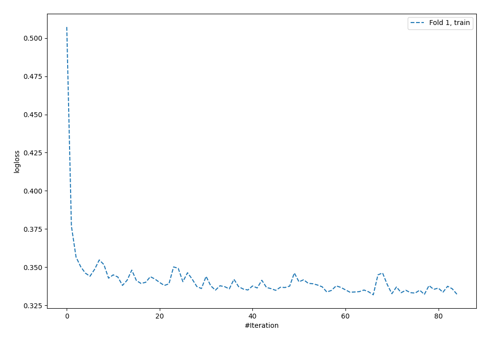
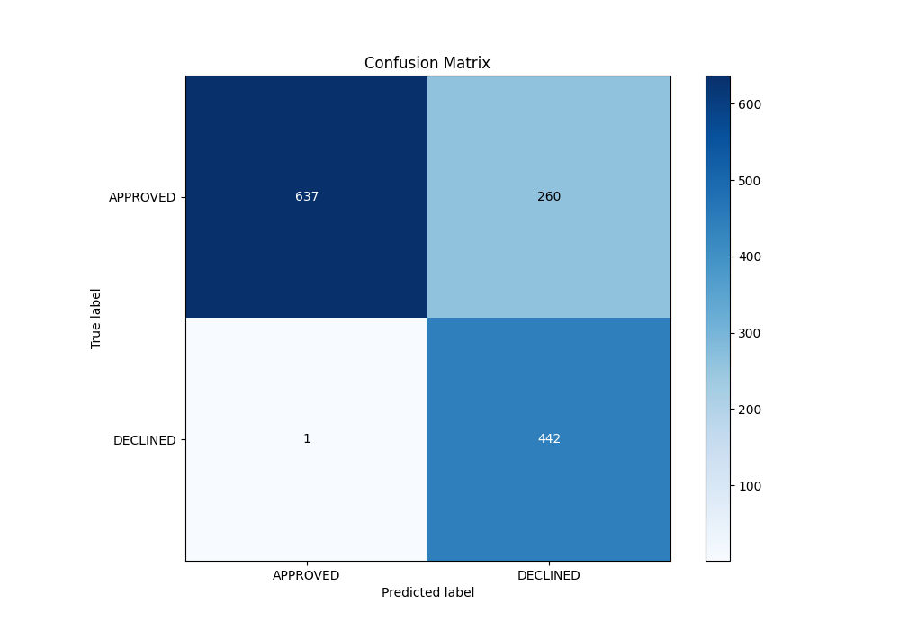
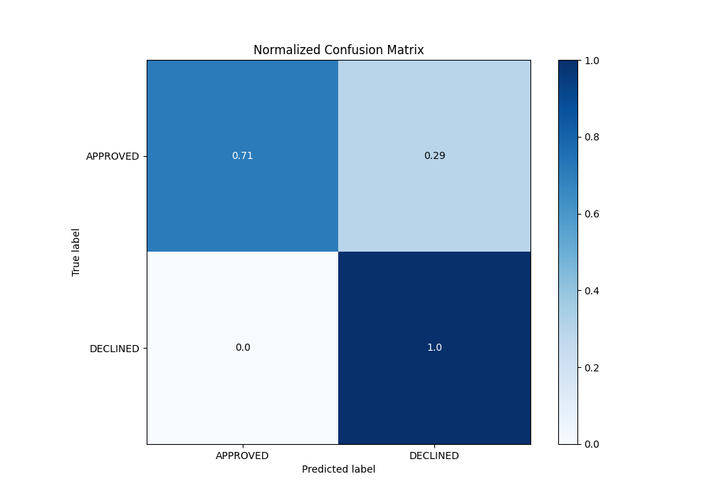
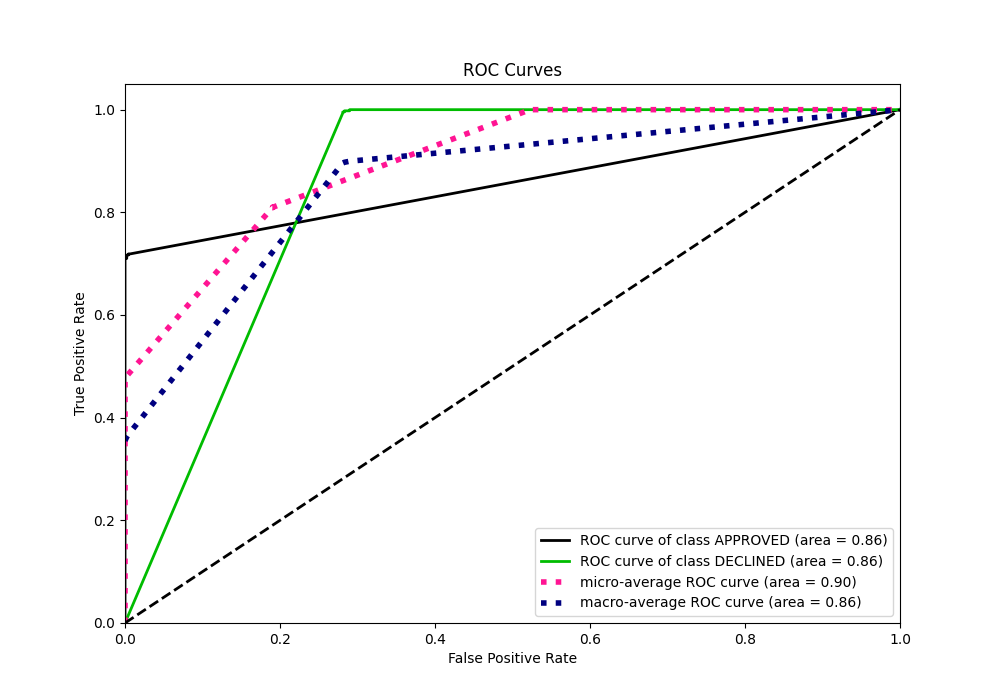
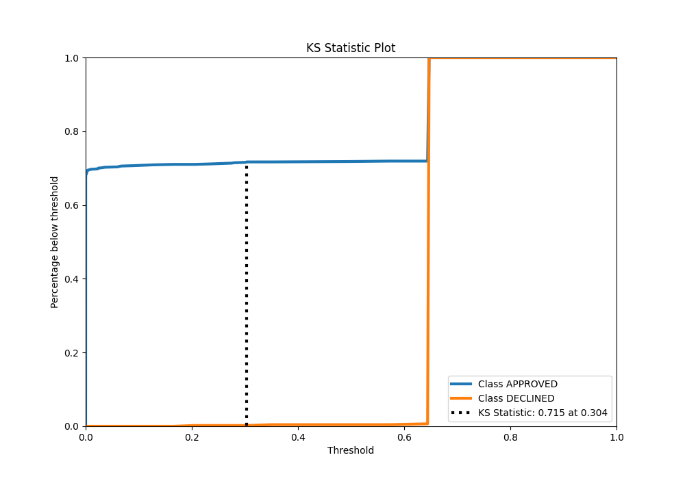
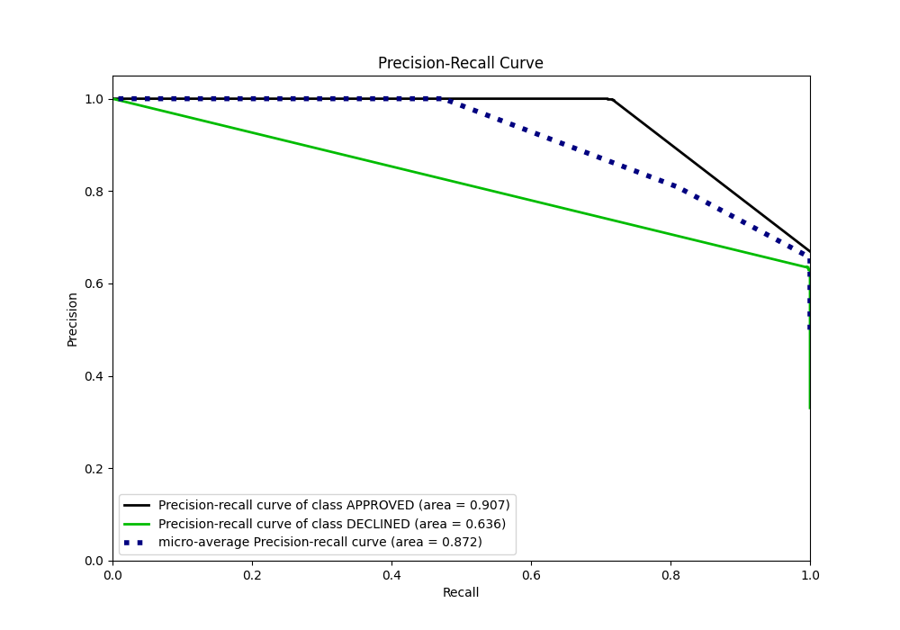
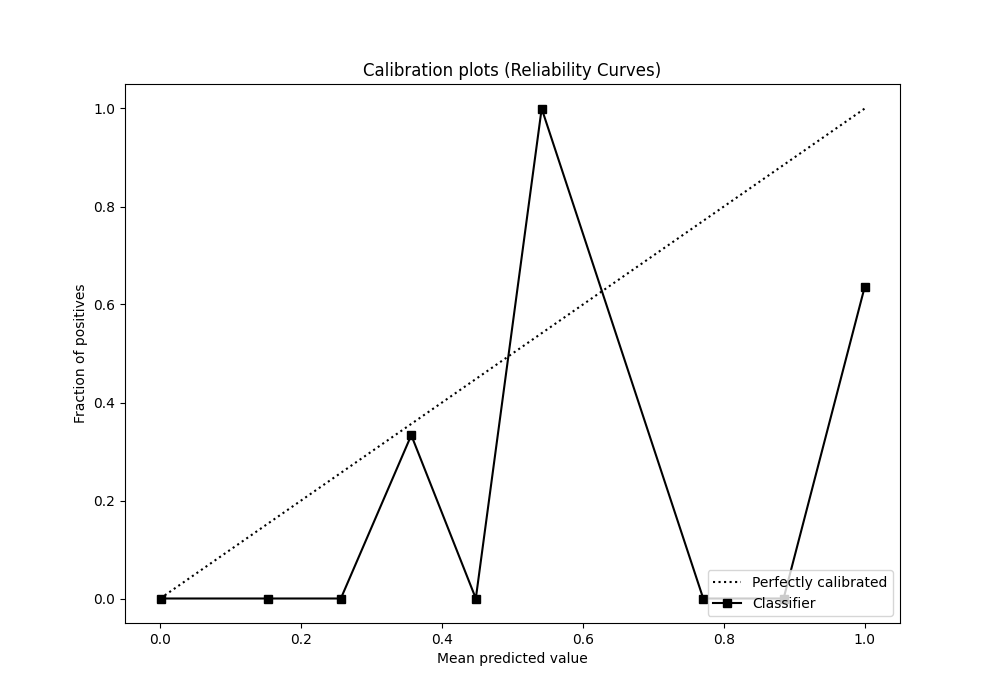
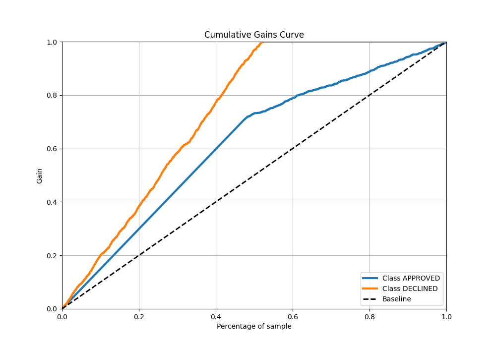
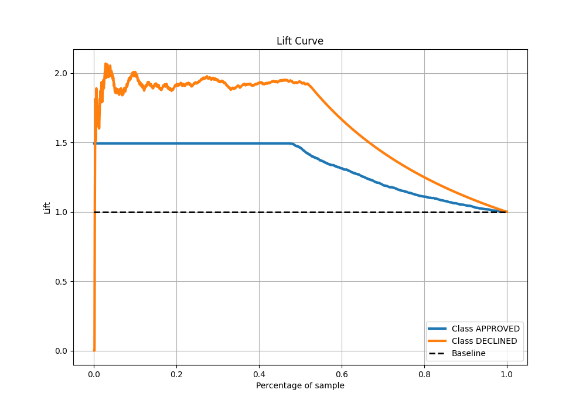

# Summary of 97_NeuralNetwork

[<< Go back](../README.md)

## Neural Network
- **n_jobs**: -1
- **dense_1_size**: 64
- **dense_2_size**: 8
- **learning_rate**: 0.05
- **explain_level**: 0

## Validation
 - **validation_type**: split
 - **train_ratio**: 0.8
 - **shuffle**: True
 - **stratify**: True

## Optimized metric
auc

## Training time

3.4 seconds

## Metric details
|           |    score |      threshold |
|:----------|---------:|---------------:|
| logloss   | 0.34436  | nan            |
| auc       | 0.858555 | nan            |
| f1        | 0.772052 |   0.218548     |
| accuracy  | 0.805224 |   0.218548     |
| precision | 0.62963  |   0.218548     |
| recall    | 1        |   1.06161e-307 |
| mcc       | 0.666781 |   0.218548     |

## Metric details with threshold from accuracy metric
|           |    score |   threshold |
|:----------|---------:|------------:|
| logloss   | 0.34436  |  nan        |
| auc       | 0.858555 |  nan        |
| f1        | 0.772052 |    0.218548 |
| accuracy  | 0.805224 |    0.218548 |
| precision | 0.62963  |    0.218548 |
| recall    | 0.997743 |    0.218548 |
| mcc       | 0.666781 |    0.218548 |

## Confusion matrix (at threshold=0.218548)
|                     |   Predicted as APPROVED |   Predicted as DECLINED |
|:--------------------|------------------------:|------------------------:|
| Labeled as APPROVED |                     637 |                     260 |
| Labeled as DECLINED |                       1 |                     442 |

## Learning curves

## Confusion Matrix

## Normalized Confusion Matrix

## ROC Curve

## Kolmogorov-Smirnov Statistic

## Precision-Recall Curve

## Calibration Curve

## Cumulative Gains Curve

## Lift Curve

[<< Go back](../README.md)
