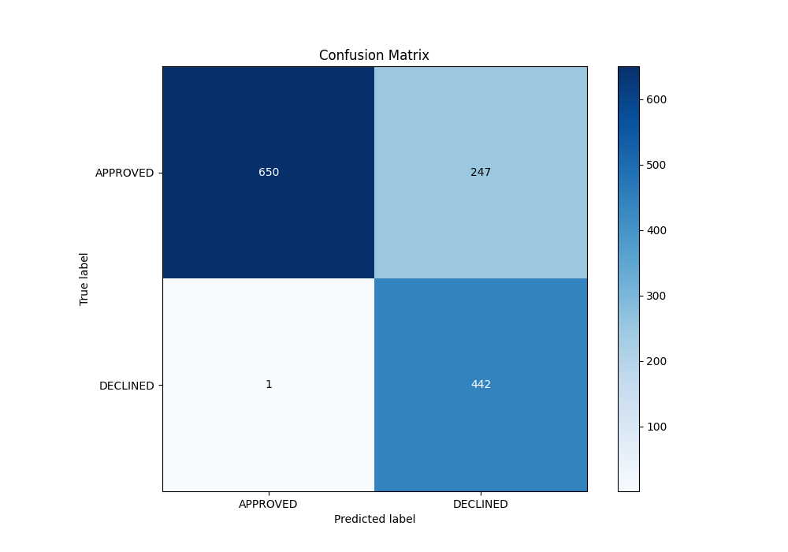

# Summary of 98_NeuralNetwork

[<< Go back](../README.md)

## Neural Network
- **n_jobs**: -1
- **dense_1_size**: 64
- **dense_2_size**: 32
- **learning_rate**: 0.05
- **explain_level**: 0

## Validation
 - **validation_type**: split
 - **train_ratio**: 0.8
 - **shuffle**: True
 - **stratify**: True

## Optimized metric
auc

## Training time

4.3 seconds

## Metric details
|           |    score |      threshold |
|:----------|---------:|---------------:|
| logloss   | 0.335553 | nan            |
| auc       | 0.879714 | nan            |
| f1        | 0.780919 |   0.358924     |
| accuracy  | 0.814925 |   0.358924     |
| precision | 0.788462 |   0.689941     |
| recall    | 1        |   2.67052e-230 |
| mcc       | 0.67993  |   0.358924     |

## Metric details with threshold from accuracy metric
|           |    score |   threshold |
|:----------|---------:|------------:|
| logloss   | 0.335553 |  nan        |
| auc       | 0.879714 |  nan        |
| f1        | 0.780919 |    0.358924 |
| accuracy  | 0.814925 |    0.358924 |
| precision | 0.641509 |    0.358924 |
| recall    | 0.997743 |    0.358924 |
| mcc       | 0.67993  |    0.358924 |

## Confusion matrix (at threshold=0.358924)
|                     |   Predicted as APPROVED |   Predicted as DECLINED |
|:--------------------|------------------------:|------------------------:|
| Labeled as APPROVED |                     650 |                     247 |
| Labeled as DECLINED |                       1 |                     442 |

## Learning curves

## Confusion Matrix

## Normalized Confusion Matrix

## ROC Curve

## Kolmogorov-Smirnov Statistic

## Precision-Recall Curve

## Calibration Curve

## Cumulative Gains Curve

## Lift Curve

[<< Go back](../README.md)
