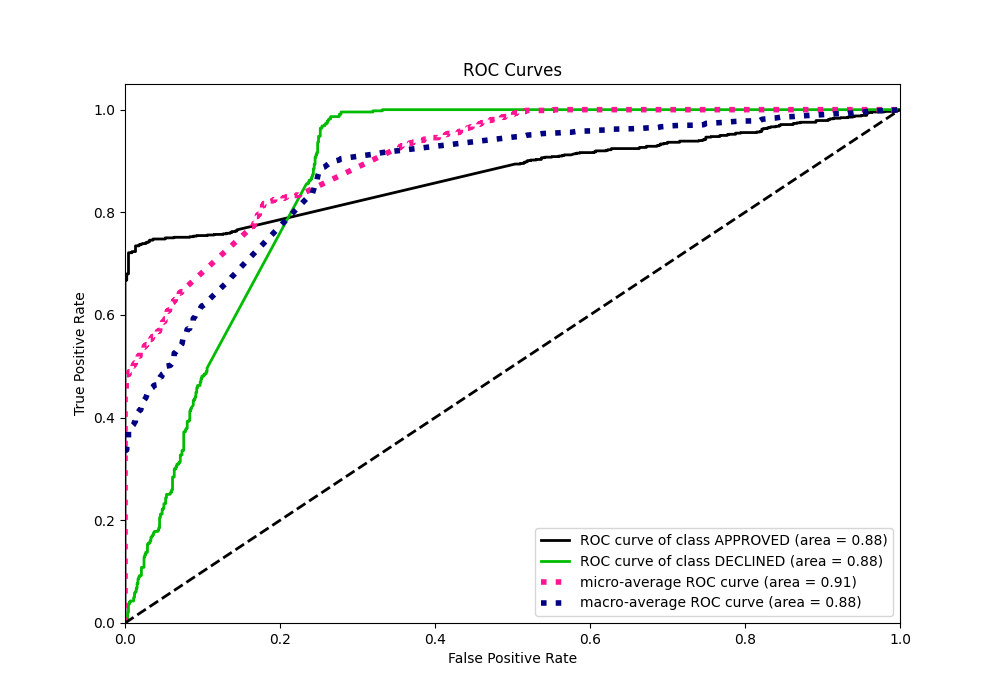

# Summary of 99_NeuralNetwork

[<< Go back](../README.md)

## Neural Network
- **n_jobs**: -1
- **dense_1_size**: 32
- **dense_2_size**: 8
- **learning_rate**: 0.05
- **explain_level**: 0

## Validation
 - **validation_type**: split
 - **train_ratio**: 0.8
 - **shuffle**: True
 - **stratify**: True

## Optimized metric
auc

## Training time

2.5 seconds

## Metric details
|           |    score |      threshold |
|:----------|---------:|---------------:|
| logloss   | 0.349566 | nan            |
| auc       | 0.876185 | nan            |
| f1        | 0.781055 |   0.448073     |
| accuracy  | 0.81791  |   0.489532     |
| precision | 0.717949 |   0.68716      |
| recall    | 1        |   1.82777e-105 |
| mcc       | 0.677455 |   0.448073     |

## Metric details with threshold from accuracy metric
|           |    score |   threshold |
|:----------|---------:|------------:|
| logloss   | 0.349566 |  nan        |
| auc       | 0.876185 |  nan        |
| f1        | 0.779385 |    0.489532 |
| accuracy  | 0.81791  |    0.489532 |
| precision | 0.650075 |    0.489532 |
| recall    | 0.972912 |    0.489532 |
| mcc       | 0.672064 |    0.489532 |

## Confusion matrix (at threshold=0.489532)
|                     |   Predicted as APPROVED |   Predicted as DECLINED |
|:--------------------|------------------------:|------------------------:|
| Labeled as APPROVED |                     665 |                     232 |
| Labeled as DECLINED |                      12 |                     431 |

## Learning curves

## Confusion Matrix

## Normalized Confusion Matrix

## ROC Curve

## Kolmogorov-Smirnov Statistic

## Precision-Recall Curve

## Calibration Curve

## Cumulative Gains Curve

## Lift Curve

[<< Go back](../README.md)
