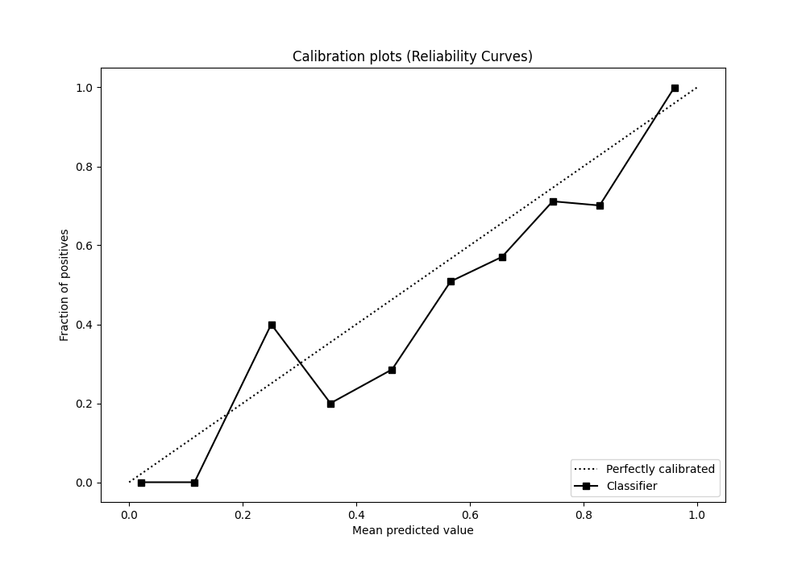

# Summary of 9_Xgboost

[<< Go back](../README.md)

## Extreme Gradient Boosting (Xgboost)
- **n_jobs**: -1
- **objective**: binary:logistic
- **eta**: 0.05
- **max_depth**: 9
- **min_child_weight**: 10
- **subsample**: 0.8
- **colsample_bytree**: 0.6
- **eval_metric**: auc
- **explain_level**: 0

## Validation
 - **validation_type**: split
 - **train_ratio**: 0.8
 - **shuffle**: True
 - **stratify**: True

## Optimized metric
auc

## Training time

1.3 seconds

## Metric details
|           |    score |   threshold |
|:----------|---------:|------------:|
| logloss   | 0.342718 | nan         |
| auc       | 0.895408 | nan         |
| f1        | 0.784629 |   0.421579  |
| accuracy  | 0.822388 |   0.508234  |
| precision | 0.865385 |   0.717931  |
| recall    | 1        |   0.0151059 |
| mcc       | 0.683801 |   0.421579  |

## Metric details with threshold from accuracy metric
|           |    score |   threshold |
|:----------|---------:|------------:|
| logloss   | 0.342718 |  nan        |
| auc       | 0.895408 |  nan        |
| f1        | 0.77963  |    0.508234 |
| accuracy  | 0.822388 |    0.508234 |
| precision | 0.660911 |    0.508234 |
| recall    | 0.950339 |    0.508234 |
| mcc       | 0.668383 |    0.508234 |

## Confusion matrix (at threshold=0.508234)
|                     |   Predicted as APPROVED |   Predicted as DECLINED |
|:--------------------|------------------------:|------------------------:|
| Labeled as APPROVED |                     681 |                     216 |
| Labeled as DECLINED |                      22 |                     421 |

## Learning curves

## Confusion Matrix

## Normalized Confusion Matrix

## ROC Curve

## Kolmogorov-Smirnov Statistic

## Precision-Recall Curve

## Calibration Curve

## Cumulative Gains Curve

## Lift Curve

[<< Go back](../README.md)
