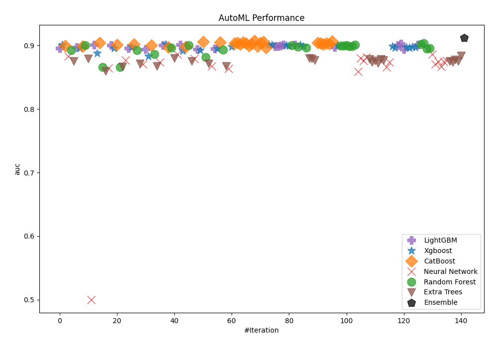
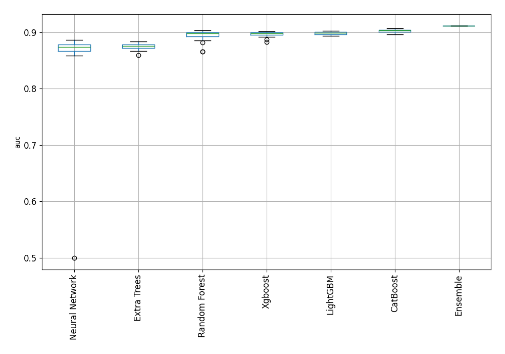
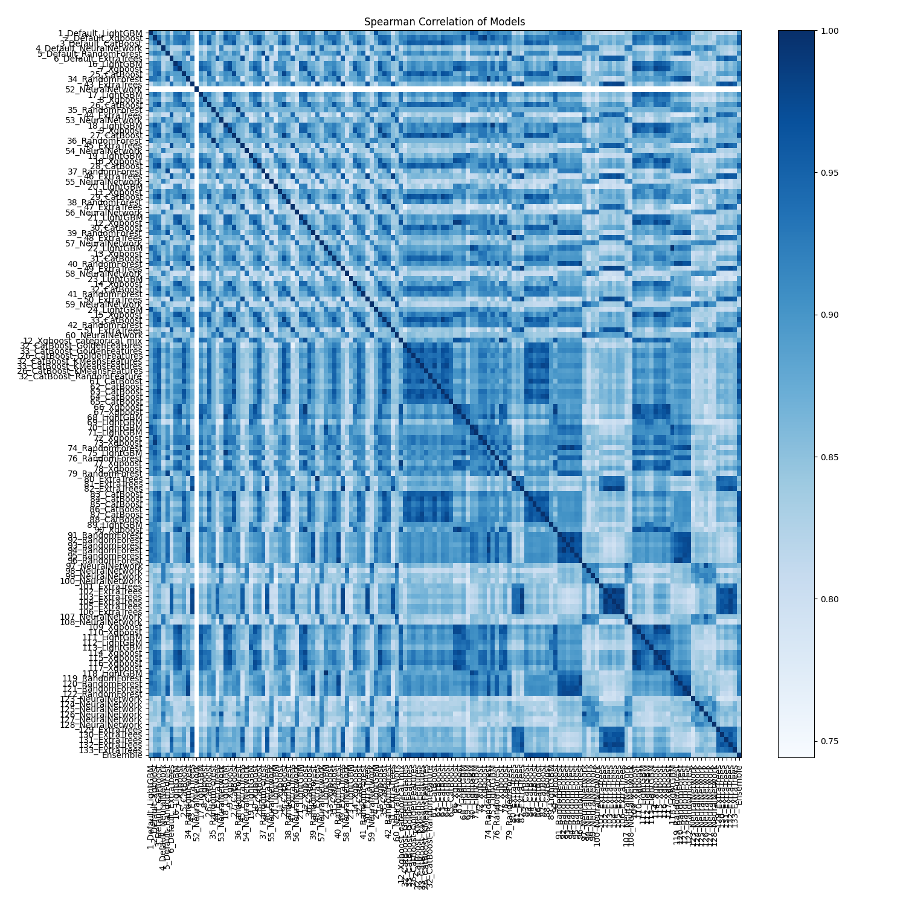

# AutoML Leaderboard

| Best model   | name                                                               | model_type     | metric_type   |   metric_value |   train_time |
|:-------------|:-------------------------------------------------------------------|:---------------|:--------------|---------------:|-------------:|
|              | [1_Default_LightGBM](1_Default_LightGBM/README.md)                 | LightGBM       | auc           |       0.895769 |         4.87 |
|              | [2_Default_Xgboost](2_Default_Xgboost/README.md)                   | Xgboost        | auc           |       0.90088  |         1.65 |
|              | [3_Default_CatBoost](3_Default_CatBoost/README.md)                 | CatBoost       | auc           |       0.899233 |         1.98 |
|              | [4_Default_NeuralNetwork](4_Default_NeuralNetwork/README.md)       | Neural Network | auc           |       0.882991 |         3.13 |
|              | [5_Default_RandomForest](5_Default_RandomForest/README.md)         | Random Forest  | auc           |       0.8928   |         4.26 |
|              | [6_Default_ExtraTrees](6_Default_ExtraTrees/README.md)             | Extra Trees    | auc           |       0.875197 |         2.52 |
|              | [16_LightGBM](16_LightGBM/README.md)                               | LightGBM       | auc           |       0.897262 |         1.78 |
|              | [7_Xgboost](7_Xgboost/README.md)                                   | Xgboost        | auc           |       0.895343 |         1.74 |
|              | [25_CatBoost](25_CatBoost/README.md)                               | CatBoost       | auc           |       0.898782 |         1.94 |
|              | [34_RandomForest](34_RandomForest/README.md)                       | Random Forest  | auc           |       0.900418 |         2.44 |
|              | [43_ExtraTrees](43_ExtraTrees/README.md)                           | Extra Trees    | auc           |       0.87916  |         2.61 |
|              | [52_NeuralNetwork](52_NeuralNetwork/README.md)                     | Neural Network | auc           |       0.5      |         1.88 |
|              | [17_LightGBM](17_LightGBM/README.md)                               | LightGBM       | auc           |       0.901415 |         1.95 |
|              | [8_Xgboost](8_Xgboost/README.md)                                   | Xgboost        | auc           |       0.887658 |         2.03 |
|              | [26_CatBoost](26_CatBoost/README.md)                               | CatBoost       | auc           |       0.904154 |         2.25 |
|              | [35_RandomForest](35_RandomForest/README.md)                       | Random Forest  | auc           |       0.866221 |         2.37 |
|              | [44_ExtraTrees](44_ExtraTrees/README.md)                           | Extra Trees    | auc           |       0.859598 |         2.48 |
|              | [53_NeuralNetwork](53_NeuralNetwork/README.md)                     | Neural Network | auc           |       0.864294 |         4.01 |
|              | [18_LightGBM](18_LightGBM/README.md)                               | LightGBM       | auc           |       0.900115 |         2.11 |
|              | [9_Xgboost](9_Xgboost/README.md)                                   | Xgboost        | auc           |       0.895408 |         2.18 |
|              | [27_CatBoost](27_CatBoost/README.md)                               | CatBoost       | auc           |       0.901408 |         3.53 |
|              | [36_RandomForest](36_RandomForest/README.md)                       | Random Forest  | auc           |       0.866221 |         2.46 |
|              | [45_ExtraTrees](45_ExtraTrees/README.md)                           | Extra Trees    | auc           |       0.866364 |         3.4  |
|              | [54_NeuralNetwork](54_NeuralNetwork/README.md)                     | Neural Network | auc           |       0.877222 |         3.2  |
|              | [19_LightGBM](19_LightGBM/README.md)                               | LightGBM       | auc           |       0.895918 |         2.35 |
|              | [10_Xgboost](10_Xgboost/README.md)                                 | Xgboost        | auc           |       0.898115 |         2.3  |
|              | [28_CatBoost](28_CatBoost/README.md)                               | CatBoost       | auc           |       0.901874 |         2.91 |
|              | [37_RandomForest](37_RandomForest/README.md)                       | Random Forest  | auc           |       0.892608 |         3.82 |
|              | [46_ExtraTrees](46_ExtraTrees/README.md)                           | Extra Trees    | auc           |       0.871274 |         3.18 |
|              | [55_NeuralNetwork](55_NeuralNetwork/README.md)                     | Neural Network | auc           |       0.870299 |         3.08 |
|              | [20_LightGBM](20_LightGBM/README.md)                               | LightGBM       | auc           |       0.894012 |         2.52 |
|              | [11_Xgboost](11_Xgboost/README.md)                                 | Xgboost        | auc           |       0.88309  |         2.46 |
|              | [29_CatBoost](29_CatBoost/README.md)                               | CatBoost       | auc           |       0.900621 |         3.7  |
|              | [38_RandomForest](38_RandomForest/README.md)                       | Random Forest  | auc           |       0.885905 |         4.63 |
|              | [47_ExtraTrees](47_ExtraTrees/README.md)                           | Extra Trees    | auc           |       0.867324 |         3.31 |
|              | [56_NeuralNetwork](56_NeuralNetwork/README.md)                     | Neural Network | auc           |       0.873754 |         3.22 |
|              | [21_LightGBM](21_LightGBM/README.md)                               | LightGBM       | auc           |       0.900102 |         2.55 |
|              | [12_Xgboost](12_Xgboost/README.md)                                 | Xgboost        | auc           |       0.902065 |         2.61 |
|              | [30_CatBoost](30_CatBoost/README.md)                               | CatBoost       | auc           |       0.897189 |         3.22 |
|              | [39_RandomForest](39_RandomForest/README.md)                       | Random Forest  | auc           |       0.896486 |         3.77 |
|              | [48_ExtraTrees](48_ExtraTrees/README.md)                           | Extra Trees    | auc           |       0.880103 |         2.93 |
|              | [57_NeuralNetwork](57_NeuralNetwork/README.md)                     | Neural Network | auc           |       0.886352 |         3.99 |
|              | [22_LightGBM](22_LightGBM/README.md)                               | LightGBM       | auc           |       0.901144 |         2.43 |
|              | [13_Xgboost](13_Xgboost/README.md)                                 | Xgboost        | auc           |       0.89166  |         2.46 |
|              | [31_CatBoost](31_CatBoost/README.md)                               | CatBoost       | auc           |       0.898057 |         2.86 |
|              | [40_RandomForest](40_RandomForest/README.md)                       | Random Forest  | auc           |       0.900007 |         3.21 |
|              | [49_ExtraTrees](49_ExtraTrees/README.md)                           | Extra Trees    | auc           |       0.875268 |         3.77 |
|              | [58_NeuralNetwork](58_NeuralNetwork/README.md)                     | Neural Network | auc           |       0.879064 |         3.44 |
|              | [23_LightGBM](23_LightGBM/README.md)                               | LightGBM       | auc           |       0.894138 |         2.61 |
|              | [14_Xgboost](14_Xgboost/README.md)                                 | Xgboost        | auc           |       0.892853 |         2.58 |
|              | [32_CatBoost](32_CatBoost/README.md)                               | CatBoost       | auc           |       0.905832 |         3.14 |
|              | [41_RandomForest](41_RandomForest/README.md)                       | Random Forest  | auc           |       0.881726 |         3.07 |
|              | [50_ExtraTrees](50_ExtraTrees/README.md)                           | Extra Trees    | auc           |       0.871357 |         3.97 |
|              | [59_NeuralNetwork](59_NeuralNetwork/README.md)                     | Neural Network | auc           |       0.867726 |         3.12 |
|              | [24_LightGBM](24_LightGBM/README.md)                               | LightGBM       | auc           |       0.895287 |         2.53 |
|              | [15_Xgboost](15_Xgboost/README.md)                                 | Xgboost        | auc           |       0.894904 |         2.59 |
|              | [33_CatBoost](33_CatBoost/README.md)                               | CatBoost       | auc           |       0.905454 |         3.92 |
|              | [42_RandomForest](42_RandomForest/README.md)                       | Random Forest  | auc           |       0.893379 |         4.47 |
|              | [51_ExtraTrees](51_ExtraTrees/README.md)                           | Extra Trees    | auc           |       0.867825 |         3.28 |
|              | [60_NeuralNetwork](60_NeuralNetwork/README.md)                     | Neural Network | auc           |       0.86387  |         3.6  |
|              | [12_Xgboost_categorical_mix](12_Xgboost_categorical_mix/README.md) | Xgboost        | auc           |       0.898221 |         2.94 |
|              | [32_CatBoost_GoldenFeatures](32_CatBoost_GoldenFeatures/README.md) | CatBoost       | auc           |       0.903415 |         9.31 |
|              | [33_CatBoost_GoldenFeatures](33_CatBoost_GoldenFeatures/README.md) | CatBoost       | auc           |       0.904268 |         3.99 |
|              | [26_CatBoost_GoldenFeatures](26_CatBoost_GoldenFeatures/README.md) | CatBoost       | auc           |       0.901705 |         3.31 |
|              | [32_CatBoost_KMeansFeatures](32_CatBoost_KMeansFeatures/README.md) | CatBoost       | auc           |       0.905402 |         4.1  |
|              | [33_CatBoost_KMeansFeatures](33_CatBoost_KMeansFeatures/README.md) | CatBoost       | auc           |       0.903435 |         3.61 |
|              | [26_CatBoost_KMeansFeatures](26_CatBoost_KMeansFeatures/README.md) | CatBoost       | auc           |       0.899726 |         3.45 |
|              | [32_CatBoost_RandomFeature](32_CatBoost_RandomFeature/README.md)   | CatBoost       | auc           |       0.902524 |         3.36 |
|              | [61_CatBoost](61_CatBoost/README.md)                               | CatBoost       | auc           |       0.907321 |         3.22 |
|              | [62_CatBoost](62_CatBoost/README.md)                               | CatBoost       | auc           |       0.899098 |         3.31 |
|              | [63_CatBoost](63_CatBoost/README.md)                               | CatBoost       | auc           |       0.904046 |         3.53 |
|              | [64_CatBoost](64_CatBoost/README.md)                               | CatBoost       | auc           |       0.905574 |         3.85 |
|              | [65_CatBoost](65_CatBoost/README.md)                               | CatBoost       | auc           |       0.896573 |         3.58 |
|              | [66_Xgboost](66_Xgboost/README.md)                                 | Xgboost        | auc           |       0.901198 |         2.79 |
|              | [67_Xgboost](67_Xgboost/README.md)                                 | Xgboost        | auc           |       0.901352 |         2.85 |
|              | [68_LightGBM](68_LightGBM/README.md)                               | LightGBM       | auc           |       0.89906  |         2.78 |
|              | [69_LightGBM](69_LightGBM/README.md)                               | LightGBM       | auc           |       0.898976 |         2.8  |
|              | [70_LightGBM](70_LightGBM/README.md)                               | LightGBM       | auc           |       0.899676 |         2.84 |
|              | [71_LightGBM](71_LightGBM/README.md)                               | LightGBM       | auc           |       0.901019 |         2.86 |
|              | [72_Xgboost](72_Xgboost/README.md)                                 | Xgboost        | auc           |       0.899994 |         2.9  |
|              | [73_Xgboost](73_Xgboost/README.md)                                 | Xgboost        | auc           |       0.899842 |         2.9  |
|              | [74_RandomForest](74_RandomForest/README.md)                       | Random Forest  | auc           |       0.900078 |         3.59 |
|              | [75_LightGBM](75_LightGBM/README.md)                               | LightGBM       | auc           |       0.901382 |         2.83 |
|              | [76_RandomForest](76_RandomForest/README.md)                       | Random Forest  | auc           |       0.898265 |         3.57 |
|              | [77_Xgboost](77_Xgboost/README.md)                                 | Xgboost        | auc           |       0.900789 |         3.02 |
|              | [78_Xgboost](78_Xgboost/README.md)                                 | Xgboost        | auc           |       0.898771 |         3.01 |
|              | [79_RandomForest](79_RandomForest/README.md)                       | Random Forest  | auc           |       0.896666 |         4.11 |
|              | [80_ExtraTrees](80_ExtraTrees/README.md)                           | Extra Trees    | auc           |       0.879862 |         3.39 |
|              | [81_ExtraTrees](81_ExtraTrees/README.md)                           | Extra Trees    | auc           |       0.878936 |         3.47 |
|              | [82_ExtraTrees](82_ExtraTrees/README.md)                           | Extra Trees    | auc           |       0.876612 |         5.24 |
|              | [83_CatBoost](83_CatBoost/README.md)                               | CatBoost       | auc           |       0.90391  |         4.09 |
|              | [84_CatBoost](84_CatBoost/README.md)                               | CatBoost       | auc           |       0.903715 |         3.66 |
|              | [85_CatBoost](85_CatBoost/README.md)                               | CatBoost       | auc           |       0.901735 |         3.06 |
|              | [86_CatBoost](86_CatBoost/README.md)                               | CatBoost       | auc           |       0.903386 |         3.44 |
|              | [87_CatBoost](87_CatBoost/README.md)                               | CatBoost       | auc           |       0.903084 |         3.53 |
|              | [88_CatBoost](88_CatBoost/README.md)                               | CatBoost       | auc           |       0.906431 |         4.13 |
|              | [89_LightGBM](89_LightGBM/README.md)                               | LightGBM       | auc           |       0.896929 |         2.69 |
|              | [90_Xgboost](90_Xgboost/README.md)                                 | Xgboost        | auc           |       0.9003   |         2.77 |
|              | [91_RandomForest](91_RandomForest/README.md)                       | Random Forest  | auc           |       0.89923  |         3.28 |
|              | [92_RandomForest](92_RandomForest/README.md)                       | Random Forest  | auc           |       0.899744 |         3.35 |
|              | [93_RandomForest](93_RandomForest/README.md)                       | Random Forest  | auc           |       0.900044 |         3.52 |
|              | [94_RandomForest](94_RandomForest/README.md)                       | Random Forest  | auc           |       0.898885 |         3.35 |
|              | [95_RandomForest](95_RandomForest/README.md)                       | Random Forest  | auc           |       0.898522 |         3.84 |
|              | [96_RandomForest](96_RandomForest/README.md)                       | Random Forest  | auc           |       0.900949 |         3.4  |
|              | [97_NeuralNetwork](97_NeuralNetwork/README.md)                     | Neural Network | auc           |       0.858555 |         4.14 |
|              | [98_NeuralNetwork](98_NeuralNetwork/README.md)                     | Neural Network | auc           |       0.879714 |         5.07 |
|              | [99_NeuralNetwork](99_NeuralNetwork/README.md)                     | Neural Network | auc           |       0.876185 |         3.24 |
|              | [100_NeuralNetwork](100_NeuralNetwork/README.md)                   | Neural Network | auc           |       0.881484 |         4.02 |
|              | [101_ExtraTrees](101_ExtraTrees/README.md)                         | Extra Trees    | auc           |       0.878802 |         3.26 |
|              | [102_ExtraTrees](102_ExtraTrees/README.md)                         | Extra Trees    | auc           |       0.874017 |         3.89 |
|              | [103_ExtraTrees](103_ExtraTrees/README.md)                         | Extra Trees    | auc           |       0.875922 |         3.91 |
|              | [104_ExtraTrees](104_ExtraTrees/README.md)                         | Extra Trees    | auc           |       0.872469 |         3.99 |
|              | [105_ExtraTrees](105_ExtraTrees/README.md)                         | Extra Trees    | auc           |       0.878187 |         3.85 |
|              | [106_ExtraTrees](106_ExtraTrees/README.md)                         | Extra Trees    | auc           |       0.876993 |         3.58 |
|              | [107_NeuralNetwork](107_NeuralNetwork/README.md)                   | Neural Network | auc           |       0.865559 |         3.58 |
|              | [108_NeuralNetwork](108_NeuralNetwork/README.md)                   | Neural Network | auc           |       0.873801 |         5.41 |
|              | [109_Xgboost](109_Xgboost/README.md)                               | Xgboost        | auc           |       0.898537 |         2.94 |
|              | [110_Xgboost](110_Xgboost/README.md)                               | Xgboost        | auc           |       0.896498 |         2.93 |
|              | [111_LightGBM](111_LightGBM/README.md)                             | LightGBM       | auc           |       0.900102 |         2.94 |
|              | [112_LightGBM](112_LightGBM/README.md)                             | LightGBM       | auc           |       0.902766 |         2.93 |
|              | [113_LightGBM](113_LightGBM/README.md)                             | LightGBM       | auc           |       0.89431  |         2.95 |
|              | [114_Xgboost](114_Xgboost/README.md)                               | Xgboost        | auc           |       0.896993 |         2.96 |
|              | [115_Xgboost](115_Xgboost/README.md)                               | Xgboost        | auc           |       0.896739 |         2.9  |
|              | [116_Xgboost](116_Xgboost/README.md)                               | Xgboost        | auc           |       0.898059 |         2.96 |
|              | [117_Xgboost](117_Xgboost/README.md)                               | Xgboost        | auc           |       0.897303 |         2.96 |
|              | [118_LightGBM](118_LightGBM/README.md)                             | LightGBM       | auc           |       0.901144 |         2.94 |
|              | [119_RandomForest](119_RandomForest/README.md)                     | Random Forest  | auc           |       0.90182  |         3.49 |
|              | [120_RandomForest](120_RandomForest/README.md)                     | Random Forest  | auc           |       0.90358  |         3.51 |
|              | [121_RandomForest](121_RandomForest/README.md)                     | Random Forest  | auc           |       0.895034 |         3.69 |
|              | [122_RandomForest](122_RandomForest/README.md)                     | Random Forest  | auc           |       0.896003 |         3.66 |
|              | [123_NeuralNetwork](123_NeuralNetwork/README.md)                   | Neural Network | auc           |       0.886236 |         5.89 |
|              | [124_NeuralNetwork](124_NeuralNetwork/README.md)                   | Neural Network | auc           |       0.870594 |         4.07 |
|              | [125_NeuralNetwork](125_NeuralNetwork/README.md)                   | Neural Network | auc           |       0.874474 |         4.02 |
|              | [126_NeuralNetwork](126_NeuralNetwork/README.md)                   | Neural Network | auc           |       0.866898 |         4.51 |
|              | [127_NeuralNetwork](127_NeuralNetwork/README.md)                   | Neural Network | auc           |       0.8743   |         4.8  |
|              | [128_NeuralNetwork](128_NeuralNetwork/README.md)                   | Neural Network | auc           |       0.875765 |         4.12 |
|              | [129_ExtraTrees](129_ExtraTrees/README.md)                         | Extra Trees    | auc           |       0.874949 |         3.61 |
|              | [130_ExtraTrees](130_ExtraTrees/README.md)                         | Extra Trees    | auc           |       0.873672 |         3.91 |
|              | [131_ExtraTrees](131_ExtraTrees/README.md)                         | Extra Trees    | auc           |       0.877734 |         3.92 |
|              | [132_ExtraTrees](132_ExtraTrees/README.md)                         | Extra Trees    | auc           |       0.875322 |         3.74 |
|              | [133_ExtraTrees](133_ExtraTrees/README.md)                         | Extra Trees    | auc           |       0.883558 |         3.78 |
| **the best** | [Ensemble](Ensemble/README.md)                                     | Ensemble       | auc           |       0.911784 |        44.53 |

### AutoML Performance

### AutoML Performance Boxplot

### Spearman Correlation of Models

